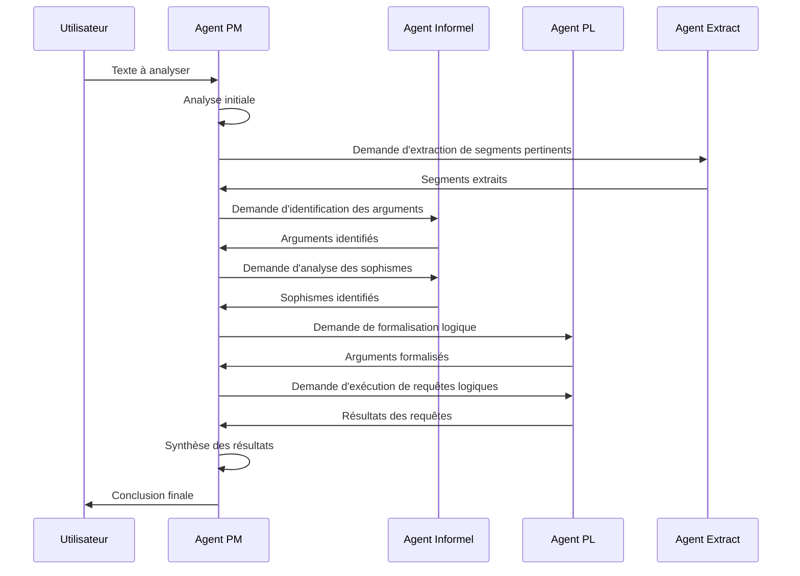

# API des Agents d'Analyse Argumentative

Ce document présente une vue d'ensemble des agents spécialisés qui composent le système d'analyse argumentative, leurs rôles respectifs et leurs interactions.

## Introduction

Le système d'analyse argumentative repose sur plusieurs agents spécialisés qui collaborent pour analyser des textes argumentatifs. Chaque agent possède des compétences spécifiques et contribue à une partie du processus d'analyse.

## Agents Principaux

### 1. [Agent Project Manager (PM)](./pm_agent_api.md)

L'Agent PM est le chef d'orchestre du système. Il est responsable de :
- Analyser la demande initiale et l'état actuel de l'analyse
- Planifier les étapes d'analyse
- Définir et déléguer des tâches aux agents spécialistes
- Suivre l'avancement de l'analyse
- Synthétiser les résultats et formuler une conclusion finale

### 2. [Agent d'Analyse Informelle](./informal_agent_api.md)

L'Agent d'Analyse Informelle est spécialisé dans l'identification et l'analyse des arguments et sophismes. Ses responsabilités incluent :
- Identifier les arguments principaux dans un texte
- Détecter les sophismes potentiels
- Classifier les sophismes selon une taxonomie établie
- Justifier l'attribution des sophismes

### 3. [Agent de Logique Propositionnelle (PL)](./pl_agent_api.md)

L'Agent PL est responsable de la formalisation logique des arguments. Il peut :
- Traduire des arguments en formules de logique propositionnelle
- Vérifier la validité logique des arguments formalisés
- Générer et exécuter des requêtes logiques
- Interpréter les résultats des requêtes en langage naturel

### 4. [Agent d'Extraction](./extract_agent_api.md)

L'Agent d'Extraction est spécialisé dans l'identification et l'extraction de segments pertinents dans un texte. Ses fonctionnalités incluent :
- Extraire des passages pertinents à partir d'une dénomination
- Réparer des extraits avec des bornes défectueuses
- Valider la pertinence des extraits proposés

## Flux de Travail Typique

## Principes Communs

Tous les agents partagent certains principes de conception :

1. **Isolation** : Chaque agent opère de manière isolée avec son propre état et ses propres fonctionnalités.
2. **Communication standardisée** : Les agents communiquent via le système de gestion d'état partagé (`StateManager`).
3. **Extensibilité** : Le système est conçu pour permettre l'ajout de nouveaux agents spécialistes.
4. **Traçabilité** : Toutes les actions des agents sont enregistrées pour permettre une analyse a posteriori.

## Guide de Sélection des Agents

Pour choisir l'agent approprié à une tâche spécifique :

| Tâche | Agent Recommandé |
|-------|-----------------|
| Orchestration globale de l'analyse | Agent PM |
| Identification des arguments et sophismes | Agent Informel |
| Formalisation logique et vérification de validité | Agent PL |
| Extraction de segments pertinents | Agent Extract |

## Interactions entre Agents

Les agents interagissent principalement via l'Agent PM, qui joue le rôle de coordinateur. Le flux d'information typique est le suivant :

1. L'Agent PM reçoit une demande d'analyse
2. L'Agent PM délègue des tâches spécifiques aux agents spécialistes
3. Les agents spécialistes exécutent leurs tâches et renvoient les résultats à l'Agent PM
4. L'Agent PM intègre les résultats et détermine les prochaines étapes
5. Une fois l'analyse complète, l'Agent PM formule une conclusion finale

## Voir aussi

- [API d'Orchestration](../orchestration/README.md)
- [API du Système de Communication](../reference_api.md)