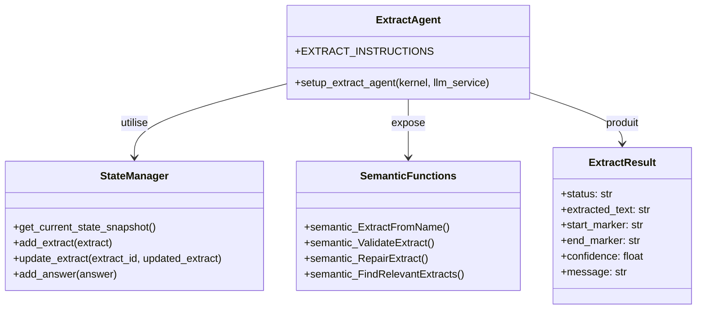
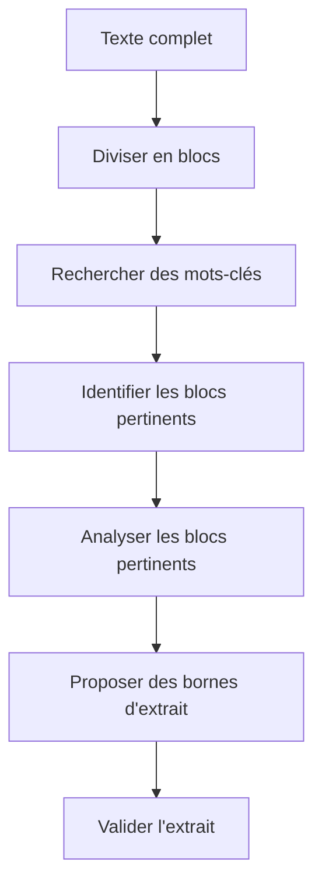
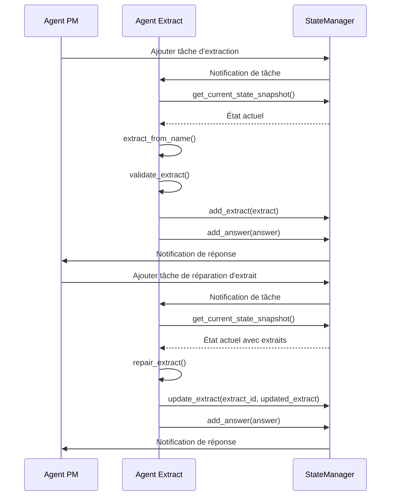

# API de l'Agent d'Extraction

## Introduction

L'Agent d'Extraction est un composant spécialisé du système d'analyse argumentative, responsable de l'identification et de l'extraction de segments pertinents dans un texte source. Il utilise des techniques avancées pour proposer, valider et réparer des extraits en se basant sur leur dénomination et le contexte.

## Rôle et Responsabilités

L'Agent d'Extraction a plusieurs responsabilités clés :

1. **Extraction intelligente** : Proposer des extraits pertinents à partir d'une dénomination.
2. **Navigation efficace** : Utiliser une approche dichotomique pour traiter efficacement des textes volumineux.
3. **Réparation d'extraits** : Corriger les bornes défectueuses des extraits existants.
4. **Validation automatique** : Vérifier la pertinence des extraits proposés.

## Architecture

L'Agent d'Extraction est implémenté comme un plugin Semantic Kernel qui expose plusieurs fonctions sémantiques pour l'extraction et la manipulation d'extraits de texte.



## Classes et Interfaces Principales

### ExtractAgent

La classe principale qui encapsule les fonctionnalités de l'Agent d'Extraction.

```python
class ExtractAgent:
    """
    Agent d'extraction intelligent pour l'analyse argumentative.
    """
    
    def __init__(self, kernel=None):
        """
        Initialise une nouvelle instance de l'agent d'extraction.
        
        Args:
            kernel: Le kernel Semantic Kernel à utiliser
        """
        self.kernel = kernel
```

### Fonction de Configuration

```python
def setup_extract_agent(kernel, llm_service):
    """
    Configure le kernel Semantic Kernel pour l'agent d'extraction.
    
    Args:
        kernel: Le kernel Semantic Kernel à configurer
        llm_service: Le service LLM à utiliser
        
    Returns:
        tuple: Un tuple contenant (kernel, agent)
    """
```

### ExtractResult

Classe représentant le résultat d'une opération d'extraction.

```python
class ExtractResult:
    """
    Résultat d'une opération d'extraction.
    """
    
    def __init__(self, status, extracted_text=None, start_marker=None, end_marker=None, 
                 confidence=0.0, message=None):
        """
        Initialise un nouveau résultat d'extraction.
        
        Args:
            status (str): Statut de l'extraction ("valid", "invalid", "error")
            extracted_text (str, optional): Texte extrait
            start_marker (str, optional): Marqueur de début de l'extrait
            end_marker (str, optional): Marqueur de fin de l'extrait
            confidence (float, optional): Niveau de confiance (0.0 à 1.0)
            message (str, optional): Message explicatif
        """
        self.status = status
        self.extracted_text = extracted_text
        self.start_marker = start_marker
        self.end_marker = end_marker
        self.confidence = confidence
        self.message = message
```

## Méthodes Publiques

### extract_from_name

```python
async def extract_from_name(self, source_info, extract_name, context=None):
    """
    Extrait un passage pertinent à partir d'une dénomination.
    
    Cette méthode analyse un texte source pour en extraire un segment
    qui correspond à la dénomination fournie.
    
    Args:
        source_info (dict): Informations sur la source (texte, métadonnées)
        extract_name (str): Dénomination de l'extrait à rechercher
        context (dict, optional): Contexte supplémentaire pour l'extraction
        
    Returns:
        ExtractResult: Le résultat de l'opération d'extraction
        
    Exemple d'utilisation:
    ```python
    result = await extract_agent.extract_from_name(
        source_info={"text": "Texte complet...", "title": "Titre du document"},
        extract_name="Définition du syllogisme"
    )
    
    if result.status == "valid":
        print(f"Extrait trouvé: {result.extracted_text}")
        print(f"Marqueur de début: {result.start_marker}")
        print(f"Marqueur de fin: {result.end_marker}")
    else:
        print(f"Échec de l'extraction: {result.message}")
    ```
    """
```

### repair_extract

```python
async def repair_extract(self, extract_definitions, source_idx, extract_idx):
    """
    Répare un extrait existant avec des bornes défectueuses.
    
    Cette méthode tente de corriger les marqueurs de début et de fin
    d'un extrait existant pour mieux correspondre à sa dénomination.
    
    Args:
        extract_definitions (dict): Définitions des extraits
        source_idx (int): Index de la source dans les définitions
        extract_idx (int): Index de l'extrait à réparer
        
    Returns:
        ExtractResult: Le résultat de l'opération de réparation
        
    Exemple d'utilisation:
    ```python
    result = await extract_agent.repair_extract(
        extract_definitions=extract_defs,
        source_idx=0,
        extract_idx=3
    )
    
    if result.status == "valid":
        success = await extract_agent.update_extract_markers(
            extract_definitions=extract_defs,
            source_idx=0,
            extract_idx=3,
            result=result
        )
        if success:
            print("Extrait réparé avec succès")
    ```
    """
```

### validate_extract

```python
async def validate_extract(self, source_text, extract_name, extracted_text):
    """
    Valide la pertinence d'un extrait proposé.
    
    Cette méthode vérifie si un extrait proposé correspond bien
    à la dénomination fournie et s'il est pertinent dans le contexte.
    
    Args:
        source_text (str): Texte source complet
        extract_name (str): Dénomination de l'extrait
        extracted_text (str): Texte extrait à valider
        
    Returns:
        dict: Résultat de la validation
        
    Exemple de retour:
    {
        "is_valid": true,
        "confidence": 0.95,
        "reasoning": "L'extrait correspond parfaitement à la définition du syllogisme...",
        "suggestions": []
    }
    """
```

### add_new_extract

```python
async def add_new_extract(self, extract_definitions, source_idx, extract_name, extract_result):
    """
    Ajoute un nouvel extrait aux définitions existantes.
    
    Cette méthode ajoute un nouvel extrait validé aux définitions
    d'extraits existantes.
    
    Args:
        extract_definitions (dict): Définitions des extraits
        source_idx (int): Index de la source dans les définitions
        extract_name (str): Dénomination de l'extrait
        extract_result (ExtractResult): Résultat de l'extraction
        
    Returns:
        tuple: (success, extract_idx) où success est un booléen indiquant
               si l'ajout a réussi et extract_idx est l'index du nouvel extrait
        
    Exemple d'utilisation:
    ```python
    result = await extract_agent.extract_from_name(
        source_info=source_info,
        extract_name="Critique de la raison pure"
    )
    
    if result.status == "valid":
        success, extract_idx = await extract_agent.add_new_extract(
            extract_definitions=extract_defs,
            source_idx=0,
            extract_name="Critique de la raison pure",
            extract_result=result
        )
        if success:
            print(f"Nouvel extrait ajouté à l'index {extract_idx}")
    ```
    """
```

### update_extract_markers

```python
async def update_extract_markers(self, extract_definitions, source_idx, extract_idx, result):
    """
    Met à jour les marqueurs d'un extrait existant.
    
    Cette méthode met à jour les marqueurs de début et de fin
    d'un extrait existant avec de nouveaux marqueurs.
    
    Args:
        extract_definitions (dict): Définitions des extraits
        source_idx (int): Index de la source dans les définitions
        extract_idx (int): Index de l'extrait à mettre à jour
        result (ExtractResult): Résultat contenant les nouveaux marqueurs
        
    Returns:
        bool: True si la mise à jour a réussi, False sinon
    """
```

### find_relevant_extracts

```python
async def find_relevant_extracts(self, source_text, query, existing_extracts=None):
    """
    Trouve des extraits pertinents pour une requête donnée.
    
    Cette méthode recherche dans le texte source des passages
    qui sont pertinents pour la requête fournie.
    
    Args:
        source_text (str): Texte source complet
        query (str): Requête de recherche
        existing_extracts (list, optional): Liste des extraits existants
        
    Returns:
        list: Liste des extraits pertinents trouvés
        
    Exemple de retour:
    [
        {
            "extract_name": "Définition du syllogisme",
            "extracted_text": "Un syllogisme est un raisonnement...",
            "start_marker": "Un syllogisme est",
            "end_marker": "conclusion nécessaire.",
            "relevance": 0.95,
            "reasoning": "Cet extrait définit directement le concept de syllogisme..."
        }
    ]
    """
```

## Approche Dichotomique

Pour traiter efficacement des textes volumineux, l'Agent d'Extraction utilise une approche dichotomique qui :

1. **Divise le texte en blocs** de taille fixe (par défaut 500 lignes) avec chevauchement.
2. **Recherche des mots-clés** de la dénomination dans chaque bloc.
3. **Analyse les blocs pertinents** pour identifier les passages correspondant à la dénomination.
4. **Propose des bornes précises** pour délimiter l'extrait.

Cette approche permet de traiter des textes de grande taille tout en maintenant une précision élevée dans l'extraction.



## Interactions avec le StateManager

L'Agent d'Extraction interagit avec le système via le `StateManager`, qui lui permet de :

1. **Obtenir l'état actuel** : `StateManager.get_current_state_snapshot()`
2. **Ajouter des extraits** : `StateManager.add_extract(extract)`
3. **Mettre à jour des extraits** : `StateManager.update_extract(extract_id, updated_extract)`
4. **Répondre aux tâches** : `StateManager.add_answer(answer)`

## Flux de Travail Typique



## Exemples d'Utilisation

### Initialisation de l'Agent d'Extraction

```python
import asyncio
from core.llm_service import create_llm_service
from agents.core.extract import setup_extract_agent

async def main():
    # Créer le service LLM
    llm_service = create_llm_service()
    
    # Initialiser l'agent d'extraction
    kernel, extract_agent = await setup_extract_agent(kernel, llm_service)
    
    # Utiliser l'agent d'extraction...
    
asyncio.run(main())
```

### Extraction à partir d'une Dénomination

```python
# Informations sur la source
source_info = {
    "text": """
    La logique est l'étude des principes du raisonnement valide. Un syllogisme est un raisonnement déductif qui comprend deux prémisses et une conclusion. Par exemple, "Tous les hommes sont mortels. Socrate est un homme. Donc Socrate est mortel." est un syllogisme valide.
    
    La rhétorique est l'art de persuader par le discours. Elle utilise diverses techniques comme l'ethos, le pathos et le logos pour convaincre l'auditoire.
    """,
    "title": "Introduction à la logique et à la rhétorique"
}

# Extraire un passage pertinent
result = await extract_agent.extract_from_name(
    source_info=source_info,
    extract_name="Définition du syllogisme"
)

# Vérifier le résultat
if result.status == "valid":
    print(f"Extrait trouvé: {result.extracted_text}")
    print(f"Marqueur de début: {result.start_marker}")
    print(f"Marqueur de fin: {result.end_marker}")
    print(f"Confiance: {result.confidence}")
    
    # Valider l'extrait
    validation = await extract_agent.validate_extract(
        source_text=source_info["text"],
        extract_name="Définition du syllogisme",
        extracted_text=result.extracted_text
    )
    
    if validation["is_valid"]:
        print("L'extrait est valide.")
        
        # Ajouter l'extrait aux définitions
        extract_definitions = {"sources": [{"text": source_info["text"], "extracts": []}]}
        success, extract_idx = await extract_agent.add_new_extract(
            extract_definitions=extract_definitions,
            source_idx=0,
            extract_name="Définition du syllogisme",
            extract_result=result
        )
        
        if success:
            print(f"Extrait ajouté à l'index {extract_idx}")
    else:
        print(f"L'extrait n'est pas valide: {validation['reasoning']}")
else:
    print(f"Échec de l'extraction: {result.message}")
```

### Réparation d'un Extrait Existant

```python
# Définitions d'extraits avec un extrait défectueux
extract_definitions = {
    "sources": [
        {
            "text": source_info["text"],
            "extracts": [
                {
                    "name": "Définition du syllogisme",
                    "start_marker": "Un syllogisme",
                    "end_marker": "valide.",  # Marqueur de fin incorrect
                    "text": "Un syllogisme est un raisonnement déductif qui comprend deux prémisses et une conclusion. Par exemple, \"Tous les hommes sont mortels. Socrate est un homme. Donc Socrate est mortel.\" est un syllogisme valide."
                }
            ]
        }
    ]
}

# Réparer l'extrait
result = await extract_agent.repair_extract(
    extract_definitions=extract_definitions,
    source_idx=0,
    extract_idx=0
)

# Vérifier le résultat
if result.status == "valid":
    print(f"Nouveaux marqueurs proposés:")
    print(f"Début: {result.start_marker}")
    print(f"Fin: {result.end_marker}")
    
    # Mettre à jour les marqueurs
    success = await extract_agent.update_extract_markers(
        extract_definitions=extract_definitions,
        source_idx=0,
        extract_idx=0,
        result=result
    )
    
    if success:
        print("Marqueurs mis à jour avec succès")
else:
    print(f"Échec de la réparation: {result.message}")
```

### Recherche d'Extraits Pertinents

```python
# Rechercher des extraits pertinents pour une requête
relevant_extracts = await extract_agent.find_relevant_extracts(
    source_text=source_info["text"],
    query="Techniques de persuasion en rhétorique",
    existing_extracts=[
        {
            "name": "Définition du syllogisme",
            "text": "Un syllogisme est un raisonnement déductif qui comprend deux prémisses et une conclusion."
        }
    ]
)

# Afficher les extraits trouvés
for i, extract in enumerate(relevant_extracts):
    print(f"Extrait {i+1}: {extract['extract_name']}")
    print(f"Texte: {extract['extracted_text']}")
    print(f"Pertinence: {extract['relevance']}")
    print(f"Raisonnement: {extract['reasoning']}")
    print()
```

## Bonnes Pratiques

1. **Fournir des dénominations précises** pour obtenir des extraits plus pertinents.
2. **Valider les extraits proposés** avant de les ajouter aux définitions.
3. **Utiliser l'approche dichotomique** pour les textes volumineux.
4. **Réparer les extraits défectueux** plutôt que de les recréer.
5. **Fournir un contexte suffisant** pour améliorer la qualité des extractions.

## Limitations

1. La qualité de l'extraction dépend de la précision de la dénomination fournie.
2. L'approche dichotomique peut ne pas être optimale pour tous les types de textes.
3. Les extraits très courts ou très longs peuvent être difficiles à identifier précisément.
4. La performance peut être limitée pour des textes très volumineux ou complexes.

## Voir aussi

- [Vue d'ensemble des agents](./README.md)
- [API de l'Agent PM](./pm_agent_api.md)
- [API de l'Agent Informel](./informal_agent_api.md)
- [API de l'Agent PL](./pl_agent_api.md)
- [API d'Orchestration](../orchestration/README.md)