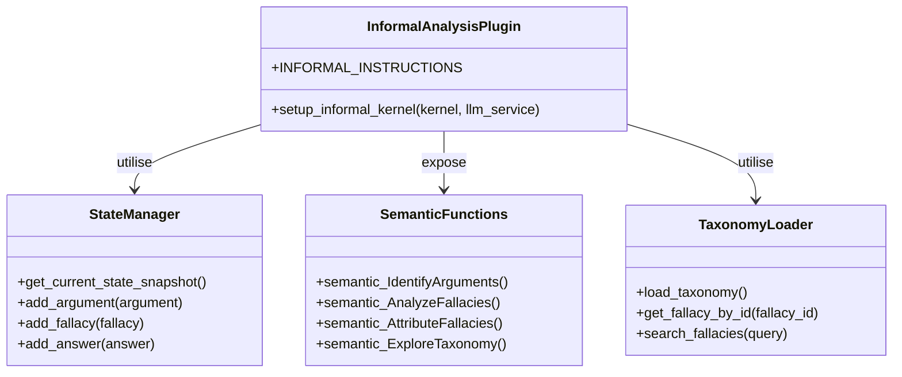
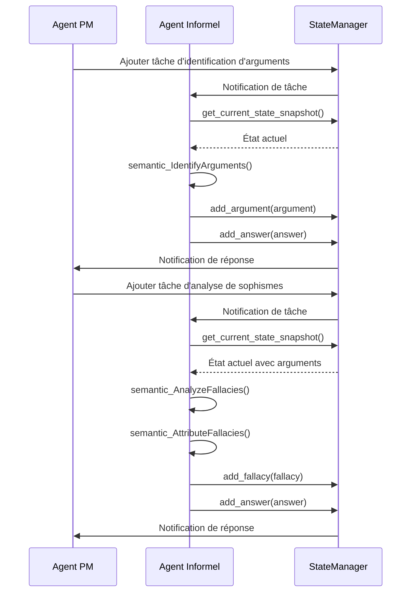

# API de l'Agent d'Analyse Informelle

## Introduction

L'Agent d'Analyse Informelle est un composant spécialisé du système d'analyse argumentative, responsable de l'identification des arguments et de l'analyse des sophismes dans un texte. Il constitue une étape cruciale dans le processus d'analyse, fournissant une compréhension approfondie de la structure argumentative et des potentielles faiblesses logiques.

## Rôle et Responsabilités

L'Agent d'Analyse Informelle a plusieurs responsabilités clés :

1. **Identification des arguments** : Repérer et extraire les arguments principaux d'un texte.
2. **Exploration de la taxonomie des sophismes** : Naviguer dans la hiérarchie des sophismes pour identifier les catégories pertinentes.
3. **Analyse des sophismes** : Détecter les sophismes potentiels dans les arguments identifiés.
4. **Attribution de sophismes** : Associer des sophismes spécifiques à des arguments et justifier cette attribution.

## Architecture

L'Agent d'Analyse Informelle est implémenté comme un plugin Semantic Kernel qui expose plusieurs fonctions sémantiques pour l'analyse des arguments et des sophismes.



## Classes et Interfaces Principales

### InformalAnalysisPlugin

La classe principale qui encapsule les fonctionnalités de l'Agent d'Analyse Informelle.

```python
class InformalAnalysisPlugin:
    """
    Plugin pour l'agent d'analyse informelle.
    """
    
    def __init__(self, taxonomy_path=None):
        """
        Initialise une nouvelle instance du plugin d'analyse informelle.
        
        Args:
            taxonomy_path (str, optional): Chemin vers le fichier de taxonomie des sophismes.
                Si None, utilise le chemin par défaut.
        """
        self.taxonomy_loader = TaxonomyLoader(taxonomy_path)
        self.taxonomy = self.taxonomy_loader.load_taxonomy()
```

### Fonction de Configuration

```python
def setup_informal_kernel(kernel, llm_service):
    """
    Configure le kernel Semantic Kernel pour l'agent d'analyse informelle.
    
    Args:
        kernel: Le kernel Semantic Kernel à configurer
        llm_service: Le service LLM à utiliser
        
    Returns:
        tuple: Un tuple contenant (kernel, agent)
    """
```

## Méthodes Publiques

### semantic_IdentifyArguments

```python
async def semantic_IdentifyArguments(text, context=None):
    """
    Identifie les arguments principaux dans un texte.
    
    Cette fonction analyse un texte pour en extraire les arguments principaux,
    en identifiant les prémisses et les conclusions.
    
    Args:
        text (str): Le texte à analyser
        context (dict, optional): Contexte supplémentaire pour l'analyse
        
    Returns:
        dict: Un dictionnaire contenant les arguments identifiés
        
    Exemple de retour:
    {
        "arguments": [
            {
                "id": "arg-1",
                "premises": ["Tous les hommes sont mortels", "Socrate est un homme"],
                "conclusion": "Socrate est mortel",
                "structure": "déductif",
                "confidence": 0.95
            }
        ],
        "reasoning": "Le texte présente un syllogisme classique..."
    }
    """
```

### semantic_AnalyzeFallacies

```python
async def semantic_AnalyzeFallacies(arguments, context=None):
    """
    Analyse les arguments pour détecter des sophismes potentiels.
    
    Cette fonction examine les arguments fournis pour identifier
    des sophismes potentiels selon la taxonomie établie.
    
    Args:
        arguments (list): Liste des arguments à analyser
        context (dict, optional): Contexte supplémentaire pour l'analyse
        
    Returns:
        dict: Un dictionnaire contenant les sophismes détectés
        
    Exemple de retour:
    {
        "fallacies": [
            {
                "id": "fallacy-1",
                "argument_id": "arg-2",
                "type": "ad_hominem",
                "description": "Attaque personnelle plutôt que réfutation de l'argument",
                "confidence": 0.85,
                "justification": "L'argument attaque la personne plutôt que ses idées..."
            }
        ],
        "reasoning": "L'analyse révèle plusieurs instances de sophismes..."
    }
    """
```

### semantic_AttributeFallacies

```python
async def semantic_AttributeFallacies(arguments, fallacies, context=None):
    """
    Attribue des sophismes spécifiques à des arguments identifiés.
    
    Cette fonction associe les sophismes détectés aux arguments correspondants
    et fournit une justification détaillée pour chaque attribution.
    
    Args:
        arguments (list): Liste des arguments identifiés
        fallacies (list): Liste des sophismes détectés
        context (dict, optional): Contexte supplémentaire pour l'analyse
        
    Returns:
        dict: Un dictionnaire contenant les attributions de sophismes
        
    Exemple de retour:
    {
        "attributions": [
            {
                "argument_id": "arg-2",
                "fallacy_id": "fallacy-1",
                "justification": "Cet argument est un ad hominem car...",
                "severity": "high",
                "impact": "Diminue significativement la force de l'argument"
            }
        ],
        "reasoning": "L'attribution des sophismes est basée sur..."
    }
    """
```

### semantic_ExploreTaxonomy

```python
async def semantic_ExploreTaxonomy(query, context=None):
    """
    Explore la taxonomie des sophismes pour trouver des catégories pertinentes.
    
    Cette fonction recherche dans la taxonomie des sophismes pour trouver
    des catégories qui correspondent à la requête fournie.
    
    Args:
        query (str): La requête de recherche
        context (dict, optional): Contexte supplémentaire pour la recherche
        
    Returns:
        dict: Un dictionnaire contenant les résultats de la recherche
        
    Exemple de retour:
    {
        "results": [
            {
                "id": "ad_hominem",
                "name": "Argumentum ad Hominem",
                "description": "Attaque personnelle plutôt que réfutation de l'argument",
                "examples": ["X est une mauvaise personne, donc son argument est invalide"],
                "subcategories": ["ad_hominem_abusive", "ad_hominem_circumstantial"]
            }
        ],
        "reasoning": "La requête correspond à la catégorie ad hominem..."
    }
    """
```

## Taxonomie des Sophismes

L'Agent d'Analyse Informelle utilise une taxonomie détaillée des sophismes, stockée dans un fichier CSV externe. Cette taxonomie est chargée via l'utilitaire `TaxonomyLoader` et fournit une hiérarchie structurée des différents types de sophismes.

La taxonomie inclut pour chaque sophisme :
- Un identifiant unique
- Un nom (en français et en latin si applicable)
- Une description détaillée
- Des exemples typiques
- Des catégories et sous-catégories
- Des mots-clés associés

## Interactions avec le StateManager

L'Agent d'Analyse Informelle interagit avec le système via le `StateManager`, qui lui permet de :

1. **Obtenir l'état actuel** : `StateManager.get_current_state_snapshot()`
2. **Ajouter des arguments** : `StateManager.add_argument(argument)`
3. **Ajouter des sophismes** : `StateManager.add_fallacy(fallacy)`
4. **Répondre aux tâches** : `StateManager.add_answer(answer)`

## Flux de Travail Typique



## Exemples d'Utilisation

### Initialisation de l'Agent Informel

```python
import asyncio
from core.llm_service import create_llm_service
from agents.core.informal.informal_definitions import setup_informal_kernel

async def main():
    # Créer le service LLM
    llm_service = create_llm_service()
    
    # Initialiser l'agent informel
    kernel, informal_agent = await setup_informal_kernel(kernel, llm_service)
    
    # Utiliser l'agent informel...
    
asyncio.run(main())
```

### Identification des Arguments

```python
# Texte à analyser
text = """
Tous les hommes sont mortels.
Socrate est un homme.
Donc, Socrate est mortel.
"""

# Identifier les arguments
result = await kernel.invoke_semantic_function(
    "Informal",
    "IdentifyArguments",
    {"text": text}
)

# Analyser le résultat
arguments_result = json.loads(result)

# Ajouter les arguments à l'état
for argument in arguments_result["arguments"]:
    state_manager.add_argument(argument)
```

### Analyse des Sophismes

```python
# Obtenir les arguments de l'état
state_snapshot = state_manager.get_current_state_snapshot()
arguments = state_snapshot["arguments"]

# Analyser les sophismes
result = await kernel.invoke_semantic_function(
    "Informal",
    "AnalyzeFallacies",
    {"arguments": json.dumps(arguments)}
)

# Analyser le résultat
fallacies_result = json.loads(result)

# Ajouter les sophismes à l'état
for fallacy in fallacies_result["fallacies"]:
    state_manager.add_fallacy(fallacy)
```

## Bonnes Pratiques

1. **Fournir un contexte suffisant** pour l'analyse des arguments et des sophismes.
2. **Vérifier la taxonomie des sophismes** pour s'assurer qu'elle est à jour et complète.
3. **Utiliser des seuils de confiance appropriés** pour filtrer les résultats incertains.
4. **Justifier clairement l'attribution des sophismes** pour faciliter la compréhension.
5. **Combiner l'analyse informelle avec l'analyse formelle** pour une compréhension plus complète.

## Limitations

1. La détection des sophismes dépend de la qualité de la taxonomie et des instructions fournies.
2. L'agent peut avoir des difficultés avec des arguments très complexes ou ambigus.
3. La qualité de l'analyse dépend de la qualité du modèle LLM sous-jacent.
4. Certains sophismes subtils ou contextuels peuvent être difficiles à détecter automatiquement.

## Voir aussi

- [Vue d'ensemble des agents](./README.md)
- [API de l'Agent PM](./pm_agent_api.md)
- [API de l'Agent PL](./pl_agent_api.md)
- [API de l'Agent Extract](./extract_agent_api.md)
- [API d'Orchestration](../orchestration/README.md)