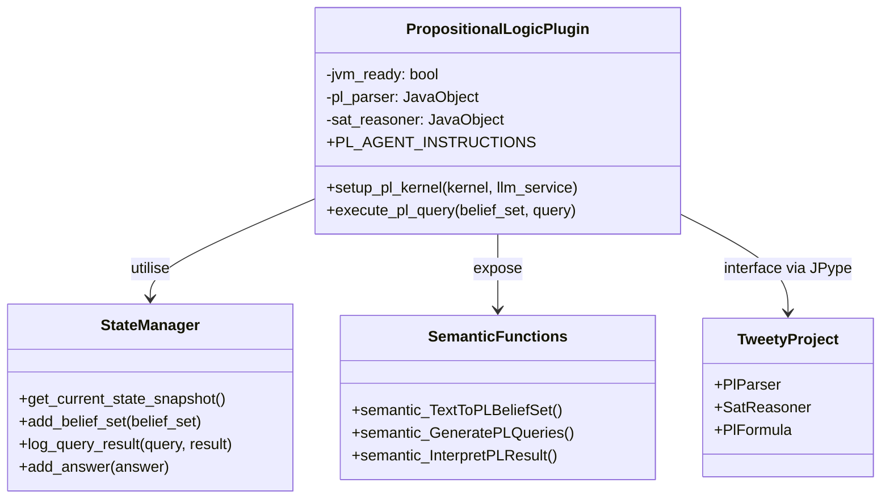
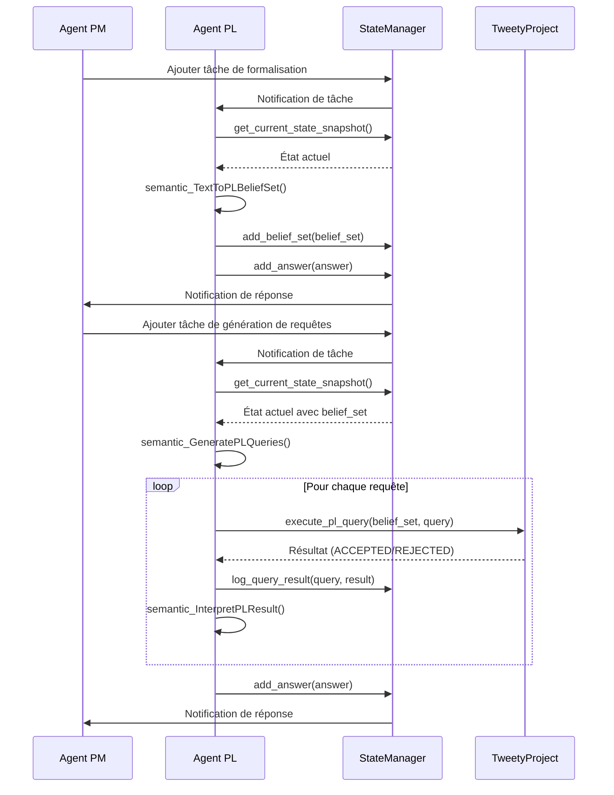

# API de l'Agent de Logique Propositionnelle (PL)

## Introduction

L'Agent de Logique Propositionnelle (PL) est un composant spécialisé du système d'analyse argumentative, responsable de la formalisation logique des arguments et de la vérification de leur validité. Il utilise la bibliothèque Java [TweetyProject](https://tweetyproject.org/) via [JPype](https://jpype.readthedocs.io/) pour effectuer des raisonnements en logique propositionnelle.

## Rôle et Responsabilités

L'Agent PL a plusieurs responsabilités clés :

1. **Formalisation** : Traduire des extraits de texte ou des arguments en ensembles de croyances (Belief Sets) en logique propositionnelle.
2. **Génération de requêtes** : Créer des requêtes logiques pertinentes pour interroger les ensembles de croyances.
3. **Exécution de requêtes** : Utiliser le raisonneur SAT de Tweety pour déterminer si une requête est une conséquence logique d'un ensemble de croyances.
4. **Interprétation** : Traduire les résultats bruts des requêtes en langage naturel compréhensible.

## Prérequis Techniques

L'Agent PL nécessite une JVM correctement initialisée via `core.jvm_setup.initialize_jvm()`. Cette initialisation requiert :
- Un JDK version 11 ou supérieure
- La variable d'environnement `JAVA_HOME` correctement configurée

## Architecture

L'Agent PL est implémenté comme un plugin Semantic Kernel qui expose plusieurs fonctions sémantiques et natives pour la formalisation logique et le raisonnement.



## Classes et Interfaces Principales

### PropositionalLogicPlugin

La classe principale qui encapsule les fonctionnalités de l'Agent PL et gère l'interface avec Tweety via JPype.

```python
class PropositionalLogicPlugin:
    """
    Plugin pour l'agent de logique propositionnelle.
    """
    
    def __init__(self):
        """
        Initialise une nouvelle instance du plugin de logique propositionnelle.
        """
        self.jvm_ready = False
        self.pl_parser = None
        self.sat_reasoner = None
        self._initialize_components()
    
    def _initialize_components(self):
        """
        Initialise les composants Java nécessaires si la JVM est prête.
        """
        try:
            import jpype
            if jpype.isJVMStarted():
                self.jvm_ready = True
                # Charger les classes Java nécessaires
                self.pl_parser = jpype.JClass("net.sf.tweety.logics.pl.parser.PlParser")()
                self.sat_reasoner = jpype.JClass("net.sf.tweety.logics.pl.sat.SatReasoner")()
        except Exception as e:
            print(f"Erreur lors de l'initialisation des composants Java: {e}")
            self.jvm_ready = False
```

### Fonction de Configuration

```python
def setup_pl_kernel(kernel, llm_service):
    """
    Configure le kernel Semantic Kernel pour l'agent de logique propositionnelle.
    
    Args:
        kernel: Le kernel Semantic Kernel à configurer
        llm_service: Le service LLM à utiliser
        
    Returns:
        tuple: Un tuple contenant (kernel, agent)
        
    Raises:
        RuntimeError: Si la JVM n'est pas initialisée correctement
    """
```

## Méthodes Publiques

### semantic_TextToPLBeliefSet

```python
async def semantic_TextToPLBeliefSet(text, context=None):
    """
    Traduit un texte en un ensemble de croyances en logique propositionnelle.
    
    Cette fonction analyse un texte pour en extraire les propositions logiques
    et les formalise selon la syntaxe de Tweety.
    
    Args:
        text (str): Le texte à formaliser
        context (dict, optional): Contexte supplémentaire pour la formalisation
        
    Returns:
        dict: Un dictionnaire contenant l'ensemble de croyances formalisé
        
    Exemple de retour:
    {
        "belief_set": "mortal(X) && human(X) => mortal(X)\nhuman(socrates)\n",
        "propositions": [
            {
                "natural": "Tous les hommes sont mortels",
                "formal": "mortal(X) && human(X) => mortal(X)"
            },
            {
                "natural": "Socrate est un homme",
                "formal": "human(socrates)"
            }
        ],
        "reasoning": "Le texte présente un syllogisme classique..."
    }
    """
```

### semantic_GeneratePLQueries

```python
async def semantic_GeneratePLQueries(belief_set, context=None):
    """
    Génère des requêtes logiques pertinentes pour un ensemble de croyances.
    
    Cette fonction analyse un ensemble de croyances et génère des requêtes
    logiques pertinentes pour interroger cet ensemble.
    
    Args:
        belief_set (str): L'ensemble de croyances en logique propositionnelle
        context (dict, optional): Contexte supplémentaire pour la génération
        
    Returns:
        dict: Un dictionnaire contenant les requêtes générées
        
    Exemple de retour:
    {
        "queries": [
            {
                "query": "mortal(socrates)",
                "description": "Socrate est-il mortel?",
                "relevance": "Teste la conclusion du syllogisme"
            },
            {
                "query": "human(socrates) => mortal(socrates)",
                "description": "Si Socrate est un homme, est-il mortel?",
                "relevance": "Teste l'implication directe"
            }
        ],
        "reasoning": "Ces requêtes testent les principales implications..."
    }
    """
```

### semantic_InterpretPLResult

```python
async def semantic_InterpretPLResult(belief_set, query, result, context=None):
    """
    Interprète le résultat d'une requête logique en langage naturel.
    
    Cette fonction traduit le résultat brut d'une requête logique
    (ACCEPTED/REJECTED) en une explication en langage naturel.
    
    Args:
        belief_set (str): L'ensemble de croyances utilisé
        query (str): La requête logique exécutée
        result (str): Le résultat brut de la requête
        context (dict, optional): Contexte supplémentaire pour l'interprétation
        
    Returns:
        dict: Un dictionnaire contenant l'interprétation du résultat
        
    Exemple de retour:
    {
        "interpretation": "La requête 'Socrate est mortel' est une conséquence logique de l'ensemble de croyances.",
        "explanation": "Puisque tous les hommes sont mortels (prémisse 1) et Socrate est un homme (prémisse 2), il s'ensuit logiquement que Socrate est mortel.",
        "validity": "valid",
        "confidence": "high"
    }
    """
```

### execute_pl_query (Méthode Native)

```python
def execute_pl_query(self, belief_set, query):
    """
    Exécute une requête logique sur un ensemble de croyances.
    
    Cette méthode native utilise le raisonneur SAT de Tweety pour déterminer
    si une requête est une conséquence logique d'un ensemble de croyances.
    
    Args:
        belief_set (str): L'ensemble de croyances en logique propositionnelle
        query (str): La requête logique à exécuter
        
    Returns:
        str: Le résultat de la requête ("ACCEPTED", "REJECTED" ou "ERROR")
        
    Raises:
        RuntimeError: Si la JVM n'est pas initialisée correctement
        ValueError: Si la syntaxe de l'ensemble de croyances ou de la requête est invalide
    """
```

## Syntaxe BNF de Tweety

L'Agent PL utilise la syntaxe spécifique de Tweety pour les formules logiques. Il est crucial de respecter cette syntaxe pour que les formules soient correctement interprétées par le raisonneur.

```bnf
FORMULASET ::== FORMULA ( "\n" FORMULA )*
FORMULA ::== PROPOSITION | "(" FORMULA ")" | FORMULA ">>" FORMULA |
             FORMULA "||" FORMULA | FORMULA "=>" FORMULA | FORMULA "<=>" FORMULA |
             FORMULA "^^" FORMULA | "!" FORMULA | "+" | "-"
PROPOSITION is a sequence of characters excluding |,&,!,(),=,<,> and whitespace.
```

### Opérateurs Logiques

| Opérateur | Description | Exemple |
|-----------|-------------|---------|
| `!` | Négation | `!p` (non p) |
| `||` | Disjonction | `p || q` (p ou q) |
| `=>` | Implication | `p => q` (si p alors q) |
| `<=>` | Équivalence | `p <=> q` (p si et seulement si q) |
| `^^` | Disjonction exclusive | `p ^^ q` (p ou q mais pas les deux) |

**Important** : Utilisez `||` au lieu de `&&` pour la conjonction, et évitez d'utiliser `>>` qui n'est pas supporté par Tweety.

## Interactions avec le StateManager

L'Agent PL interagit avec le système via le `StateManager`, qui lui permet de :

1. **Obtenir l'état actuel** : `StateManager.get_current_state_snapshot()`
2. **Ajouter des ensembles de croyances** : `StateManager.add_belief_set(belief_set)`
3. **Enregistrer les résultats des requêtes** : `StateManager.log_query_result(query, result)`
4. **Répondre aux tâches** : `StateManager.add_answer(answer)`

## Flux de Travail Typique



## Exemples d'Utilisation

### Initialisation de l'Agent PL

```python
import asyncio
from core.jvm_setup import initialize_jvm
from core.llm_service import create_llm_service
from agents.core.pl.pl_definitions import setup_pl_kernel

async def main():
    # Initialiser la JVM
    initialize_jvm()
    
    # Créer le service LLM
    llm_service = create_llm_service()
    
    # Initialiser l'agent PL
    kernel, pl_agent = await setup_pl_kernel(kernel, llm_service)
    
    # Utiliser l'agent PL...
    
asyncio.run(main())
```

### Formalisation d'un Argument

```python
# Texte à formaliser
text = """
Tous les hommes sont mortels.
Socrate est un homme.
Donc, Socrate est mortel.
"""

# Formaliser l'argument
result = await kernel.invoke_semantic_function(
    "PL",
    "TextToPLBeliefSet",
    {"text": text}
)

# Analyser le résultat
belief_set_result = json.loads(result)

# Ajouter l'ensemble de croyances à l'état
state_manager.add_belief_set({
    "id": "belief-set-1",
    "content": belief_set_result["belief_set"],
    "propositions": belief_set_result["propositions"]
})
```

### Exécution de Requêtes Logiques

```python
# Obtenir l'ensemble de croyances de l'état
state_snapshot = state_manager.get_current_state_snapshot()
belief_set = state_snapshot["belief_sets"][0]["content"]

# Générer des requêtes
result = await kernel.invoke_semantic_function(
    "PL",
    "GeneratePLQueries",
    {"belief_set": belief_set}
)

# Analyser le résultat
queries_result = json.loads(result)

# Exécuter chaque requête
for query_info in queries_result["queries"]:
    query = query_info["query"]
    
    # Exécuter la requête via la méthode native
    pl_plugin = kernel.get_plugin("PL")
    query_result = pl_plugin.execute_pl_query(belief_set, query)
    
    # Enregistrer le résultat
    state_manager.log_query_result(query, query_result)
    
    # Interpréter le résultat
    interpretation_result = await kernel.invoke_semantic_function(
        "PL",
        "InterpretPLResult",
        {
            "belief_set": belief_set,
            "query": query,
            "result": query_result
        }
    )
    
    # Analyser l'interprétation
    interpretation = json.loads(interpretation_result)
    print(f"Interprétation: {interpretation['interpretation']}")
```

## Bonnes Pratiques

1. **Toujours vérifier que la JVM est correctement initialisée** avant d'utiliser l'Agent PL.
2. **Respecter strictement la syntaxe BNF de Tweety** pour les formules logiques.
3. **Utiliser les opérateurs corrects** (`||` au lieu de `&&`, `=>` au lieu de `>>`).
4. **Gérer les erreurs de syntaxe** qui peuvent survenir lors de la formalisation ou de l'exécution des requêtes.
5. **Fournir des interprétations claires** des résultats logiques pour faciliter la compréhension.

## Limitations

1. L'Agent PL ne peut traiter que la logique propositionnelle, pas la logique du premier ordre complète.
2. La formalisation automatique peut être imprécise pour des arguments complexes ou ambigus.
3. La dépendance à la JVM peut causer des problèmes de compatibilité sur certains systèmes.
4. Les performances peuvent être limitées pour des ensembles de croyances très grands ou complexes.

## Voir aussi

- [Vue d'ensemble des agents](./README.md)
- [API de l'Agent PM](./pm_agent_api.md)
- [API de l'Agent Informel](./informal_agent_api.md)
- [API de l'Agent Extract](./extract_agent_api.md)
- [Documentation de TweetyProject](https://tweetyproject.org/doc/)
- [Documentation de JPype](https://jpype.readthedocs.io/)