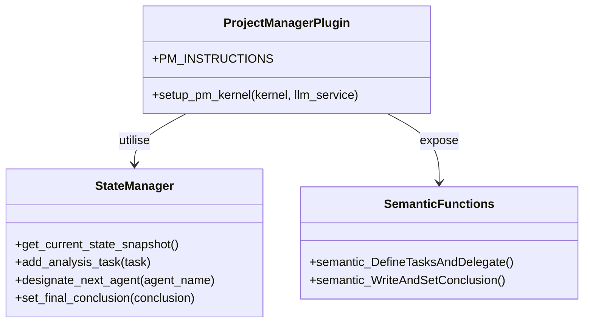
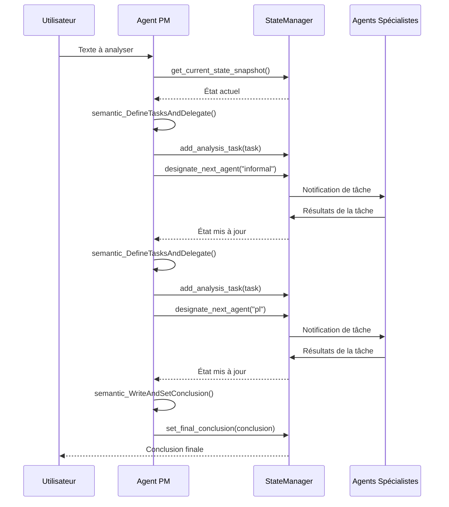

# API de l'Agent Project Manager (PM)

## Introduction

L'Agent Project Manager (PM) est le composant central du système d'analyse argumentative, responsable de l'orchestration globale du processus d'analyse. Il agit comme un chef d'orchestre qui coordonne les activités des autres agents spécialisés, planifie les étapes d'analyse et synthétise les résultats.

## Rôle et Responsabilités

L'Agent PM a plusieurs responsabilités clés :

1. **Analyse de la demande** : Comprendre la demande initiale et déterminer les étapes d'analyse nécessaires.
2. **Planification** : Définir une séquence logique d'étapes d'analyse (Arguments → Sophismes → Traduction PL → Requêtes PL → Conclusion).
3. **Délégation** : Assigner des tâches spécifiques aux agents spécialistes appropriés.
4. **Suivi** : Surveiller l'avancement de l'analyse et vérifier quelles tâches ont été accomplies.
5. **Synthèse** : Intégrer les résultats des différents agents et formuler une conclusion finale.

## Architecture

L'Agent PM est implémenté comme un plugin Semantic Kernel qui expose plusieurs fonctions sémantiques pour interagir avec les autres composants du système.



## Classes et Interfaces Principales

### ProjectManagerPlugin

La classe principale qui encapsule les fonctionnalités de l'Agent PM.

```python
class ProjectManagerPlugin:
    """
    Plugin pour l'agent Project Manager.
    """
    
    def __init__(self):
        """
        Initialise une nouvelle instance du plugin Project Manager.
        """
        pass
```

### Fonction de Configuration

```python
def setup_pm_kernel(kernel, llm_service):
    """
    Configure le kernel Semantic Kernel pour l'agent Project Manager.
    
    Args:
        kernel: Le kernel Semantic Kernel à configurer
        llm_service: Le service LLM à utiliser
        
    Returns:
        tuple: Un tuple contenant (kernel, agent)
    """
```

## Méthodes Publiques

### semantic_DefineTasksAndDelegate

```python
async def semantic_DefineTasksAndDelegate(state_snapshot):
    """
    Définit les tâches d'analyse et délègue aux agents appropriés.
    
    Cette fonction analyse l'état actuel du système, détermine les prochaines
    étapes logiques, et définit des tâches spécifiques pour les agents spécialistes.
    
    Args:
        state_snapshot (dict): Un instantané de l'état actuel du système
        
    Returns:
        dict: Un dictionnaire contenant les tâches définies et l'agent désigné
        
    Exemple de retour:
    {
        "tasks": [
            {
                "id": "task-1",
                "description": "Identifier les arguments principaux dans le texte",
                "agent": "informal"
            }
        ],
        "designated_agent": "informal",
        "reasoning": "L'agent informel est le plus approprié pour identifier les arguments..."
    }
    """
```

### semantic_WriteAndSetConclusion

```python
async def semantic_WriteAndSetConclusion(state_snapshot):
    """
    Synthétise les résultats et formule une conclusion finale.
    
    Cette fonction analyse les résultats des différentes étapes d'analyse
    et formule une conclusion globale qui résume les principales découvertes.
    
    Args:
        state_snapshot (dict): Un instantané de l'état actuel du système
        
    Returns:
        dict: Un dictionnaire contenant la conclusion finale
        
    Exemple de retour:
    {
        "conclusion": "L'analyse révèle que le texte contient plusieurs sophismes...",
        "key_findings": [
            "Présence de trois arguments ad hominem",
            "Structure logique invalide dans l'argument principal"
        ],
        "confidence": "high"
    }
    """
```

## Interactions avec le StateManager

L'Agent PM interagit principalement avec le système via le `StateManager`, qui lui permet de :

1. **Obtenir l'état actuel** : `StateManager.get_current_state_snapshot()`
2. **Ajouter des tâches** : `StateManager.add_analysis_task(task)`
3. **Désigner l'agent suivant** : `StateManager.designate_next_agent(agent_name)`
4. **Définir la conclusion finale** : `StateManager.set_final_conclusion(conclusion)`

## Flux de Travail Typique



## Exemples d'Utilisation

### Initialisation de l'Agent PM

```python
import asyncio
from core.llm_service import create_llm_service
from agents.core.pm.pm_definitions import setup_pm_kernel

async def main():
    # Créer le service LLM
    llm_service = create_llm_service()
    
    # Initialiser l'agent PM
    kernel, pm_agent = await setup_pm_kernel(kernel, llm_service)
    
    # Utiliser l'agent PM...
    
asyncio.run(main())
```

### Délégation de Tâches

```python
# Obtenir l'état actuel
state_snapshot = state_manager.get_current_state_snapshot()

# Définir les tâches et déléguer
result = await kernel.invoke_semantic_function(
    "PM",
    "DefineTasksAndDelegate",
    {"state_snapshot": json.dumps(state_snapshot)}
)

# Analyser le résultat
tasks_result = json.loads(result)

# Ajouter les tâches à l'état
for task in tasks_result["tasks"]:
    state_manager.add_analysis_task(task)

# Désigner l'agent suivant
state_manager.designate_next_agent(tasks_result["designated_agent"])
```

### Formulation de la Conclusion

```python
# Obtenir l'état actuel
state_snapshot = state_manager.get_current_state_snapshot()

# Vérifier si toutes les tâches sont terminées
all_tasks_completed = all(task["status"] == "completed" for task in state_snapshot["tasks"])

if all_tasks_completed:
    # Formuler la conclusion finale
    result = await kernel.invoke_semantic_function(
        "PM",
        "WriteAndSetConclusion",
        {"state_snapshot": json.dumps(state_snapshot)}
    )
    
    # Analyser le résultat
    conclusion_result = json.loads(result)
    
    # Définir la conclusion finale
    state_manager.set_final_conclusion(conclusion_result["conclusion"])
```

## Séquence Idéale d'Analyse

L'Agent PM suit généralement cette séquence idéale pour l'analyse argumentative :

1. **Extraction** : Identifier les segments pertinents du texte (Agent Extract)
2. **Identification des Arguments** : Repérer les arguments principaux (Agent Informal)
3. **Analyse des Sophismes** : Détecter et classifier les sophismes (Agent Informal)
4. **Formalisation Logique** : Traduire les arguments en logique propositionnelle (Agent PL)
5. **Interrogation Logique** : Vérifier la validité logique des arguments (Agent PL)
6. **Conclusion** : Synthétiser les résultats et formuler une conclusion (Agent PM)

## Bonnes Pratiques

1. **Toujours vérifier l'état actuel** avant de définir de nouvelles tâches pour éviter les duplications.
2. **Suivre la séquence idéale** d'analyse pour garantir une progression logique.
3. **Fournir des descriptions de tâches claires et précises** pour les agents spécialistes.
4. **Vérifier que toutes les tâches sont terminées** avant de formuler la conclusion finale.
5. **Inclure un raisonnement explicite** pour justifier la délégation à un agent spécifique.

## Limitations

1. L'Agent PM ne peut pas exécuter lui-même des analyses spécialisées, il doit déléguer aux agents appropriés.
2. La qualité de l'orchestration dépend de la qualité des instructions système fournies.
3. L'Agent PM ne peut pas modifier directement les résultats des autres agents, il peut seulement les synthétiser.

## Voir aussi

- [Vue d'ensemble des agents](./README.md)
- [API de l'Agent Informel](./informal_agent_api.md)
- [API de l'Agent PL](./pl_agent_api.md)
- [API de l'Agent Extract](./extract_agent_api.md)
- [API d'Orchestration](../orchestration/README.md)