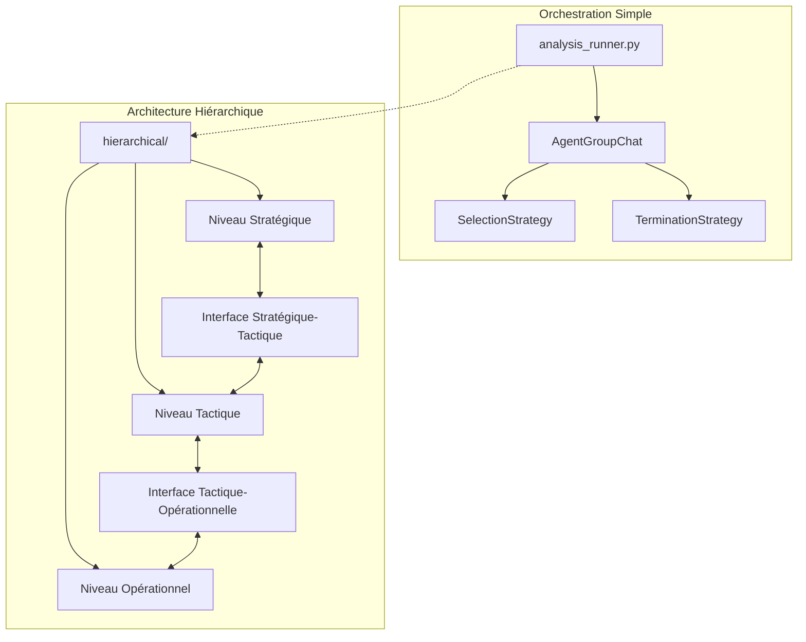
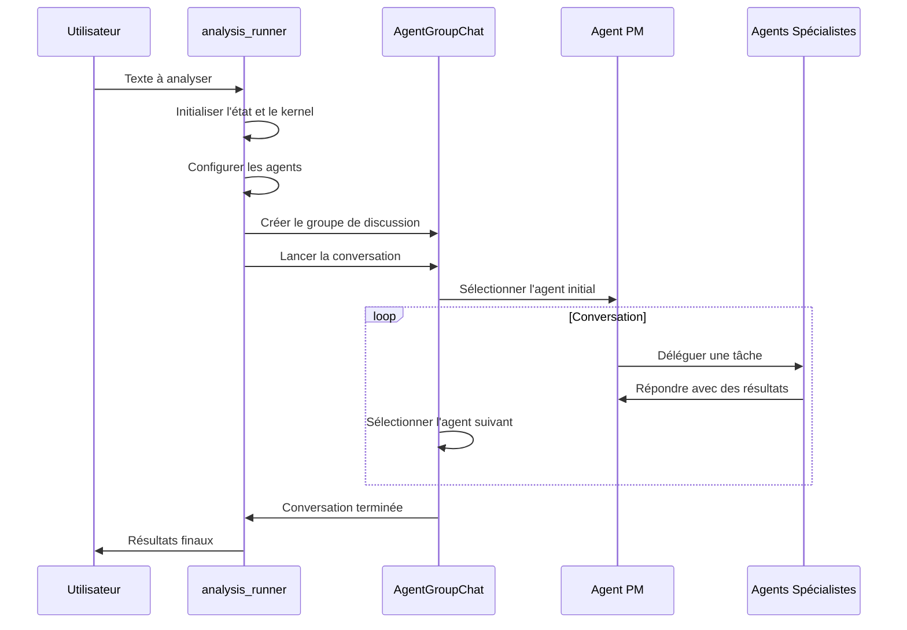
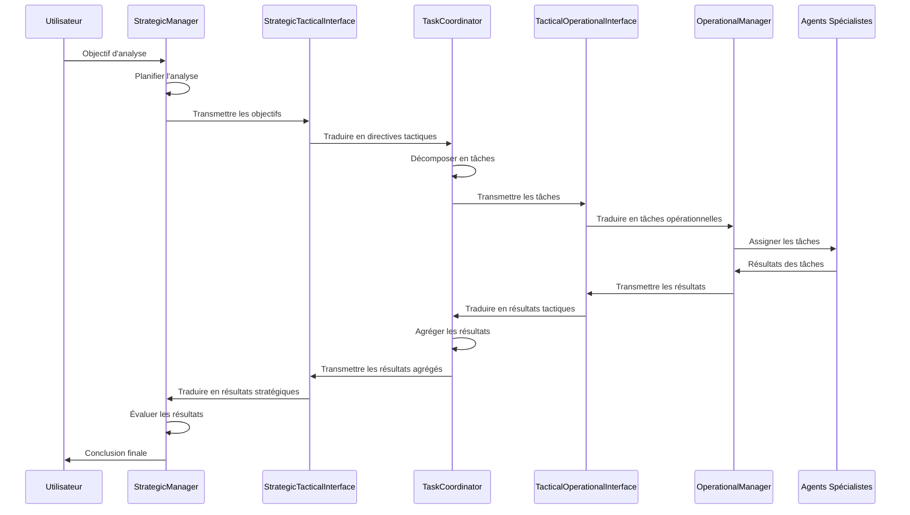

# API d'Orchestration

## Introduction

L'API d'Orchestration définit les interfaces et les composants responsables de la coordination des agents spécialistes dans le système d'analyse argumentative. Elle permet une collaboration efficace entre les différents agents et assure une progression logique du processus d'analyse.

## Vue d'ensemble

Le système d'orchestration est organisé selon deux approches principales :

1. **Orchestration Simple** : Implémentée dans `analysis_runner.py`, cette approche utilise un groupe de discussion d'agents (Agent Group Chat) avec des stratégies de sélection et de terminaison pour coordonner les interactions entre les agents.

2. **Architecture Hiérarchique** : Implémentée dans le dossier `hierarchical/`, cette approche plus sophistiquée organise le système en trois niveaux (stratégique, tactique, opérationnel) pour une meilleure séparation des responsabilités et une orchestration plus structurée.



## Composants Principaux

### Orchestration Simple

#### [analysis_runner.py](./analysis_runner.md)

Le module `analysis_runner.py` définit la fonction asynchrone principale `run_analysis_conversation(texte_a_analyser, llm_service)` qui :

- Crée des instances locales de l'état, du `StateManagerPlugin`, du `Kernel` et des agents
- Configure le kernel avec le service LLM et le `StateManagerPlugin`
- Initialise les agents et les stratégies d'orchestration
- Lance la conversation via `AgentGroupChat` et gère la boucle d'échanges
- Logue et affiche les tours de conversation et les résultats

### Architecture Hiérarchique

#### [Architecture Hiérarchique](./hierarchical_architecture_api.md)

L'architecture hiérarchique organise le système en trois niveaux distincts :

1. **[Niveau Stratégique](./strategic_level_api.md)** : Responsable de la planification globale, de l'allocation des ressources et des décisions de haut niveau.
   - `StrategicManager` : Coordonne les agents stratégiques
   - `ResourceAllocator` : Gère l'allocation des ressources
   - `StrategicPlanner` : Crée des plans d'analyse structurés

2. **[Niveau Tactique](./tactical_level_api.md)** : Responsable de la coordination des tâches, de la résolution des conflits et de la supervision des agents opérationnels.
   - `TaskCoordinator` : Décompose les objectifs en tâches et les assigne
   - `ProgressMonitor` : Suit l'avancement des tâches
   - `ConflictResolver` : Résout les contradictions dans les résultats

3. **[Niveau Opérationnel](./operational_level_api.md)** : Responsable de l'exécution des tâches spécifiques et de l'interaction directe avec les données.
   - `OperationalManager` : Interface entre le niveau tactique et les agents
   - `AgentRegistry` : Gère les agents disponibles et leur sélection
   - Adaptateurs pour les agents spécialistes

#### Interfaces entre Niveaux

- **Interface Stratégique-Tactique** : Assure la communication entre les niveaux stratégique et tactique
- **Interface Tactique-Opérationnelle** : Assure la communication entre les niveaux tactique et opérationnel

## Flux de Travail Typiques

### Orchestration Simple



### Architecture Hiérarchique



## Comparaison des Approches d'Orchestration

| Aspect | Orchestration Simple | Architecture Hiérarchique |
|--------|----------------------|---------------------------|
| **Complexité** | Faible à moyenne | Moyenne à élevée |
| **Séparation des responsabilités** | Limitée | Élevée |
| **Flexibilité** | Moyenne | Élevée |
| **Extensibilité** | Moyenne | Élevée |
| **Cas d'utilisation** | Analyses simples à moyennes | Analyses complexes |
| **Gestion des erreurs** | Basique | Avancée |
| **Parallélisme** | Limité | Élevé |

## Guide de Sélection de l'Approche

Pour choisir l'approche d'orchestration appropriée :

1. **Orchestration Simple** est recommandée pour :
   - Des analyses argumentatives simples à moyennes
   - Des projets avec peu d'agents spécialistes
   - Des cas où la simplicité est prioritaire sur la flexibilité

2. **Architecture Hiérarchique** est recommandée pour :
   - Des analyses argumentatives complexes
   - Des projets avec de nombreux agents spécialistes
   - Des cas nécessitant une planification stratégique et une coordination tactique
   - Des systèmes devant être hautement extensibles

## Exemples d'Utilisation

### Orchestration Simple

```python
import asyncio
from core.llm_service import create_llm_service
from orchestration.analysis_runner import run_analysis_conversation

async def main():
    # Créer le service LLM
    llm_service = create_llm_service()
    
    # Texte à analyser
    text = """
    Tous les hommes sont mortels.
    Socrate est un homme.
    Donc, Socrate est mortel.
    """
    
    # Exécuter l'analyse
    result = await run_analysis_conversation(
        texte_a_analyser=text,
        llm_service=llm_service
    )
    
    # Afficher les résultats
    print(f"Résultats: {result}")
    
asyncio.run(main())
```

### Architecture Hiérarchique

```python
import asyncio
from core.llm_service import create_llm_service
from orchestration.hierarchical.strategic.manager import StrategicManager
from orchestration.hierarchical.strategic.state import StrategicState
from orchestration.hierarchical.tactical.state import TacticalState
from orchestration.hierarchical.operational.state import OperationalState
from orchestration.hierarchical.interfaces.strategic_tactical import StrategicTacticalInterface
from orchestration.hierarchical.interfaces.tactical_operational import TacticalOperationalInterface

async def main():
    # Créer le service LLM
    llm_service = create_llm_service()
    
    # Initialiser les états
    strategic_state = StrategicState()
    tactical_state = TacticalState()
    operational_state = OperationalState()
    
    # Initialiser les interfaces
    st_interface = StrategicTacticalInterface(strategic_state, tactical_state)
    to_interface = TacticalOperationalInterface(tactical_state, operational_state)
    
    # Initialiser le gestionnaire stratégique
    strategic_manager = StrategicManager(strategic_state, st_interface)
    
    # Définir l'objectif d'analyse
    objective = {
        "type": "analyze_argumentation",
        "text": "Tous les hommes sont mortels. Socrate est un homme. Donc, Socrate est mortel.",
        "focus": "logical_validity",
        "depth": "comprehensive"
    }
    
    # Exécuter l'analyse
    await strategic_manager.set_objective(objective)
    await strategic_manager.execute()
    
    # Récupérer les résultats
    results = await strategic_manager.get_final_results()
    print(f"Résultats: {results}")
    
asyncio.run(main())
```

## Bonnes Pratiques

1. **Choisir l'approche appropriée** en fonction de la complexité de l'analyse et des besoins du projet.
2. **Utiliser des stratégies de sélection adaptées** pour l'orchestration simple.
3. **Définir clairement les responsabilités** de chaque niveau dans l'architecture hiérarchique.
4. **Gérer correctement les erreurs** à chaque niveau d'orchestration.
5. **Documenter les flux de communication** entre les différents composants.
6. **Tester l'orchestration** avec différents scénarios et combinaisons d'agents.

## Voir aussi

- [API des Agents](../agents/README.md)
- [API du Système de Communication](../reference_api.md)