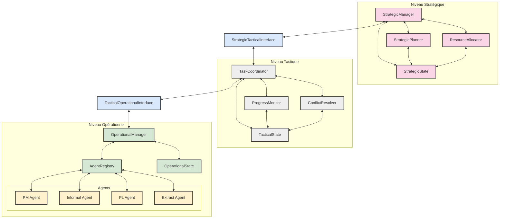
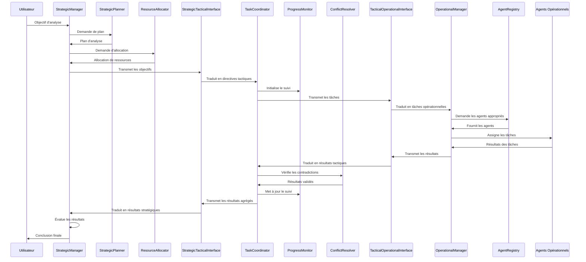

# API de l'Architecture Hiérarchique

## Introduction

L'Architecture Hiérarchique est une approche avancée d'orchestration qui organise le système d'analyse argumentative en trois niveaux distincts : stratégique, tactique et opérationnel. Cette architecture permet une séparation claire des responsabilités, une meilleure gestion de la complexité et une orchestration efficace du processus d'analyse.

## Vue d'ensemble

L'architecture hiérarchique s'inspire des principes de gestion organisationnelle pour structurer le système d'analyse argumentative :

1. **Niveau Stratégique** : Responsable de la planification globale, de l'allocation des ressources et des décisions de haut niveau.
2. **Niveau Tactique** : Responsable de la coordination des tâches, de la résolution des conflits et de la supervision des agents opérationnels.
3. **Niveau Opérationnel** : Responsable de l'exécution des tâches spécifiques et de l'interaction directe avec les données et les outils d'analyse.



## Structure du Répertoire

```
orchestration/hierarchical/
├── __init__.py
├── README.md
├── interfaces/
│   ├── __init__.py
│   ├── README.md
│   ├── strategic_tactical.py
│   └── tactical_operational.py
├── strategic/
│   ├── __init__.py
│   ├── README.md
│   ├── allocator.py
│   ├── manager.py
│   ├── planner.py
│   └── state.py
├── tactical/
│   ├── __init__.py
│   ├── README.md
│   ├── coordinator.py
│   ├── monitor.py
│   ├── resolver.py
│   └── state.py
├── operational/
│   ├── __init__.py
│   ├── README.md
│   ├── agent_interface.py
│   ├── agent_registry.py
│   ├── feedback_mechanism.py
│   ├── manager.py
│   ├── state.py
│   └── adapters/
│       ├── __init__.py
│       ├── extract_agent_adapter.py
│       ├── informal_agent_adapter.py
│       ├── pl_agent_adapter.py
│       └── README.md
└── templates/
    ├── agent_template.py
    ├── analysis_tool_template.py
    ├── analysis_type_template.py
    ├── README.md
    └── strategy_template.py
```

## Composants Principaux

### Interfaces entre Niveaux

#### [StrategicTacticalInterface](./strategic_level_api.md#strategictacticalinterface)

L'interface entre les niveaux stratégique et tactique est responsable de :

- Traduire les objectifs stratégiques en directives tactiques
- Transmettre le contexte global nécessaire au niveau tactique
- Remonter les rapports de progression du niveau tactique au niveau stratégique
- Remonter les résultats agrégés du niveau tactique au niveau stratégique

```python
class StrategicTacticalInterface:
    """
    Interface entre les niveaux stratégique et tactique.
    """
    
    def __init__(self, strategic_state, tactical_state, middleware=None):
        """
        Initialise une nouvelle interface stratégique-tactique.
        
        Args:
            strategic_state: L'état stratégique à utiliser
            tactical_state: L'état tactique à utiliser
            middleware: Le middleware de communication à utiliser
        """
        
    def translate_objectives(self, objectives):
        """
        Traduit les objectifs stratégiques en directives tactiques.
        
        Args:
            objectives: Liste des objectifs stratégiques
            
        Returns:
            Un dictionnaire contenant les directives tactiques
        """
```

#### [TacticalOperationalInterface](./tactical_level_api.md#tacticaloperationalinterface)

L'interface entre les niveaux tactique et opérationnel est responsable de :

- Traduire les tâches tactiques en tâches opérationnelles spécifiques
- Transmettre le contexte local nécessaire aux agents opérationnels
- Remonter les résultats d'analyse du niveau opérationnel au niveau tactique
- Remonter les métriques d'exécution du niveau opérationnel au niveau tactique

```python
class TacticalOperationalInterface:
    """
    Interface entre les niveaux tactique et opérationnel.
    """
    
    def __init__(self, tactical_state, operational_state, middleware=None):
        """
        Initialise une nouvelle interface tactique-opérationnelle.
        
        Args:
            tactical_state: L'état tactique à utiliser
            operational_state: L'état opérationnel à utiliser
            middleware: Le middleware de communication à utiliser
        """
        
    def translate_task(self, task):
        """
        Traduit une tâche tactique en tâche opérationnelle.
        
        Args:
            task: La tâche tactique à traduire
            
        Returns:
            Un dictionnaire contenant la tâche opérationnelle
        """
```

### Niveau Stratégique

#### [StrategicManager](./strategic_level_api.md#strategicmanager)

Le gestionnaire stratégique est l'agent principal du niveau stratégique, responsable de :

- La coordination globale entre les agents stratégiques
- L'interface principale avec l'utilisateur et le niveau tactique
- La prise de décisions finales concernant la stratégie d'analyse
- L'évaluation des résultats finaux et la formulation de la conclusion globale

```python
class StrategicManager:
    """
    Gestionnaire du niveau stratégique.
    """
    
    def __init__(self, strategic_state, strategic_tactical_interface):
        """
        Initialise un nouveau gestionnaire stratégique.
        
        Args:
            strategic_state: L'état stratégique à utiliser
            strategic_tactical_interface: L'interface stratégique-tactique à utiliser
        """
        
    async def set_objective(self, objective):
        """
        Définit l'objectif global de l'analyse.
        
        Args:
            objective: L'objectif à définir
            
        Returns:
            bool: True si l'objectif a été défini avec succès
        """
        
    async def execute(self):
        """
        Exécute le processus d'analyse stratégique.
        
        Returns:
            dict: Les résultats de l'analyse
        """
        
    async def get_final_results(self):
        """
        Récupère les résultats finaux de l'analyse.
        
        Returns:
            dict: Les résultats finaux
        """
```

#### [ResourceAllocator](./strategic_level_api.md#resourceallocator)

L'allocateur de ressources est responsable de la gestion des ressources du système, notamment :

- Gérer l'allocation des ressources computationnelles et cognitives
- Déterminer quels agents opérationnels doivent être activés
- Établir les priorités entre les différentes tâches d'analyse

#### [StrategicPlanner](./strategic_level_api.md#strategicplanner)

Le planificateur stratégique est spécialisé dans la création de plans d'analyse structurés :

- Créer des plans d'analyse structurés
- Décomposer les objectifs globaux en sous-objectifs cohérents
- Établir les dépendances entre les différentes parties de l'analyse

### Niveau Tactique

#### [TaskCoordinator](./tactical_level_api.md#taskcoordinator)

Le coordinateur de tâches est le composant central du niveau tactique, responsable de :

- Décomposer les objectifs stratégiques en tâches opérationnelles spécifiques
- Assigner les tâches aux agents opérationnels appropriés
- Gérer les dépendances entre les tâches et leur ordonnancement
- Adapter dynamiquement le plan d'exécution en fonction des résultats intermédiaires

```python
class TaskCoordinator:
    """
    Coordinateur de tâches du niveau tactique.
    """
    
    def __init__(self, tactical_state, strategic_tactical_interface, tactical_operational_interface):
        """
        Initialise un nouveau coordinateur de tâches.
        
        Args:
            tactical_state: L'état tactique à utiliser
            strategic_tactical_interface: L'interface stratégique-tactique à utiliser
            tactical_operational_interface: L'interface tactique-opérationnelle à utiliser
        """
        
    def decompose_objective(self, objective):
        """
        Décompose un objectif stratégique en tâches tactiques.
        
        Args:
            objective: L'objectif stratégique à décomposer
            
        Returns:
            list: Liste des tâches tactiques
        """
        
    def assign_tasks(self, tasks):
        """
        Assigne des tâches aux agents opérationnels.
        
        Args:
            tasks: Liste des tâches à assigner
            
        Returns:
            dict: Résultat de l'assignation
        """
        
    def aggregate_results(self):
        """
        Agrège les résultats des tâches opérationnelles.
        
        Returns:
            dict: Résultats agrégés
        """
```

#### [ProgressMonitor](./tactical_level_api.md#progressmonitor)

Le moniteur de progression est responsable du suivi de l'avancement des tâches, notamment :

- Suivre l'avancement des tâches en temps réel
- Identifier les retards, blocages ou déviations
- Collecter les métriques de performance

#### [ConflictResolver](./tactical_level_api.md#conflictresolver)

Le résolveur de conflits est spécialisé dans la gestion des contradictions et incohérences :

- Détecter et analyser les contradictions dans les résultats
- Arbitrer entre différentes interprétations ou analyses
- Appliquer des heuristiques de résolution de conflits

### Niveau Opérationnel

#### [OperationalManager](./operational_level_api.md#operationalmanager)

Le gestionnaire opérationnel sert d'interface entre le niveau tactique et les agents opérationnels :

- Recevoir des tâches tactiques via l'interface tactique-opérationnelle
- Les traduire en tâches opérationnelles
- Les faire exécuter par les agents appropriés
- Renvoyer les résultats au niveau tactique

```python
class OperationalManager:
    """
    Gestionnaire du niveau opérationnel.
    """
    
    def __init__(self, operational_state, tactical_operational_interface):
        """
        Initialise un nouveau gestionnaire opérationnel.
        
        Args:
            operational_state: L'état opérationnel à utiliser
            tactical_operational_interface: L'interface tactique-opérationnelle à utiliser
        """
        
    async def start(self):
        """
        Démarre le gestionnaire opérationnel.
        
        Returns:
            bool: True si le démarrage a réussi
        """
        
    async def stop(self):
        """
        Arrête le gestionnaire opérationnel.
        
        Returns:
            bool: True si l'arrêt a réussi
        """
        
    async def process_tactical_task(self, task):
        """
        Traite une tâche tactique.
        
        Args:
            task: La tâche tactique à traiter
            
        Returns:
            dict: Le résultat du traitement
        """
```

#### [AgentRegistry](./operational_level_api.md#agentregistry)

Le registre d'agents gère les agents disponibles et sélectionne l'agent approprié pour une tâche donnée :

- Maintenir une liste des types d'agents disponibles
- Créer et initialiser les agents à la demande
- Sélectionner l'agent le plus approprié pour une tâche en fonction des capacités requises

#### [OperationalAgent](./operational_level_api.md#operationalagent)

L'interface commune que tous les agents opérationnels doivent implémenter :

```python
class OperationalAgent(ABC):
    """
    Interface abstraite pour les agents opérationnels.
    """
    
    @abstractmethod
    async def process_task(self, task):
        """
        Traite une tâche opérationnelle.
        
        Args:
            task: La tâche opérationnelle à traiter
            
        Returns:
            dict: Le résultat du traitement
        """
        pass
    
    @abstractmethod
    def get_capabilities(self):
        """
        Retourne les capacités de l'agent.
        
        Returns:
            list: Liste des capacités de l'agent
        """
        pass
    
    @abstractmethod
    def can_process_task(self, task):
        """
        Vérifie si l'agent peut traiter une tâche donnée.
        
        Args:
            task: La tâche à vérifier
            
        Returns:
            bool: True si l'agent peut traiter la tâche
        """
        pass
```

## États Partagés

Chaque niveau de l'architecture hiérarchique possède son propre état partagé qui encapsule les données pertinentes pour ce niveau :

### [StrategicState](./strategic_level_api.md#strategicstate)

L'état stratégique maintient les informations partagées entre les composants du niveau stratégique :

- Les objectifs globaux actuels
- L'état d'avancement des différentes parties du plan
- Les ressources disponibles et leur allocation
- Les résultats agrégés remontés du niveau tactique

### [TacticalState](./tactical_level_api.md#tacticalstate)

L'état tactique maintient les informations partagées entre les composants du niveau tactique :

- Les tâches actuelles et leur état d'avancement
- Les résultats intermédiaires des agents opérationnels
- Les métriques de performance et les indicateurs de progression
- Les conflits identifiés et leur statut de résolution

### [OperationalState](./operational_level_api.md#operationalstate)

L'état opérationnel maintient les informations partagées entre les composants du niveau opérationnel :

- Les tâches assignées
- Les extraits de texte à analyser
- Les résultats d'analyse
- Les problèmes rencontrés
- Les métriques opérationnelles
- Le journal des actions

## Flux de Travail Typique



## Exemples d'Utilisation

### Initialisation de l'Architecture Hiérarchique

```python
import asyncio
from core.llm_service import create_llm_service
from orchestration.hierarchical.strategic.state import StrategicState
from orchestration.hierarchical.tactical.state import TacticalState
from orchestration.hierarchical.operational.state import OperationalState
from orchestration.hierarchical.interfaces.strategic_tactical import StrategicTacticalInterface
from orchestration.hierarchical.interfaces.tactical_operational import TacticalOperationalInterface
from orchestration.hierarchical.strategic.manager import StrategicManager
from orchestration.hierarchical.tactical.coordinator import TaskCoordinator
from orchestration.hierarchical.operational.manager import OperationalManager

async def main():
    # Créer le service LLM
    llm_service = create_llm_service()
    
    # Initialiser les états
    strategic_state = StrategicState()
    tactical_state = TacticalState()
    operational_state = OperationalState()
    
    # Initialiser les interfaces
    st_interface = StrategicTacticalInterface(strategic_state, tactical_state)
    to_interface = TacticalOperationalInterface(tactical_state, operational_state)
    
    # Initialiser les gestionnaires
    strategic_manager = StrategicManager(strategic_state, st_interface)
    task_coordinator = TaskCoordinator(tactical_state, st_interface, to_interface)
    operational_manager = OperationalManager(operational_state, to_interface)
    
    # Démarrer les gestionnaires
    await operational_manager.start()
    
    # Utiliser l'architecture hiérarchique...
    
    # Arrêter les gestionnaires
    await operational_manager.stop()
    
asyncio.run(main())
```

### Exécution d'une Analyse Complète

```python
# Définir l'objectif d'analyse
objective = {
    "type": "analyze_argumentation",
    "text": "Tous les hommes sont mortels. Socrate est un homme. Donc, Socrate est mortel.",
    "focus": "logical_validity",
    "depth": "comprehensive"
}

# Définir l'objectif au niveau stratégique
await strategic_manager.set_objective(objective)

# Exécuter l'analyse
await strategic_manager.execute()

# Récupérer les résultats
results = await strategic_manager.get_final_results()
print(f"Résultats: {results}")
```

## Bonnes Pratiques

1. **Respecter la séparation des responsabilités** entre les différents niveaux de l'architecture.
2. **Utiliser les interfaces appropriées** pour la communication entre les niveaux.
3. **Maintenir des états cohérents** à chaque niveau de l'architecture.
4. **Gérer correctement les erreurs** à chaque niveau et les propager de manière appropriée.
5. **Documenter les flux de communication** entre les différents composants.
6. **Tester chaque niveau indépendamment** avant de les intégrer.

## Limitations

1. La complexité de l'architecture peut être excessive pour des analyses simples.
2. La communication entre les niveaux peut introduire une latence supplémentaire.
3. La maintenance de trois niveaux d'état peut être complexe.
4. L'architecture nécessite une bonne compréhension des principes de conception hiérarchique.

## Voir aussi

- [API du Niveau Stratégique](./strategic_level_api.md)
- [API du Niveau Tactique](./tactical_level_api.md)
- [API du Niveau Opérationnel](./operational_level_api.md)
- [API des Agents](../agents/README.md)
- [API du Système de Communication](../reference_api.md)