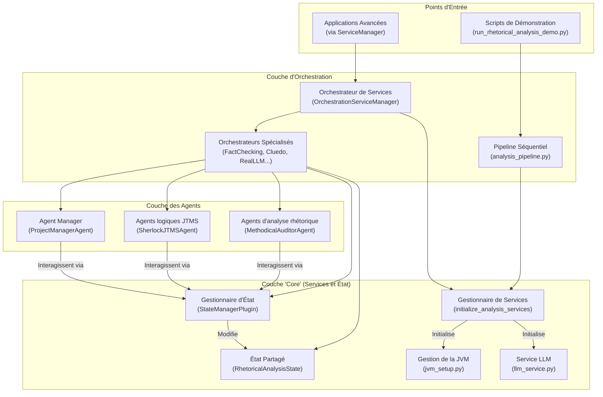

# Rapport d'Analyse Architecturale : Système d'Analyse Rhétorique Unifié

**Date:** 2025-08-22
**Auteur:** Roo, l'ingénieur IA

## 1. Introduction

Ce document présente une analyse architecturale complète du "Système d'Analyse Rhétorique Unifié" conformément à la méthodologie SDDD. L'analyse s'est basée sur une combinaison de recherche sémantique, d'étude de la documentation existante et d'exploration du code source.

## 2. Architecture et Composants

Le système présente une dualité architecturale notable. Il n'existe pas une seule, mais deux philosophies d'exécution qui coexistent : une approche "pipeline" séquentielle pour les tâches simples, et une approche "orchestration" collaborative et dynamique pour les analyses complexes. Le cœur du système est cependant partagé.

### 2.1. Description textuelle de l'architecture

L'architecture peut être décrite comme un système multi-agents modulaire dont le niveau de complexité est adaptable.

### 2.2. Liste des Composants Clés

*   **Point d'Entrée Principal (Simplifié)**: `argumentation_analysis/demos/run_rhetorical_analysis_demo.py` qui invoque le pipeline.
*   **Point d'Entrée Principal (Avancé)**: `argumentation_analysis/orchestration/service_manager.py:OrchestrationServiceManager` qui agit comme un routeur vers des orchestrateurs spécialisés.
*   **Coeur de l'État**: `argumentation_analysis/core/shared_state.py:RhetoricalAnalysisState`. Cet objet centralise toutes les données de l'analyse en cours.
*   **Interface d'État**: `argumentation_analysis/core/state_manager_plugin.py:StateManagerPlugin`. Interface sécurisée que les agents utilisent pour lire et modifier l'état.
*   **Logique de Contrôle**: `argumentation_analysis/core/strategies.py`. Contient la logique `BalancedParticipationStrategy` et `SimpleTerminationStrategy` qui gouvernent le flux de la conversation.
*   **Familles d'Agents**:
    *   **Analyse Rhétorique**: `MethodicalAuditorAgent`, `ParallelExplorerAgent`.
    *   **Logique Formelle (JTMS)**: `SherlockJTMSAgent`, `watson_jtms_agent`.
*   **Gestionnaire de Dépendances Critiques**: `argumentation_analysis/core/jvm_setup.py`. Gère le cycle de vie de la JVM, une dépendance externe essentielle pour l'analyse logique.

## 3. Évaluation de l'État Actuel

### 3.1. Forces

*   **Modularité et Spécialisation**: Le système est bien décomposé en modules (core, agents, orchestration) et les agents ont des rôles très spécialisés.
*   **Robustesse des Dépendances**: La gestion de la dépendance à la JVM est exceptionnellement robuste, avec des mécanismes de téléchargement, validation et gestion d'erreur très complets.
*   **Flexibilité de l'Orchestration**: La coexistence des pipelines simples et d'un `ServiceManager` avancé permet d'adapter la complexité de l'exécution au besoin.
*   **Vision d'Avenir Claire**: La documentation et la présence du répertoire `hierarchical` montrent une conscience claire des limites de l'architecture plate et une feuille de route pour l'améliorer.

### 3.2. Faiblesses et Points de Fragilité

*   **Dépendance Externe Critique (JVM/Tweety)**: Bien que robuste, le script `jvm_setup.py` dépend de la disponibilité de serveurs externes. C'est le principal point de défaillance unique (`single point of failure`) lors d'une première initialisation.
*   **Complexité de l'État Partagé**: Dans l'architecture plate, le `RhetoricalAnalysisState` est monolithique. Tous les agents ont accès à tout, ce qui peut rendre le débogage difficile et potentiellement mener à des effets de bord inattendus.
*   **Hétérogénéité des Mécanismes de Communication**: La coexistence d'une communication via le `SharedState` et d'un `JTMSCommunicationHub` plus formel pour les agents logiques peut créer une complexité de maintenance et de compréhension.
*   **Manque de Tests**: Une recherche rapide n'a pas révélé de framework de test unitaire ou d'intégration clairement défini pour les composants `core` et `orchestration`. La validation semble se reposer sur des scripts de démonstration.

## 4. Recommandations

1.  **Mettre en Cache les Dépendances Externes**: Proposer un mécanisme (ex: un script `cache_dependencies.py`) pour télécharger et stocker localement les JARs Tweety et le JDK portable lors de la phase d'installation du projet. Cela décorrélerait l'exécution quotidienne de la disponibilité des serveurs externes.
2.  **Affiner le `SharedState` ou Accélérer la Refonte**: Pour l'architecture plate, envisager de scinder le `RhetoricalAnalysisState` en sous-états plus petits et spécifiques à chaque type d'analyse pour limiter les accès croisés. Idéalement, accélérer la migration vers l'architecture hiérarchique déjà planifiée, qui résout ce problème de manière structurelle.
3.  **Clarifier les Points d'Entrée dans la Documentation**: La documentation devrait clairement indiquer quand utiliser le `pipeline` simple et quand (et comment) utiliser l'`OrchestrationServiceManager` pour des tâches avancées. Un guide pratique serait bénéfique.
4.  **Mettre en Place une Stratégie de Tests**: Introduire des tests unitaires (avec `pytest`) pour les composants critiques, notamment les méthodes de manipulation du `RhetoricalAnalysisState` et la logique des `Stratégies`. Des tests d'intégration devraient simuler une conversation entre agents pour valider les flux d'interaction.
