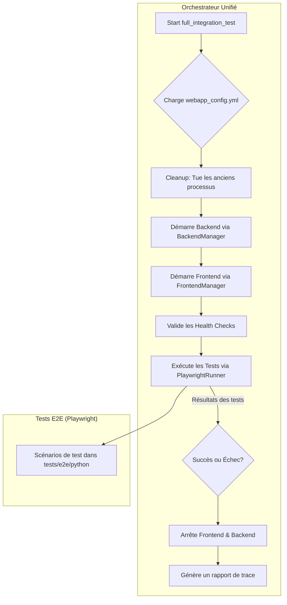

# Cartographie de la Stack Web - Passe 3

Ce document détaille l'architecture et les composants de la stack de communication web du projet, suite à l'analyse réalisée lors de la troisième phase de refactoring.

## 1. Vue d'ensemble de l'architecture

La stack web est principalement construite autour d'un serveur **FastAPI** en Python qui agit comme un orchestrateur central. Ce serveur expose une **API RESTful** consommée par les clients. Une caractéristique clé de l'architecture est son intégration avec une couche de logique métier écrite en **Java** (utilisant `TweetyProject`), accessible via la bibliothèque **JPype**. De plus, le système interagit avec divers services de modèles de langage (LLM), qu'ils soient locaux ou externes.

```mermaid
graph TD
    subgraph Client
        A[Client Python]
    end

    subgraph Serveur Web (Python)
        B[API REST FastAPI]
        C[Logique d'Orchestration]
        D[Interface JPype]
    end

    subgraph Services Backend
        E[Logique Métier Java (TweetyProject)]
        F[API LLM (OpenAI, Local)]
    end

    A -- Requêtes HTTP --> B
    B -- Appels de fonctions --> C
    C -- Appels de méthodes --> D
    D -- Pont JVM --> E
    C -- Requêtes HTTP --> F
```

## 2. Composants Détaillés

### 2.1. Serveur Web FastAPI (`/api`)

-   **Description :** Le cœur de la stack. Il est responsable de la gestion des requêtes HTTP, du routage, de la validation des données (via Pydantic) et de l'orchestration des appels vers les autres services.
-   **Fichiers Clés :**
    -   [`api/factory.py`](api/factory.py) : **(Nouveau)** Introduit un *factory pattern* pour centraliser et standardiser la création des applications FastAPI. Il gère la configuration de base, comme le middleware CORS, assurant la cohérence entre les différents points d'entrée.
    -   [`api/main.py`](api/main.py) : Point d'entrée principal de l'application. A été refactorisé pour utiliser `create_app` depuis la factory, simplifiant son code pour se concentrer uniquement sur la logique de démarrage spécifique (comme l'initialisation de la JVM) et le montage des routes.
    -   [`api/endpoints.py`](api/endpoints.py) : Définit les routes de l'API REST principale, comme `/api/analyze`. Sa logique interne a été nettoyée pour une meilleure lisibilité.
    -   [`api/main_simple.py`](api/main_simple.py) & [`api/endpoints_simple.py`](api/endpoints_simple.py) : Version alternative simplifiée de l'API. A également été refactorisée pour utiliser la factory, résolvant des bugs de démarrage et alignant sa structure sur celle de l'application principale.
-   **Interactions :** Reçoit les requêtes des clients, les traite via la logique d'orchestration et renvoie les réponses.

### 2.2. Pont Java (`JPype` & `TweetyProject`)

-   **Description :** Pour exploiter la puissance des bibliothèques d'argumentation de `TweetyProject` écrites en Java, un pont est établi à l'aide de `JPype`. Cela permet d'appeler directement du code Java depuis Python.
-   **Fichiers Clés :**
    -   [`api/dependencies.py`](api/dependencies.py:136) : Contient la logique d'initialisation du `DungAnalysisService`, qui semble encapsuler les appels à la logique de Dung via `JPype`.
    -   [`api/main.py`](api/main.py:23) : Assure que la JVM est démarrée correctement au lancement de l'application FastAPI.
    -   [`abs_arg_dung/README.md`](abs_arg_dung/README.md:4) : Confirme l'utilisation de `TweetyProject`.
-   **Interactions :** La logique d'orchestration Python appelle des classes et des méthodes Java pour effectuer des analyses d'argumentation complexes.

### 2.3. Services de Modèles de Langage (LLM)

-   **Description :** La stack intègre des capacités de traitement du langage naturel en faisant appel à des LLM. Elle peut utiliser des services externes comme OpenAI ou des modèles hébergés localement.
-   **Fichiers Clés :**
    -   [`.env`](.env) : Contient les clés d'API (`OPENAI_API_KEY`) et les URLs des différents services LLM.
    -   [`2.3.6_local_llm/app.py`](2.3.6_local_llm/app.py:52) : Exemple d'une API FastAPI dédiée à un modèle local de détection de sophismes.
    -   [`2.3.6_local_llm/subject.md`](2.3.6_local_llm/subject.md) : Documentation complète sur la mise en place et l'utilisation de LLM locaux avec des outils comme Ollama, accessible via une API REST.
-   **Interactions :** La logique métier peut appeler ces API pour enrichir les analyses, générer du texte ou effectuer d'autres tâches liées au NLP.

### 2.4. Configuration (`.env`)

-   **Description :** Un fichier central qui découple la configuration du code. Il est essentiel pour gérer les environnements (développement, production) et sécuriser les informations sensibles.
-   **Fichiers Clés :**
    -   [`.env`](.env:7) : Contient les clés d'API, les endpoints des services, etc.
    -   [`.gitignore`](.gitignore:100) : Ignore le fichier `.env` pour des raisons de sécurité.
-   **Interactions :** Le code Python (notamment dans les modules de dépendances et de services) charge ces variables d'environnement au démarrage pour se connecter aux services externes.

## 3. Flux de Communication Typique

1.  Un **client Python** envoie une requête POST avec du texte à analyser à l'endpoint `/api/analyze`.
2.  Le **serveur FastAPI** reçoit la requête.
3.  La fonction associée à l'endpoint appelle le **service d'orchestration**.
4.  Le service peut d'abord appeler un **LLM** (local ou distant) pour une première analyse ou un pré-traitement.
5.  Ensuite, il utilise le **pont JPype** pour invoquer la logique d'analyse d'argumentation de **TweetyProject** en Java.
6.  Les résultats des différentes étapes sont agrégés.
7.  Le serveur FastAPI formate la **réponse** et la renvoie au client en JSON.

## 4. Principes de Conception et Améliorations (Suite au Refactoring)

La refactorisation de la passe 3 a introduit plusieurs améliorations clés visant à solidifier la stack web :

-   **Standardisation via Factory Pattern** : L'introduction du fichier [`api/factory.py`](api/factory.py) centralise la création et la configuration des instances FastAPI. Cela garantit que toutes les applications, présentes et futures, partagent une configuration de base cohérente (CORS, middleware, etc.), réduisant les erreurs et la complexité.

-   **Application du Principe DRY (Don't Repeat Yourself)** : Avant la refactorisation, la logique d'initialisation de FastAPI était dupliquée entre [`api/main.py`](api/main.py) et [`api/main_simple.py`](api/main_simple.py). L'utilisation de la factory a éliminé cette redondance, rendant le code plus facile à maintenir.

-   **Clarté et Séparation des Préoccupations** : Les fichiers `main` se concentrent désormais sur leur rôle de point d'entrée (démarrage des services, montage des routeurs) tandis que la configuration de l'application est déléguée à la factory. De même, les endpoints complexes dans [`api/endpoints.py`](api/endpoints.py) ont été décomposés en fonctions plus petites et privées, améliorant la lisibilité et la testabilité.

-   **Robustesse et Fiabilité** : La clarification de la logique de démarrage dans [`api/main_simple.py`](api/main_simple.py) a permis de corriger des bugs subtils qui empêchaient les tests de validation de passer, rendant l'API plus fiable. L'ajout d'un endpoint `/health` standardise également la surveillance de l'application.

## 5. Orchestration des Tests d'Intégration et Validation E2E

Au-delà de l'API elle-même, le projet dispose d'une infrastructure de tests d'intégration (End-to-End) sophistiquée, pilotée par un orchestrateur central.

### 5.1. L'Orchestrateur Web Unifié

Le projet a centralisé sa logique de test d'intégration dans un script unique et puissant :

-   **Fichier Clé** : [`scripts/apps/webapp/unified_web_orchestrator.py`](scripts/apps/webapp/unified_web_orchestrator.py)
-   **Description** : Ce script Python remplace une multitude de scripts PowerShell et Python redondants. Il sert de point d'entrée unique pour exécuter un cycle de vie complet de test d'intégration.
-   **Configuration** : Il est entièrement piloté par le fichier [`config/webapp_config.yml`](config/webapp_config.yml), qui définit les chemins, les ports, les commandes, et les tests à exécuter.
-   **Architecture** : L'orchestrateur délègue les tâches à des gestionnaires spécialisés pour une meilleure séparation des préoccupations :
    -   `BackendManager` : Gère le cycle de vie du serveur backend (démarrage, arrêt, health check).
    -   `FrontendManager` : Gère le cycle de vie du serveur de développement frontend (ex: `npm start`).
    -   `PlaywrightRunner` : Encapsule la logique d'exécution des tests Playwright via `pytest`.

Le flux d'exécution est le suivant :



### 5.2. Scénarios de Test End-to-End (Playwright)

Le projet utilise Playwright pour ses tests E2E, qui simulent des interactions utilisateur réelles avec l'application web.

-   **Framework** : Playwright, lancé via `pytest` pour une meilleure intégration et un reporting avancé.
-   **Localisation** : Les scénarios de test se trouvent dans le répertoire [`tests/e2e/python/`](tests/e2e/python).
-   **Couverture** : Les tests couvrent un large éventail de fonctionnalités, incluant :
    -   **Tests d'Interface Complète** : Comme [`test_interface_web_complete.py`](tests/e2e/python/test_interface_web_complete.py) et [`test_react_interface_complete.py`](tests/e2e/python/test_react_interface_complete.py), qui valident l'application du point de vue de l'utilisateur.
    -   **Tests de Workflows** : [`test_integration_workflows.py`](tests/e2e/python/test_integration_workflows.py) teste des parcours utilisateurs complets impliquant plusieurs étapes.
    -   **Tests de Fonctionnalités Spécifiques** : Des fichiers comme [`test_argument_reconstructor.py`](tests/e2e/python/test_argument_reconstructor.py) et [`test_fallacy_detector.py`](tests/e2e/python/test_fallacy_detector.py) ciblent des parties précises de la logique métier via l'interface.
    -   **Validation de formulaire et d'API** : Des tests comme [`test_validation_form.py`](tests/e2e/python/test_validation_form.py) et [`test_api_dung_integration.py`](tests/e2e/python/test_api_dung_integration.py) assurent que le frontend et le backend communiquent correctement.

Cette suite de tests robuste garantit que non seulement les composants individuels fonctionnent, mais que leur intégration est également validée de manière continue.