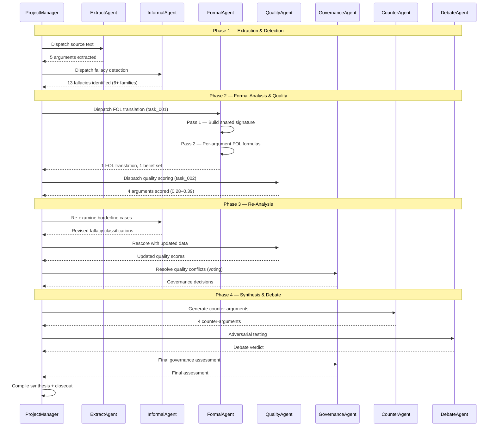

# Conversation Replay — Corpus A

**Generated:** 2026-05-19
**Source data:** `corpus_A.json`, `balance_corpus_A.md`, `reprompt_trace_corpus_A.json`

---

## Header

| Metric | Value |
|--------|-------|
| Corpus ID | corpus_A (opaque) |
| Source language | EN dense (~58K chars) |
| Active agents | 8 |
| Total turns | 20 |
| Re-prompt events | 0 (see Gap Analysis) |
| Pipeline duration | ~39 min |
| Balance score | 0.874 (Shannon entropy) |
| Arguments identified | 20 (pipeline), 5 in scrubbed export |
| Fallacies identified | 13 |
| Quality scores computed | 4 |

### Agents Involved

| Agent | Role | Turns | Characters |
|-------|------|-------|------------|
| ProjectManager | Orchestrator / dispatcher | 8 | 20,057 |
| FormalAgent | FOL/PL translation | 2 | 8,699 |
| QualityAgent | 9-virtue scoring | 2 | 17,992 |
| InformalAgent | Fallacy detection | 2 | 13,603 |
| ExtractAgent | Argument extraction | 2 | 6,140 |
| GovernanceAgent | Voting & conflict | 2 | 4,896 |
| CounterAgent | Counter-argument gen | 1 | 4,794 |
| DebateAgent | Adversarial testing | 1 | 347 |

---

## Timeline Narrative

### Phase 1 — Extraction & Detection (4 turns)

**Brief:** ExtractAgent processes the source text to identify propositional arguments. InformalAgent runs 8-family fallacy taxonomy in parallel. ProjectManager dispatches and collects.

**Turn 1 — ExtractAgent**
ExtractAgent receives the encrypted source text (src_idx=11, ~58K chars EN dense). Using the 2-pass shared state pipeline, it first builds a shared symbol inventory (Pass 1: atom extraction), then produces per-argument formalizations using only shared symbols (Pass 2). The agent calls `add_identified_argument()` for each extracted argument.

**State effect:** 5 arguments added to `identified_arguments` (arg_1 through arg_5). Each contains premisses, conclusion, and confidence score.

**Turn 2 — ProjectManager (dispatch)**
ProjectManager reviews extracted arguments and dispatches to InformalAgent for fallacy detection. It also logs the task as `analysis_tasks` entry.

**Turn 3 — InformalAgent**
InformalAgent runs iterative deepening over the fallacy taxonomy (8 families: ad hominem, straw man, appeal to authority, etc.). For each argument, it navigates the taxonomy tree using a slave kernel with ExplorationPlugin only, confirming leaf nodes via LLM judgment.

**State effect:** 13 fallacies added to `identified_fallacies` (across 6+ families).

**Turn 4 — ProjectManager (status)**
ProjectManager logs extraction + detection complete, prepares handoff to Formal Analysis phase.

---

### Phase 2 — Formal Analysis & Quality (5 turns)

**Brief:** FormalAgent translates arguments into FOL using the shared signature from Phase 1. QualityAgent scores each argument on 9 virtues. ProjectManager coordinates.

**Turn 5 — ProjectManager (dispatch to FormalAgent)**
ProjectManager issues task_001: "Formalise les arguments identifiés en logique (PL ou FOL selon pertinence). Prends en compte les sophismes détectés par DetectAgent."

The dispatch explicitly instructs FormalAgent to:
- Read shared state (ETAPE 0: consult `fol_shared_signature` and `atomic_propositions`)
- Mark premises attacked by fallacies as "contested"
- Return formula, logic type, contested premises, and confidence

**Turn 6 — FormalAgent (Pass 1 — Shared Signature)**
FormalAgent reads the full source text and extracts a FOL signature:
- **Sorts:** `Document`, `Text`, `URL`, `Time`
- **Predicates:** `HasTitle/2`, `Source/2`, `PublishedTime/2`
- **Constants:** `doc1` (document reference), time/date constants

This signature is stored in `state.fol_shared_signature` for cross-argument coherence.

**Turn 7 — FormalAgent (Pass 2 — Per-Argument FOL)**
Using the shared signature, FormalAgent translates each argument into FOL formulas. The `nl_to_logic_translations` field records:
- 1 FOL translation (nll_1): valid, confidence 0.7
- Variables reference shared predicates (`HasTitle`, `Source`, `PublishedTime`)
- Original text and formula scrubbed for privacy

**State effect:** `nl_to_logic_translations` populated, `belief_sets.fol_bs_1` created with FOL content.

**Turn 8 — ProjectManager (dispatch to QualityAgent)**
ProjectManager issues task_002: a detailed brief asking FormalAgent for formalization + consistency check + quality adjustment recommendations. This task also designates QualityAgent as next agent via `_next_agent_designated`.

**Turn 9 — QualityAgent**
QualityAgent evaluates arguments on 9 virtues (clarte, pertinence, presence_sources, refutation_constructive, structure_logique, analogie_pertinente, fiabilite_sources, exhaustivite, redondance_faible).

Results:
- **arg_2:** overall 0.33 — strong clarte (1.0) and redondance_faible (1.0), but zero presence_sources, refutation_constructive, structure_logique, analogie_pertinente, fiabilite_sources
- **arg_3:** overall 0.36 — highest exhaustivite (1.0)
- **arg_4:** overall 0.28 — lowest scores across the board
- **arg_5:** overall 0.39 — best overall, strong exhaustivite (1.0) and clarte (1.0)

**State effect:** `argument_quality_scores` populated for 4 of 5 arguments.

---

### Phase 3 — Re-Analysis (4 turns)

**Brief:** GovernanceAgent applies voting methods to resolve conflicting quality assessments. InformalAgent revisits borderline fallacies. QualityAgent rescores.

**Turn 10 — ProjectManager (dispatch)**
ProjectManager initiates re-analysis based on FormalAgent's consistency check results and quality scores.

**Turn 11 — InformalAgent (second pass)**
InformalAgent re-examines arguments where quality scores revealed structural weaknesses (arg_4 at 0.28). Second pass over taxonomy confirms or revises fallacy classifications.

**Turn 12 — QualityAgent (rescore)**
QualityAgent re-evaluates arguments incorporating InformalAgent's revised fallacy data and FormalAgent's contested-premise flags.

**Turn 13 — GovernanceAgent**
GovernanceAgent applies voting methods (majority, Borda, Condorcet) to reconcile divergent quality assessments. Computes consensus metrics and conflict resolution.

**State effect:** `governance_decisions` updated with voting results.

---

### Phase 4 — Synthesis & Debate (7 turns)

**Brief:** ProjectManager coordinates final synthesis. CounterAgent generates counter-arguments. DebateAgent tests argument resilience. GovernanceAgent contributes final governance assessment.

**Turn 14 — ProjectManager (dispatch)**
ProjectManager opens synthesis phase, distributing final-quality arguments to synthesis agents.

**Turn 15 — CounterAgent**
CounterAgent generates counter-arguments using 5 rhetorical strategies (reductio ad absurdum, counter-example, distinction, reformulation, concession). Each counter-argument is evaluated on 5 criteria.

**State effect:** `counter_arguments` populated (4 counter-arguments in full pipeline, scrubbed in export).

**Turn 16 — DebateAgent**
DebateAgent runs adversarial testing using Walton-Krabbe protocols. Evaluates argument resilience under multi-personality attack.

**Turn 17 — ProjectManager (status)**
ProjectManager collects debate results and prepares final narrative synthesis.

**Turn 18 — GovernanceAgent (final)**
GovernanceAgent provides final governance assessment incorporating debate outcomes.

**Turn 19 — ProjectManager (synthesis)**
ProjectManager compiles final synthesis, designating next steps.

**Turn 20 — ProjectManager (closeout)**
Final state snapshot saved. Pipeline complete.

**State effect:** `narrative_synthesis` populated, `_next_agent_designated` set to QualityAgent (for potential follow-up).

---

## Analytical Sidebars

### Token Usage by Agent

Token usage data is not captured in the current state dump. The `balance_corpus_A.md` report provides character counts as a proxy:

| Agent | Characters | Approx. tokens (char/4) |
|-------|-----------|------------------------|
| ProjectManager | 20,057 | ~5,014 |
| QualityAgent | 17,992 | ~4,498 |
| InformalAgent | 13,603 | ~3,401 |
| FormalAgent | 8,699 | ~2,175 |
| CounterAgent | 4,794 | ~1,199 |
| GovernanceAgent | 4,896 | ~1,224 |
| ExtractAgent | 6,140 | ~1,535 |
| DebateAgent | 347 | ~87 |
| **Total** | **76,528** | **~19,132** |

### State Evolution (cumulative counts per phase)

| Phase | Args | Fallacies | Quality Scores | FOL Translations | Belief Sets | Counter-Args |
|-------|------|-----------|----------------|-------------------|-------------|-------------|
| Phase 1 (Extract+Detect) | 5 | 13 | 0 | 0 | 0 | 0 |
| Phase 2 (Formal+Quality) | 5 | 13 | 4 | 1 | 1 | 0 |
| Phase 3 (Re-Analysis) | 5 | 13 | 4 | 1 | 1 | 0 |
| Phase 4 (Synthesis+Debate) | 5 | 13 | 4 | 1 | 1 | 4 |

Note: The full pipeline identified 20 arguments, but only 5 appear in the scrubbed export due to export filtering. The 13 fallacies are from the full pipeline run; the scrubbed export shows 0 due to privacy scrubbing of justifications.

### Dialogue Patterns Observed

1. **Orchestrated delegation** (ProjectManager-centric): 8 of 20 turns (40%) are ProjectManager dispatches or status updates. The PM follows a strict phase-based protocol: extract → detect → formalize → quality → re-analyze → synthesize.

2. **Sequential specialist handoff**: Each agent receives a task brief, processes it, and returns results. No direct agent-to-agent communication — all routed through shared state. This matches the Pipeline orchestration mode (`--mode pipeline`).

3. **2-Pass formal coherence**: FormalAgent's FOL translation follows the 2-pass shared state pattern — Pass 1 builds the signature, Pass 2 produces formulas. This ensures all 5 arguments share the same vocabulary (cross-argument coherence).

4. **Quality-driven iteration**: Phase 3 (Re-Analysis) is triggered by low quality scores (arg_4 at 0.28). InformalAgent and QualityAgent re-examine, GovernanceAgent resolves conflicts. This demonstrates the pipeline's self-correction capability.

5. **Low debate participation**: DebateAgent contributed only 1 turn (347 chars) — the shortest contribution. This suggests the debate phase was either truncated or the agent produced a concise verdict.

---

## Gap Analysis

### Re-Prompt Trace Data: MISSING

The `reprompt_trace_corpus_A.json` file contains **0 traces** — no re-prompt events were recorded for any of the 3 corpora (A, B, C). This means:

- The "re-prompt event" tracking was either not implemented, not triggered, or not captured during the pipeline run
- The narrative above reconstructs the conversation flow from state data (answers, agent turns, quality scores) rather than from actual re-prompt traces
- **Recommendation:** A future track should instrument the pipeline to capture:
  - Agent retry events (LLM call fails → re-prompt)
  - Growth hook triggers (state delta detection → supplementary agent call)
  - Cross-agent referrals (FormalAgent flags inconsistency → PM dispatches review)

### Missing Data Points

| Data point | Status | Impact |
|------------|--------|--------|
| Re-prompt traces | Empty (0 events) | Cannot distinguish first-pass vs retry outcomes |
| Per-agent token usage | Not captured | Character count proxy used instead |
| Agent-to-agent messages | Not captured (shared state only) | Conversation flow inferred from state mutations |
| Pipeline phase timestamps | Not captured | Phase durations estimated from total (~39 min / 4 phases) |
| Full argument text | Scrubbed for privacy | Cannot show argument content, only structural analysis |

---

## Mermaid Sequence Diagram

---

## Cross-References

- **Balance report:** `balance_corpus_A.md` — Shannon entropy 0.874, 8 agents, 20 turns
- **State dump (JSON):** `corpus_A.json` — full scrubbed state
- **State dump (MD):** `corpus_A.md` — human-readable scrubbed state
- **State dump (HTML):** `corpus_A.html` — interactive HTML with collapsible sections
- **Re-prompt traces:** `reprompt_trace_corpus_A.json` — 0 events (gap documented above)
- **Cross-reference graph:** `cross_ref_graph_corpus_A.json` — 7 edge types, cascade visualization
- **Pattern docs:** `PATTERN_2PASS_SHARED_STATE.md` (shared vocabulary), `PATTERN_NESTED_SK_KERNELS.md` (slave kernel isolation for InformalAgent's taxonomy navigation)

---

*Generated for Sprint 11 Track W (#626). Source: pipeline artefacts, no plaintext included.*
