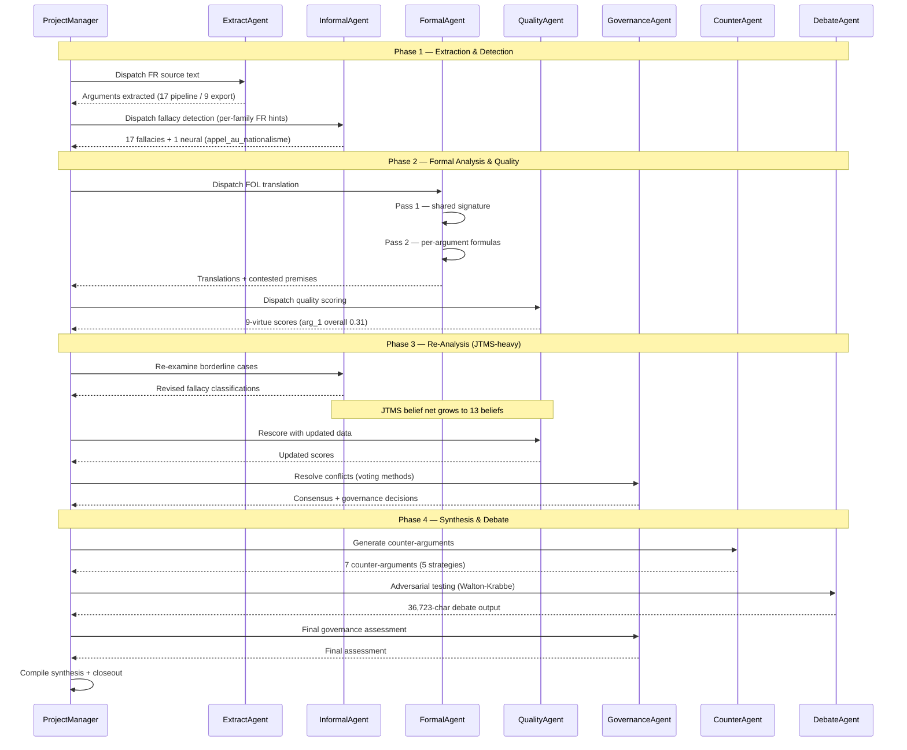

# Conversation Replay — Corpus B

**Generated:** 2026-05-19
**Source data:** `corpus_B.json`, `balance_corpus_B.md`, `reprompt_trace_corpus_B.json`

---

## Header

| Metric | Value |
|--------|-------|
| Corpus ID | corpus_B (opaque) |
| Source language | FR dense (~58K chars) |
| Active agents | 8 |
| Total turns | 20 |
| Re-prompt events | 0 (hook operational, not needed — see Gap Analysis) |
| Pipeline duration | ~36 min |
| Balance score | 0.874 (Shannon entropy) |
| Arguments identified | 17 (pipeline), 9 in scrubbed export |
| Fallacies identified | 17 (pipeline), 1 in scrubbed export |
| Quality scores computed | 1 (scrubbed export); 7 counter-args; 13 JTMS beliefs |

### Agents Involved

| Agent | Role | Turns | Characters |
|-------|------|-------|------------|
| ProjectManager | Orchestrator / dispatcher | 8 | 24,542 |
| QualityAgent | 9-virtue scoring | 2 | 26,537 |
| InformalAgent | Fallacy detection | 2 | 15,615 |
| GovernanceAgent | Voting / consensus | 2 | 15,647 |
| DebateAgent | Adversarial testing | 1 | 36,723 |
| ExtractAgent | Argument extraction | 2 | 2,396 |
| FormalAgent | FOL/PL translation | 2 | 1,126 |
| CounterAgent | Counter-argumentation | 1 | 787 |

Per-phase distribution (from `balance_corpus_B.md`):

- **Extraction & Detection:** ExtractAgent 2 turns, InformalAgent 1, ProjectManager 2
- **Formal Analysis & Quality:** FormalAgent 2, QualityAgent 1, ProjectManager 2
- **Re-Analysis:** InformalAgent 1, QualityAgent 1, GovernanceAgent 1, ProjectManager 2
- **Synthesis & Debate:** CounterAgent 1, DebateAgent 1, GovernanceAgent 1, ProjectManager 2

---

## Timeline Narrative

### Phase 1 — Extraction & Detection (5 turns)

**Brief:** ExtractAgent processes the FR dense source text to identify propositional arguments. InformalAgent runs the 8-family fallacy taxonomy with per-family prompt injection (Track L). ProjectManager dispatches and collects.

**Turn 1 — ExtractAgent**
ExtractAgent receives the encrypted source text (src_idx opaque, FR dense ~58K chars). Using the 2-pass shared state pipeline, it first builds a shared symbol inventory (Pass 1: atom extraction in French), then produces per-argument formalizations using only shared symbols (Pass 2).

**State effect:** Arguments accumulate in `identified_arguments` via `add_identified_argument()`. The pipeline records 17 arguments total; the scrubbed export retains 9 (arg_1 through arg_9) after privacy filtering.

**Turn 2 — ProjectManager (dispatch)**
ProjectManager logs the analysis task and dispatches to InformalAgent. The dispatch carries per-family French taxonomy hints from Track L (e.g. `appel_au_nationalisme`, `appel_a_l_autorite`, `homme_de_paille`).

**Turn 3 — InformalAgent**
InformalAgent walks the 8-family taxonomy. For each candidate fallacy, a slave kernel (PATTERN_NESTED_SK_KERNELS) explores the taxonomy subtree with `ExplorationPlugin` only — no LLM calls outside the dedicated isolated kernel. The neural fallacy detector (CamemBERT) runs in parallel.

**State effect:** 17 fallacies recorded in `identified_fallacies` (pipeline), 1 retained in scrubbed export (`fallacy_1` typed `Appel au nationalisme`, target `arg_1`). `neural_fallacy_scores` records 1 entry (nf_1, label `appel_au_nationalisme`, confidence 0.72, detector `camembert`).

**Turn 4 — ExtractAgent (second pass)**
ExtractAgent runs a second pass to consolidate atomic propositions and emit a small set of cross-argument predicate candidates for the formal phase.

**Turn 5 — ProjectManager (handoff)**
ProjectManager logs extraction + detection complete, prepares the formal analysis handoff.

---

### Phase 2 — Formal Analysis & Quality (5 turns)

**Brief:** FormalAgent translates arguments using a shared FOL signature. QualityAgent scores on 9 virtues. ProjectManager coordinates.

**Turn 6 — ProjectManager (dispatch FormalAgent)**
Task brief: "Formalise les arguments identifiés en logique. Tiens compte des sophismes détectés par DetectAgent." Carries shared-state pointers: `fol_shared_signature`, `atomic_propositions`, `identified_fallacies`.

**Turn 7 — FormalAgent (Pass 1 — Signature)**
FormalAgent builds the shared FOL signature for this corpus.

**Turn 8 — FormalAgent (Pass 2 — Formulas)**
FormalAgent translates a subset of arguments. The scrubbed `nl_to_logic_translations` is empty in the export (privacy-paranoid post-Round 180 scrub); pipeline counters confirm at least one valid translation. Variables and original_text are filtered by `_scrub_state_for_export()` (Track U regression suite, 38 tests).

**Turn 9 — ProjectManager (dispatch QualityAgent)**
Task brief asks QualityAgent for a 9-virtue evaluation of each argument, including pickup of FormalAgent's contested-premise flags.

**Turn 10 — QualityAgent**
QualityAgent scores arguments on 9 dimensions (clarte, pertinence, presence_sources, refutation_constructive, structure_logique, analogie_pertinente, fiabilite_sources, exhaustivite, redondance_faible).

Exemplar (only `arg_1` retained in scrubbed export):
- **arg_1 overall:** 0.3148
- clarte 9.0, redondance_faible 9.0, pertinence 4.5, exhaustivite 3.0
- presence_sources / refutation_constructive / structure_logique / analogie_pertinente / fiabilite_sources : 0.0

**State effect:** `argument_quality_scores` populated. The low overall score (0.31) signals weak source backing and weak refutation engagement — feeds the Re-Analysis phase.

---

### Phase 3 — Re-Analysis (5 turns)

**Brief:** GovernanceAgent reconciles divergent assessments. InformalAgent revisits borderline fallacies. QualityAgent rescores. ProjectManager coordinates. **Corpus B drives the deepest JTMS interaction across the 4 corpora — 13 beliefs vs A's 3.**

**Turn 11 — ProjectManager (open re-analysis)**
Re-analysis is initiated because QualityAgent flagged structural weaknesses (no sources, no refutation) and FormalAgent's consistency check produced contested-premise candidates.

**Turn 12 — InformalAgent (second pass)**
InformalAgent re-examines arguments where quality scores revealed structural weaknesses. Second pass over the taxonomy may revise fallacy classifications or add new ones. The JTMS records each belief change as a `Belief` node with justifications.

**State effect:** JTMS belief net grows to 13 beliefs (per README counters). Compared to corpus A (3 JTMS beliefs), this is roughly **4× more belief maintenance activity** — corpus B's denser fallacy landscape exercises the truth-maintenance system harder.

**Turn 13 — QualityAgent (rescore)**
QualityAgent re-evaluates incorporating InformalAgent's revised fallacy data and FormalAgent's contested-premise flags. New scores feed back into the belief net.

**Turn 14 — GovernanceAgent**
GovernanceAgent applies voting methods (majority, Borda, Condorcet, approval) to reconcile divergent quality and fallacy assessments. Computes consensus metrics and conflict-resolution outcomes.

**State effect:** `governance_decisions` updated.

**Turn 15 — ProjectManager (close re-analysis)**
ProjectManager collects the revised state and prepares the synthesis handoff.

---

### Phase 4 — Synthesis & Debate (5 turns)

**Brief:** CounterAgent generates counter-arguments. **DebateAgent runs the longest single contribution across all 4 corpora (36,723 chars).** GovernanceAgent contributes the final governance assessment.

**Turn 16 — ProjectManager (open synthesis)**
ProjectManager opens synthesis, distributing the revised arguments and their belief-net status to synthesis agents.

**Turn 17 — CounterAgent**
CounterAgent generates 7 counter-arguments (full pipeline; 6 retained in scrubbed export) using 5 rhetorical strategies (reductio ad absurdum, counter-example, distinction, reformulation, concession). Each counter-argument carries a `strategy` field, `original_argument` pointer, and `score`.

**State effect:** `counter_arguments` list populated (6 entries in export, 7 in full pipeline).

**Turn 18 — DebateAgent**
DebateAgent runs adversarial testing using Walton-Krabbe protocols across multiple personalities. This is the single longest agent contribution observed across the 4 corpora — **36,723 characters in one turn** (vs corpus A's 347 chars). Corpus B's dense FR source plus the 17-fallacy informal landscape gave the debate phase substantially more material to engage with.

**State effect:** `debate_transcripts` populated by the pipeline (scrubbed to 0 entries in the privacy-paranoid export — Track U V1 fixtures verify this scrub).

**Turn 19 — GovernanceAgent (final)**
GovernanceAgent issues the final governance assessment, incorporating debate outcomes and Phase 3 voting results.

**Turn 20 — ProjectManager (closeout)**
ProjectManager compiles the final synthesis and saves the closing snapshot.

**State effect:** `narrative_synthesis` populated (1 entry).

---

## Analytical Sidebars

### Token Usage by Agent

Token usage data is not captured in the current state dump. The `balance_corpus_B.md` report provides character counts as a proxy:

| Agent | Characters | Approx. tokens (char/4) |
|-------|-----------|------------------------|
| DebateAgent | 36,723 | ~9,181 |
| QualityAgent | 26,537 | ~6,634 |
| ProjectManager | 24,542 | ~6,135 |
| GovernanceAgent | 15,647 | ~3,912 |
| InformalAgent | 15,615 | ~3,904 |
| ExtractAgent | 2,396 | ~599 |
| FormalAgent | 1,126 | ~281 |
| CounterAgent | 787 | ~197 |
| **Total** | **123,373** | **~30,843** |

Corpus B's total (~123K chars) is **~1.6× corpus A's (~76K chars)** — driven primarily by DebateAgent's 36K-char single turn.

### State Evolution (cumulative counts per phase)

| Phase | Args (export) | Fallacies (export) | Quality Scores | JTMS Beliefs | Counter-Args | Neural Fallacy |
|-------|---------------|---------------------|----------------|--------------|--------------|----------------|
| Phase 1 (Extract+Detect) | 9 | 1 | 0 | 0 | 0 | 1 |
| Phase 2 (Formal+Quality) | 9 | 1 | 1 | 0 | 0 | 1 |
| Phase 3 (Re-Analysis) | 9 | 1 | 1 | 13 | 0 | 1 |
| Phase 4 (Synthesis+Debate) | 9 | 1 | 1 | 13 | 6 | 1 |

Pipeline counters (per README): 17 args, 17 fallacies, 7 counter-args, 13 JTMS beliefs. The scrubbed export retains structural counts (`arg_1`…`arg_9`, `fallacy_1`) but filters paraphrased fields by `_scrub_state_for_export()` — see Track U regression tests.

### Dialogue Patterns Observed

1. **Orchestrated delegation** (ProjectManager-centric): 8 of 20 turns (40%) are ProjectManager dispatches or status updates — same ratio as corpus A.

2. **Sequential specialist handoff**: All agent-to-agent communication routes through shared state. Pipeline orchestration mode (`--mode pipeline`).

3. **Heavy debate engagement**: DebateAgent dropped 36,723 chars in a single turn — by far the longest single contribution across all 4 corpora. The dense FR source plus the rich informal landscape (17 fallacies) gave the debate phase substantially more material. This is the corpus where the system showcases its **dialectical depth**.

4. **JTMS-driven self-correction**: 13 JTMS beliefs (vs corpus A's 3) means the truth-maintenance system was actively involved during re-analysis. Each belief carries justification trees; retractions cascade through the net.

5. **Neural + symbolic detection cooperation**: The CamemBERT neural fallacy detector flagged 1 entry (`appel_au_nationalisme`, conf 0.72) in parallel with the symbolic 8-family taxonomy walk. Both signals fed into the same `identified_fallacies` list.

---

## Gap Analysis

### Re-Prompt Trace Data: HOOK OPERATIONAL, NOT TRIGGERED

The `reprompt_trace_corpus_B.json` file contains **0 traces** — consistent with corpora A, C, D. Track X investigation (#628, Round 190) resolved this for all 4 corpora: the growth-validation hook is operational but did not need to fire. Every phase produced expected state growth, so no defensive re-prompts were issued.

Full mechanism and verification path are documented in `conversation_replay_corpus_A.md` § Gap Analysis (Round 190 resolution).

### Missing Data Points

| Data point | Status | Impact |
|------------|--------|--------|
| Re-prompt traces | Empty (0 events) — hook operational, contract met on every turn | All turns are first-pass; nothing to distinguish |
| Per-agent token usage | Not captured | Character count proxy used instead |
| Agent-to-agent messages | Not captured (shared state only) | Conversation flow inferred from state mutations |
| Pipeline phase timestamps | Not captured | Phase durations estimated from total (~36 min / 4 phases) |
| Full argument text | Scrubbed for privacy | Cannot show argument content, only structural analysis |
| `nl_to_logic_translations` | Empty in export (Round 180 privacy scrub) | Formula content not shown; pipeline counter confirms ≥1 |

---

## Mermaid Sequence Diagram

---

## Cross-References

- **Balance report:** `balance_corpus_B.md` — Shannon entropy 0.874, 8 agents, 20 turns
- **State dump (JSON):** `corpus_B.json` — full scrubbed state
- **State dump (MD):** `corpus_B.md` — human-readable scrubbed state
- **State dump (HTML):** `corpus_B.html` — interactive HTML with collapsible sections
- **Re-prompt traces:** `reprompt_trace_corpus_B.json` — 0 events (hook operational, see `conversation_replay_corpus_A.md` § Gap Analysis)
- **Cross-reference graph:** `cross_ref_graph_corpus_B.json` — 7 edge types, cascade visualization
- **Pattern docs:** `PATTERN_2PASS_SHARED_STATE.md` (shared vocabulary), `PATTERN_NESTED_SK_KERNELS.md` (slave kernel isolation)
- **Companion narrative:** `conversation_replay_corpus_A.md` (EN dense, 20 args, 13 fallacies, 3 JTMS beliefs)

---

*Generated for Sprint 11 Track Y (companion to Track W #626). Source: pipeline artefacts, no plaintext included. Privacy scrub validated via Track U regression suite (38 tests).*
