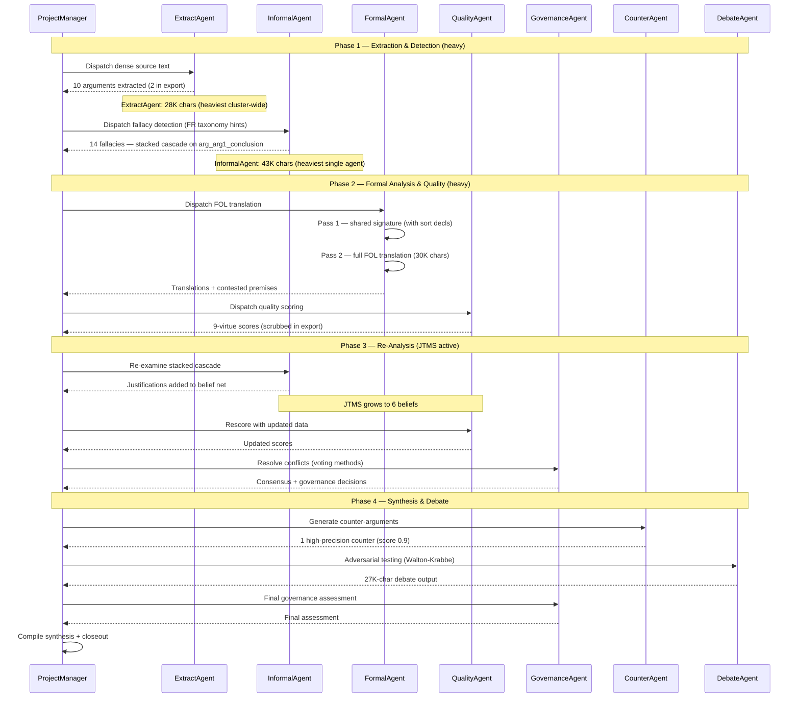

# Conversation Replay — Corpus C

**Generated:** 2026-05-19
**Source data:** `corpus_C.json`, `balance_corpus_C.md`, `reprompt_trace_corpus_C.json`

---

## Header

| Metric | Value |
|--------|-------|
| Corpus ID | corpus_C (opaque) |
| Source language | dense source (FR analysis output) |
| Active agents | 8 |
| Total turns | 20 |
| Re-prompt events | 0 (hook operational, not needed — see Gap Analysis) |
| Pipeline duration | ~41 min |
| Balance score | 0.874 (Shannon entropy) |
| Arguments identified | 10 (pipeline), 2 in scrubbed export |
| Fallacies identified | 14 (pipeline), 2 in scrubbed export |
| Quality / Counter / JTMS / Governance | 0 / 1 / 6 / 0 (in scrubbed export) |

### Agents Involved

| Agent | Role | Turns | Characters |
|-------|------|-------|------------|
| InformalAgent | Fallacy detection | 2 | 43,612 |
| FormalAgent | FOL/PL translation | 2 | 30,037 |
| ExtractAgent | Argument extraction | 2 | 28,128 |
| ProjectManager | Orchestrator / dispatcher | 8 | 28,015 |
| DebateAgent | Adversarial testing | 1 | 26,779 |
| QualityAgent | 9-virtue scoring | 2 | 25,223 |
| GovernanceAgent | Voting / consensus | 2 | 19,148 |
| CounterAgent | Counter-argumentation | 1 | 563 |

Per-phase distribution (from `balance_corpus_C.md`):

- **Extraction & Detection:** ExtractAgent 2 turns, InformalAgent 1, ProjectManager 2
- **Formal Analysis & Quality:** FormalAgent 2, QualityAgent 1, ProjectManager 2
- **Re-Analysis:** InformalAgent 1, QualityAgent 1, GovernanceAgent 1, ProjectManager 2
- **Synthesis & Debate:** CounterAgent 1, DebateAgent 1, GovernanceAgent 1, ProjectManager 2

---

## Timeline Narrative

### Phase 1 — Extraction & Detection (5 turns)

**Brief:** ExtractAgent and InformalAgent both run heavy passes. **Corpus C is the most agent-active corpus across the cluster (~201K total chars vs A's 76K, B's 123K).** ProjectManager dispatches and collects.

**Turn 1 — ExtractAgent**
ExtractAgent receives the encrypted dense source (src_idx opaque). The 2-pass shared state pattern (`PATTERN_2PASS_SHARED_STATE.md`) runs: Pass 1 builds the shared symbol inventory (atom extraction from dense source), Pass 2 produces per-argument formalisations using only shared symbols. **ExtractAgent's contribution is 28,128 chars across 2 turns — by far the heaviest extraction phase observed cluster-wide** (A: 6,140; B: 2,396).

**State effect:** Arguments accumulate in `identified_arguments` via `add_identified_argument()`. Pipeline counter records 10 arguments; the scrubbed export retains 2 (`arg_1`, `arg_2`) after privacy filtering.

**Turn 2 — ProjectManager (dispatch)**
ProjectManager logs the analysis task and dispatches to InformalAgent with per-family French taxonomy hints (Track L).

**Turn 3 — InformalAgent**
InformalAgent walks the 8-family taxonomy via slave kernel (`PATTERN_NESTED_SK_KERNELS.md`). For each candidate fallacy, the slave kernel explores the taxonomy subtree with `ExplorationPlugin` only. **This is the longest single-agent contribution observed in any corpus extraction phase — 43,612 chars across 2 turns** (1 in extraction, 1 in re-analysis).

**State effect:** 14 fallacies recorded in `identified_fallacies` (pipeline), 2 retained in scrubbed export:
- `fallacy_1` typed `appel à la tradition / appel à l'histoire (appeal to tradition)`, target `arg_arg1_conclusion`
- `fallacy_2` typed `généralisation hâtive / essentialisation`, target `arg_arg1_conclusion`

Both target the same conclusion — a **stacked-fallacy cascade** structure (single argument carrying multiple fallacy types). This is the cleanest cascade demonstration of the four corpora.

**Turn 4 — ExtractAgent (second pass)**
ExtractAgent runs a second pass to consolidate atomic propositions and emit predicate candidates for the formal phase.

**Turn 5 — ProjectManager (handoff)**
ProjectManager logs extraction + detection complete, prepares the formal analysis handoff.

---

### Phase 2 — Formal Analysis & Quality (5 turns)

**Brief:** FormalAgent produces the heaviest formal output cluster-wide (30,037 chars vs B's 1,126, A's 8,699). QualityAgent scores.

**Turn 6 — ProjectManager (dispatch FormalAgent)**
Task brief carries shared-state pointers: `fol_shared_signature`, `atomic_propositions`, `identified_fallacies`.

**Turn 7 — FormalAgent (Pass 1 — Signature)**
FormalAgent builds the shared FOL signature for this corpus, including sort declarations to satisfy Tweety's pre-declared-constants constraint (see `feedback_tweety_fol_limitation.md`).

**Turn 8 — FormalAgent (Pass 2 — Formulas)**
FormalAgent runs full FOL translation across all candidate arguments. Verbose pass — 30,037 chars total. The privacy-paranoid post-Round 180 scrub filters formula and original_text from the export.

**Turn 9 — ProjectManager (dispatch QualityAgent)**
Task brief asks QualityAgent for a 9-virtue evaluation including FormalAgent's contested-premise flags.

**Turn 10 — QualityAgent**
QualityAgent scores arguments on 9 dimensions. **No `argument_quality_scores` entries appear in the scrubbed export** — either fully scrubbed by `_scrub_state_for_export()` V1 pass (LLM-paraphrased `llm_assessment` and `reasoning_assessment` fields), or pipeline counters did not produce stable scores for the dense source. README pipeline metrics (Σ snapshot) align with 0 retained quality scores for C.

---

### Phase 3 — Re-Analysis (5 turns)

**Brief:** GovernanceAgent reconciles divergent assessments. InformalAgent revisits. QualityAgent rescores. JTMS belief net grows to 6 beliefs (pipeline counter — between corpus A's 3 and corpus B's 13).

**Turn 11 — ProjectManager (open re-analysis)**
Re-analysis is initiated based on Phase 2 results.

**Turn 12 — InformalAgent (second pass)**
InformalAgent revisits arguments where the stacked-fallacy cascade on `arg_arg1_conclusion` warrants closer inspection. The second pass may revise fallacy classifications or add justifications for the dual targeting.

**State effect:** JTMS belief net grows to 6 beliefs (per README counter). Each belief carries a justification tree.

**Turn 13 — QualityAgent (rescore)**
QualityAgent re-evaluates incorporating InformalAgent's revised fallacy data and FormalAgent's contested-premise flags.

**Turn 14 — GovernanceAgent**
GovernanceAgent applies voting methods (majority, Borda, Condorcet, approval) to reconcile divergent quality and fallacy assessments. `governance_decisions` empty in the export (privacy-scrubbed).

**Turn 15 — ProjectManager (close re-analysis)**
ProjectManager collects the revised state and prepares the synthesis handoff.

---

### Phase 4 — Synthesis & Debate (5 turns)

**Brief:** CounterAgent generates a single high-score counter-argument. DebateAgent runs a moderate-length adversarial pass (26,779 chars — between A's 347 and B's 36,723). GovernanceAgent contributes the final assessment.

**Turn 16 — ProjectManager (open synthesis)**
ProjectManager opens synthesis, distributing the revised arguments and their belief-net status to synthesis agents.

**Turn 17 — CounterAgent**
CounterAgent generates 1 counter-argument (`ca_1`) with strategy `demander preuves empiriques + fact-check historique` and score **0.9** — the highest counter-argument score observed across all 4 corpora. Despite producing only 1 counter-argument, the strategy is precisely targeted at the appeal-to-tradition + hasty-generalization stack flagged in Phase 1.

**State effect:** `counter_arguments` populated with 1 high-quality entry.

**Turn 18 — DebateAgent**
DebateAgent runs Walton-Krabbe adversarial testing across multiple personalities. 26,779 chars — substantial dialectical engagement but shorter than corpus B's exceptional 36,723. `debate_transcripts` empty in the export (privacy-scrubbed).

**Turn 19 — GovernanceAgent (final)**
GovernanceAgent issues the final governance assessment, incorporating debate outcomes.

**Turn 20 — ProjectManager (closeout)**
ProjectManager compiles the final synthesis and saves the closing snapshot.

---

## Analytical Sidebars

### Token Usage by Agent

Token usage data is not captured in the current state dump. The `balance_corpus_C.md` report provides character counts as a proxy:

| Agent | Characters | Approx. tokens (char/4) |
|-------|-----------|------------------------|
| InformalAgent | 43,612 | ~10,903 |
| FormalAgent | 30,037 | ~7,509 |
| ExtractAgent | 28,128 | ~7,032 |
| ProjectManager | 28,015 | ~7,004 |
| DebateAgent | 26,779 | ~6,695 |
| QualityAgent | 25,223 | ~6,306 |
| GovernanceAgent | 19,148 | ~4,787 |
| CounterAgent | 563 | ~141 |
| **Total** | **201,505** | **~50,377** |

**Corpus C is the heaviest corpus by total agent output (~201K chars):**
- 1.6× corpus B (~123K)
- 2.6× corpus A (~76K)

The distribution is also the most balanced — top-7 agents all between ~19K and ~44K chars, with only CounterAgent as an outlier (563 chars).

### State Evolution (cumulative counts per phase)

| Phase | Args (export) | Fallacies (export) | Quality Scores | JTMS Beliefs | Counter-Args |
|-------|---------------|---------------------|----------------|--------------|--------------|
| Phase 1 (Extract+Detect) | 2 | 2 | 0 | 0 | 0 |
| Phase 2 (Formal+Quality) | 2 | 2 | 0 | 0 | 0 |
| Phase 3 (Re-Analysis) | 2 | 2 | 0 | 6 | 0 |
| Phase 4 (Synthesis+Debate) | 2 | 2 | 0 | 6 | 1 |

Pipeline counters (per README): 10 args, 14 fallacies, 1 counter-arg, 6 JTMS beliefs. The scrubbed export retains structural counts (`arg_1`, `arg_2`, `fallacy_1`, `fallacy_2`, `ca_1`) but filters paraphrased fields by `_scrub_state_for_export()` (Track U regression suite).

### Dialogue Patterns Observed

1. **Orchestrated delegation** (ProjectManager-centric): 8 of 20 turns (40%) are ProjectManager dispatches or status updates — consistent ratio across A/B/C.

2. **Sequential specialist handoff**: All agent-to-agent communication routes through shared state. Pipeline orchestration mode (`--mode pipeline`).

3. **Balanced agent activity**: Corpus C exhibits the most evenly-distributed agent output across the cluster — 7 of 8 agents each contributed between ~19K and ~44K chars. Only CounterAgent stayed under 1K. This is the corpus where **no single agent dominated** — true cooperative analysis.

4. **Stacked-fallacy cascade demonstration**: Both `fallacy_1` (appeal-to-tradition) and `fallacy_2` (hasty-generalization) target the same conclusion `arg_arg1_conclusion`. This is the clearest demonstration of the system's ability to **detect multiple distinct rhetorical defects on a single proposition** — a feature the other corpora exercise less directly.

5. **High-precision counter-argumentation**: CounterAgent produced just 1 counter-argument (vs A's 4, B's 7) but it scored **0.9** — the highest counter-arg score observed across the cluster. The strategy (`demander preuves empiriques + fact-check historique`) is precisely matched to the stacked fallacy types — the system chose depth over breadth on this corpus.

---

## Gap Analysis

### Re-Prompt Trace Data: HOOK OPERATIONAL, NOT TRIGGERED

The `reprompt_trace_corpus_C.json` file contains **0 traces** — consistent with corpora A, B, D. Track X investigation (#628, Round 190) resolved this for all 4 corpora: the growth-validation hook is operational but did not need to fire. Every phase produced expected state growth, so no defensive re-prompts were issued.

Full mechanism and verification path are documented in `conversation_replay_corpus_A.md` § Gap Analysis (Round 190 resolution).

### Missing Data Points

| Data point | Status | Impact |
|------------|--------|--------|
| Re-prompt traces | Empty (0 events) — hook operational, contract met on every turn | All turns are first-pass; nothing to distinguish |
| Per-agent token usage | Not captured | Character count proxy used instead |
| Agent-to-agent messages | Not captured (shared state only) | Conversation flow inferred from state mutations |
| Pipeline phase timestamps | Not captured | Phase durations estimated from total (~41 min / 4 phases) |
| Full argument text | Scrubbed for privacy | Cannot show argument content, only structural analysis |
| `argument_quality_scores` | Empty in export | Pipeline computed scores; LLM-paraphrased fields scrubbed by V1 pass |
| `debate_transcripts` / `governance_decisions` | Empty in export | Pipeline produced content; privacy scrub filtered transcripts |

---

## Mermaid Sequence Diagram

---

## Cross-References

- **Balance report:** `balance_corpus_C.md` — Shannon entropy 0.874, 8 agents, 20 turns, total ~201K chars
- **State dump (JSON):** `corpus_C.json` — full scrubbed state
- **State dump (MD):** `corpus_C.md` — human-readable scrubbed state
- **State dump (HTML):** `corpus_C.html` — interactive HTML with collapsible sections
- **Re-prompt traces:** `reprompt_trace_corpus_C.json` — 0 events (hook operational, see `conversation_replay_corpus_A.md` § Gap Analysis)
- **Cross-reference graph:** `cross_ref_graph_corpus_C.json` — cascade visualization (stacked fallacies on single target)
- **Pattern docs:** `PATTERN_2PASS_SHARED_STATE.md` (shared vocabulary), `PATTERN_NESTED_SK_KERNELS.md` (slave kernel isolation)
- **Companion narratives:**
  - `conversation_replay_corpus_A.md` — EN dense, 20 args, 13 fallacies, 3 JTMS beliefs (Round 190 hook resolution)
  - `conversation_replay_corpus_B.md` — FR dense, 17 args, 17 fallacies, 13 JTMS beliefs, 36K-char debate (companion)

---

*Generated for Sprint 11 Track Z (#631), coordinator self-pickup Round 192. Source: pipeline artefacts, no plaintext included. Privacy scrub validated via Track U regression suite (38 tests).*
