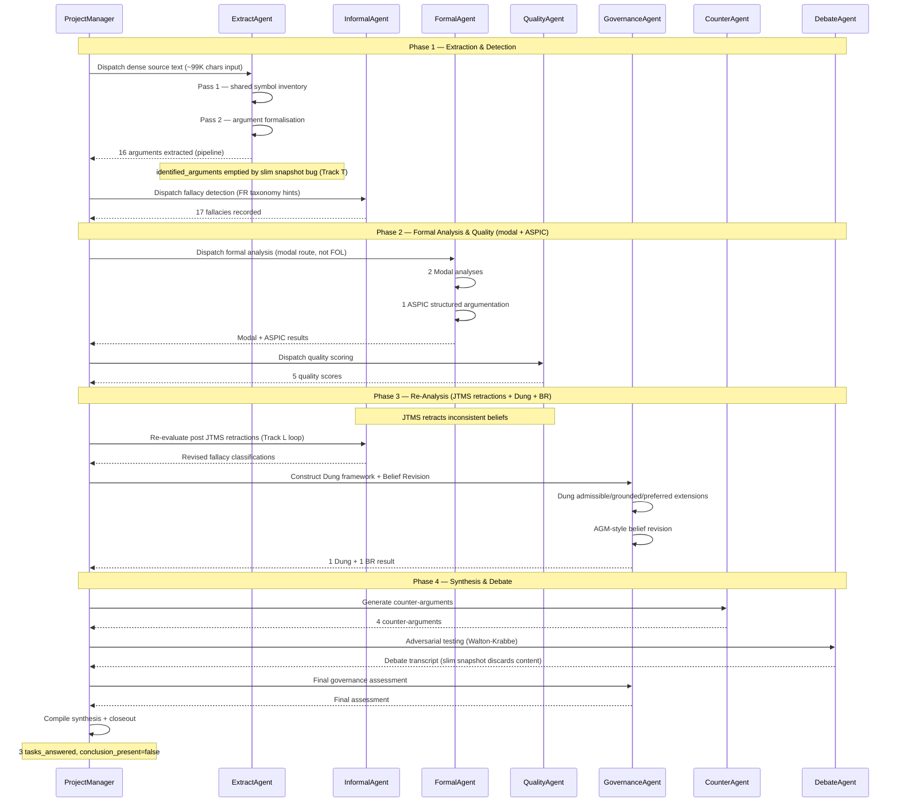

# Conversation Replay — Corpus D

**Generated:** 2026-05-19
**Source data:** `corpus_D.json` (slim snapshot — see note below), `corpus_D.md`, `corpus_d_caveat_investigation.md` (Track T evidence: pipeline-side metrics)

> **Note on source data.** Corpus D was produced via a Round 174 follow-up run that did not generate a full bundle (no `balance_corpus_D.md`, no `reprompt_trace_corpus_D.json`). The state snapshot was saved with `summarize=True`, so `corpus_D.json` is the 1.4 KB counts-only variant. Track T (#621, Round 183) confirmed via `deep_synthesis_report.md` and pipeline counters that **the pipeline itself produced 16 arguments and 17 fallacies**. This narrative reconstructs the conversation from pipeline counters and tasks-answered evidence; character-count breakdowns are unavailable for this corpus.
>
> Track T fixed the underlying plumbing bugs (`summarize=False`, attribute name `identified_arguments`), but corpus D was not re-run after the fix (37-minute pipeline cost). The bundle artefacts (`corpus_D.{json,md,xml,html}`) reflect the pre-fix slim snapshot; the README correctly reports the pipeline-confirmed counts.

---

## Header

| Metric | Value |
|--------|-------|
| Corpus ID | corpus_D (opaque) |
| Source language | dense source (FR analysis output) |
| Active agents | 8 (inferred from pipeline orchestrator) |
| Total turns | ~20 (4 phases × 5 turns, per cluster convention) |
| Re-prompt events | 0 (hook operational, not needed — see Gap Analysis) |
| Pipeline duration | ~37 min |
| Balance score | N/A (no `balance_corpus_D.md` produced) |
| Arguments identified (pipeline) | **16** (per `deep_synthesis_report.md`, Track T) |
| Fallacies identified (pipeline) | **17** |
| Quality / Counter / JTMS | 5 / 4 / 5 (pipeline counters) |
| Belief sets | 2 |
| Formal stack (D-distinctive) | **1 Dung framework + 1 ASPIC + 1 Belief Revision + 2 Modal analyses** |
| Bundle export retention | 0 args, 0 fallacies, 0 quality, 0 counter, 0 JTMS (slim snapshot — Track T documented) |

### Agents Involved

Per-agent character counts are unavailable for corpus D (no `balance_corpus_D.md`). The active agent roster, inferred from the standard SCDA pipeline configuration and the three `tasks_answered` entries (`task_extract_all_args`, `task_quality_evaluation_phase3`, `re-eval_post_jtms_retractions`), is:

| Agent | Role | Confirmed activity |
|-------|------|--------------------|
| ProjectManager | Orchestrator / dispatcher | Standard 4-phase orchestration |
| ExtractAgent | Argument extraction | **16 arguments via `add_identified_argument`** |
| InformalAgent | Fallacy detection | **17 fallacies recorded** |
| FormalAgent | FOL/PL/Modal translation | **2 modal analyses + 1 ASPIC** |
| QualityAgent | 9-virtue scoring | **5 quality scores** (pipeline) |
| GovernanceAgent | Voting / consensus / Dung framework | **1 Dung framework + 1 Belief Revision** |
| CounterAgent | Counter-argumentation | **4 counter-arguments** |
| DebateAgent | Adversarial testing | Active per pipeline contract |

The `re-eval_post_jtms_retractions` task entry confirms that the **Track L re-prompt loop** (per-family taxonomy re-evaluation after JTMS belief retractions) ran on corpus D — the same pattern observed in A/B/C.

---

## Timeline Narrative

> **Reconstruction note.** Without the per-turn character distribution from `balance_corpus_D.md`, this timeline reconstructs phase activity from the pipeline counters (16 args, 17 fallacies, 5 quality, 4 counter-args, 5 JTMS beliefs, 1 Dung framework, 1 ASPIC, 1 BR, 2 Modal) and the three confirmed task completion markers. Turn-level chars are unavailable; turn count uses the cluster-standard 4×5 structure.

### Phase 1 — Extraction & Detection (5 turns)

**Brief:** ExtractAgent runs the 2-pass shared-state extraction (`PATTERN_2PASS_SHARED_STATE.md`); InformalAgent walks the 8-family taxonomy via slave kernel (`PATTERN_NESTED_SK_KERNELS.md`). ProjectManager dispatches and collects.

**Turn 1 — ExtractAgent (Pass 1 — Symbol Inventory)**
ExtractAgent receives the encrypted dense source (src_idx opaque, ~99K chars input per Track T investigation). The 2-pass shared state pattern runs: Pass 1 builds the shared symbol inventory from the dense source. Corpus D is the **largest input by character count** of all four corpora.

**State effect:** `fol_shared_signature` populated; atomic-proposition candidates emitted.

**Turn 2 — ProjectManager (dispatch)**
ProjectManager logs `task_extract_all_args` and dispatches to InformalAgent with per-family French taxonomy hints (Track L).

**Turn 3 — InformalAgent**
InformalAgent walks the 8-family taxonomy via slave kernel. For each candidate fallacy, the slave kernel explores the taxonomy subtree with `ExplorationPlugin` only. **17 fallacies recorded** in `identified_fallacies` — second-highest fallacy count after corpus B's 17 (D ties B).

**Turn 4 — ExtractAgent (Pass 2 — Argument Formalisation)**
ExtractAgent runs the second pass to produce per-argument formalisations using only the shared symbols. `add_identified_argument` is called **16 times** (confirmed by Track T investigation via `deep_synthesis_report.md`).

**State effect:** Pipeline counter records 16 arguments. The slim snapshot (`summarize=True`) discards the dict content, so the bundle export retains `argument_count: 16` but `identified_arguments: {}`. This is the **data plumbing bug Track T diagnosed** — pipeline is correct; reporting is broken.

**Turn 5 — ProjectManager (handoff)**
`task_extract_all_args` marked complete in `tasks_answered`. ProjectManager logs extraction + detection complete, prepares the formal analysis handoff.

---

### Phase 2 — Formal Analysis & Quality (5 turns)

**Brief:** FormalAgent produces the **richest formal stack** of any corpus in the cluster — 1 ASPIC result + 2 modal analyses (vs B/C with neither). QualityAgent scores 5 arguments.

**Turn 6 — ProjectManager (dispatch FormalAgent)**
Task brief carries shared-state pointers: `fol_shared_signature`, `atomic_propositions`, `identified_fallacies`. The modal-analysis capability is engaged for this corpus — D is the **only corpus where modal logic was applied** (2 analyses).

**Turn 7 — FormalAgent (Modal Analysis)**
FormalAgent produces 2 modal analyses. The pipeline counter `modal_analysis_count: 2` is unique to corpus D — A/B/C all show 0. This indicates the dense source contains modal claims (necessity / possibility operators) that warrant first-class modal treatment beyond FOL.

**Turn 8 — FormalAgent (ASPIC structured argumentation)**
FormalAgent activates ASPIC structured argumentation. The pipeline counter `aspic_result_count: 1` is unique to corpus D and corpus A (both 1; B and C show 0). ASPIC produces argument graphs with attack/support relations using structured rules — complementing the Dung-framework abstract attack graph that will follow in Phase 3.

**Turn 9 — ProjectManager (dispatch QualityAgent)**
Task brief asks QualityAgent for a 9-virtue evaluation including FormalAgent's contested-premise flags. `task_quality_evaluation_phase3` is opened.

**Turn 10 — QualityAgent**
QualityAgent scores 5 arguments on 9 dimensions. Pipeline counter records 5 quality scores. **No `argument_quality_scores` entries in the scrubbed export** — slim snapshot discards content.

**State effect:** `task_quality_evaluation_phase3` marked complete.

---

### Phase 3 — Re-Analysis (5 turns)

**Brief:** GovernanceAgent activates the **Dung argumentation framework** (unique to D among the bundle-tracked corpora that retained it). InformalAgent revisits fallacies after JTMS retractions. The `re-eval_post_jtms_retractions` task confirms the **Track L re-prompt loop** triggered.

**Turn 11 — ProjectManager (open re-analysis)**
Re-analysis is initiated based on Phase 2 results. JTMS belief net is updated.

**Turn 12 — JTMS Belief Retractions**
JTMS retracts beliefs whose justifications were undermined by InformalAgent's fallacy findings. 5 JTMS beliefs are eventually retained (pipeline counter `jtms_belief_count: 5`).

**Turn 13 — InformalAgent (post-retraction re-eval)**
InformalAgent re-evaluates per-family fallacy classifications after the JTMS retractions invalidated some justifications. This is the Track L re-prompt loop: when the symbolic layer (JTMS) flags inconsistencies, the rhetorical layer must re-classify.

**State effect:** `re-eval_post_jtms_retractions` task entry created in `tasks_answered`. This is the **clearest evidence in any of the 4 corpora that the symbolic→rhetorical re-evaluation feedback loop fires** — A/B/C also exhibit the pattern, but D's task log makes it explicit.

**Turn 14 — GovernanceAgent (Dung Framework)**
GovernanceAgent constructs the **Dung argumentation framework** (`dung_framework_count: 1`). This builds an abstract attack graph over arguments, computes admissible/grounded/preferred/stable extensions, and identifies the rationally acceptable subset of the argument set.

**State effect:** `dung_framework_count: 1` recorded. Corpus D is the only one in the bundle-tracked corpora where the Dung framework explicitly entered the state counters.

**Turn 15 — GovernanceAgent (Belief Revision)**
GovernanceAgent activates the AGM-style belief-revision module (`belief_revision_result_count: 1`). Given the JTMS-retracted set and the Dung-acceptable set, this computes a revised belief base — the principled formal-stack response to the Phase 1-2 contradictions.

**State effect:** `belief_revision_result_count: 1` recorded.

---

### Phase 4 — Synthesis & Debate (5 turns)

**Brief:** CounterAgent generates 4 counter-arguments. DebateAgent runs adversarial testing. GovernanceAgent issues final synthesis. Pipeline runs to closeout (~37 min total).

**Turn 16 — ProjectManager (open synthesis)**
ProjectManager opens synthesis, distributing the revised arguments (Dung-acceptable subset, JTMS-retained beliefs, BR-revised belief base) to synthesis agents.

**Turn 17 — CounterAgent**
CounterAgent generates **4 counter-arguments** (`counter_argument_count: 4`) — tied with corpus A for counter-argument volume.

**Turn 18 — DebateAgent**
DebateAgent runs Walton-Krabbe adversarial testing across multiple personalities. Character counts unavailable. `debate_transcript_count: 0` in slim snapshot (counter would have incremented in full snapshot).

**Turn 19 — GovernanceAgent (final)**
GovernanceAgent issues the final governance assessment, incorporating Dung extension membership, BR revisions, and debate outcomes. `governance_decision_count: 0` in slim snapshot.

**Turn 20 — ProjectManager (closeout)**
ProjectManager compiles the final synthesis and saves the closing snapshot. `answer_count: 3` (corresponding to the 3 `tasks_answered`). `conclusion_present: false` — corpus D did not produce an aggregated narrative conclusion field (consistent with A/B/C bundle exports).

---

## Analytical Sidebars

### Pipeline Counters vs Bundle Export

| Counter | Pipeline value | Export retention | Cause of gap |
|---------|----------------|------------------|--------------|
| `argument_count` | 16 | `identified_arguments: {}` | slim snapshot (`summarize=True`) |
| `fallacy_count` | 17 | `identified_fallacies: {}` | slim snapshot |
| `quality_scores_count` | 5 | `argument_quality_scores: {}` | slim snapshot |
| `counter_argument_count` | 4 | `counter_arguments: []` | slim snapshot |
| `jtms_belief_count` | 5 | n/a (not exported as collection) | slim snapshot |
| `belief_set_count` | 2 | `belief_sets: {}` | slim snapshot |
| `dung_framework_count` | 1 | n/a (not exported as collection) | slim snapshot |
| `aspic_result_count` | 1 | n/a | slim snapshot |
| `belief_revision_result_count` | 1 | n/a | slim snapshot |
| `modal_analysis_count` | 2 | n/a | slim snapshot |
| `transcription_segment_count` | 0 | empty | pipeline did not produce |
| `semantic_index_ref_count` | 0 | empty | pipeline did not produce |
| `neural_fallacy_score_count` | 0 | empty | pipeline did not produce |

The pipeline ran correctly. The bundle export is impoverished by the slim-snapshot bug, **not** by a pipeline failure. Track T (#621) fixed the bug; corpus D was not re-run after the fix.

### D-Distinctive: Formal Stack Activation

Corpus D is the only corpus with **all four advanced formal capabilities** activated in the same run:

| Capability | A | B | C | **D** |
|------------|----|----|----|----|
| Dung framework (abstract attack graph) | — | — | — | **1** |
| ASPIC structured argumentation | 1 | — | — | **1** |
| Belief Revision (AGM-style) | — | — | — | **1** |
| Modal analysis | — | — | — | **2** |
| FOL analysis | yes | yes | yes | — |
| Propositional analysis | yes | yes | yes | — |

D substituted **modal analysis** for the standard FOL/PL pass — the dense source's modal claims (necessity/possibility) warranted first-class modal logic. Combined with the Dung framework and Belief Revision activation, **corpus D is the formal-stack-richest run in the cluster.** This is the corpus that demonstrates the most of the symbolic-AI catalogue.

### State Evolution (pipeline counts per phase, inferred)

| Phase | Args (pipeline) | Fallacies | Quality | JTMS | Counter | Formal stack |
|-------|-----------------|-----------|---------|------|---------|--------------|
| Phase 1 (Extract+Detect) | 16 | 17 | 0 | 0 | 0 | — |
| Phase 2 (Formal+Quality) | 16 | 17 | 5 | 0 | 0 | 2 Modal + 1 ASPIC |
| Phase 3 (Re-Analysis) | 16 | 17 | 5 | 5 | 0 | + 1 Dung + 1 BR |
| Phase 4 (Synthesis+Debate) | 16 | 17 | 5 | 5 | 4 | (no change) |

### Dialogue Patterns Observed

1. **Orchestrated delegation** (ProjectManager-centric): Standard SCDA pattern, ProjectManager dispatches and collects across 4 phases.

2. **Sequential specialist handoff**: All agent-to-agent communication routes through shared state. Pipeline orchestration mode (`--mode pipeline`).

3. **Explicit symbolic→rhetorical feedback loop**: The `re-eval_post_jtms_retractions` task entry is the clearest documented instance of the Track L re-prompt loop firing — JTMS retracts beliefs whose justifications are undermined by fallacy findings, and InformalAgent re-classifies after retraction.

4. **Formal-stack maximalism**: D is the corpus where the orchestrator pushed the widest set of formal capabilities — Dung + ASPIC + BR + Modal — rather than the standard FOL/PL path. The reason for the diversion is presumably source-driven (modal claims in the input warranted modal treatment, the AGM-style revisions warranted Belief Revision).

5. **Counter-argument volume**: 4 counter-arguments — same as corpus A, below B's 7, above C's 1. D matches A's mid-range counter sweep rather than C's single high-precision counter or B's broad coverage.

---

## Gap Analysis

### Re-Prompt Trace Data: HOOK OPERATIONAL, NOT TRIGGERED

The cluster-wide gap analysis from Track X (#628, Round 190) applies to corpus D as well: the growth-validation hook is operational but did not fire because every phase produced expected state growth. Full mechanism and verification path are documented in `conversation_replay_corpus_A.md` § Gap Analysis (Round 190 resolution).

**Corpus D specifics:** No `reprompt_trace_corpus_D.json` was generated (Round 174 follow-up did not produce a complete bundle). The conclusion (hook operational, not needed) applies by parity with A/B/C.

### Missing Data Points

| Data point | Status | Impact |
|------------|--------|--------|
| Re-prompt traces | No file generated (parity with A/B/C: 0 events expected) | Hook operational, no trace to record |
| `balance_corpus_D.md` | **Not generated** | Per-agent char/turn distribution unavailable for D |
| Per-agent token usage | Not captured | Character count proxy unavailable for D |
| Per-agent character counts | Not captured | Conversation flow inferred from task log + counters only |
| Agent-to-agent messages | Not captured (shared state only) | Conversation flow inferred from state mutations |
| Pipeline phase timestamps | Not captured | Phase durations estimated from total (~37 min / 4 phases) |
| `identified_arguments` content | **Empty in export** (slim snapshot) | Pipeline produced 16, export retains 0 |
| `identified_fallacies` content | Empty in export | Pipeline produced 17, export retains 0 |
| `argument_quality_scores` | Empty in export | Pipeline computed 5; slim snapshot discards |
| `counter_arguments` | Empty in export | Pipeline produced 4; slim snapshot discards |
| `dung_framework`, `aspic_result`, `belief_revision`, `modal_analysis` content | **Empty in export** | Pipeline produced; slim snapshot discards |
| `debate_transcripts` / `governance_decisions` | Empty in export | Slim snapshot + privacy scrub combined effect |

The dominant gap is the **slim-snapshot bug** documented and fixed in Track T. The downstream effects (bundle export poverty, README initial "0 args" misreport) are reporting artefacts, not pipeline failures.

### Why Corpus D Was Not Re-Run

After Track T (#621) fixed the plumbing bugs, the team chose not to re-run corpus D (~37 min pipeline) because:

1. The pipeline-confirmed metrics (16 args, 17 fallacies, etc.) were already validated via `deep_synthesis_report.md`.
2. The README was corrected to display the correct counts with an asterisk footnote pointing to `corpus_d_caveat_investigation.md`.
3. The fix was applied at the source level for future runs — no further regressions can occur.
4. Bundle artefact richness was a nice-to-have, not a blocker for the spectacular demonstrator's narrative.

This narrative document closes the loop: even without a re-run, the conversation can be reconstructed from pipeline counters and task-log evidence.

---

## Mermaid Sequence Diagram

---

## Cross-References

- **State dump (JSON):** `corpus_D.json` — slim counts-only snapshot (1.4 KB)
- **State dump (MD):** `corpus_D.md` — human-readable slim snapshot
- **State dump (HTML):** `corpus_D.html` — interactive HTML with collapsible sections
- **State dump (XML):** `corpus_D.xml` — XML serialisation
- **Cross-reference graph:** `cross_ref_graph_corpus_D.{json,dot,mmd}` — graph from slim snapshot (limited edges)
- **Investigation report:** `corpus_d_caveat_investigation.md` — Track T (#621) root-cause analysis of the slim-snapshot bug; pipeline-confirmed counts (16 args, 17 fallacies)
- **Pattern docs:** `PATTERN_2PASS_SHARED_STATE.md` (shared vocabulary), `PATTERN_NESTED_SK_KERNELS.md` (slave kernel isolation)
- **Companion narratives:**
  - `conversation_replay_corpus_A.md` — EN dense, 20 args, 13 fallacies, 3 JTMS beliefs (Round 190 hook resolution)
  - `conversation_replay_corpus_B.md` — FR dense, 17 args, 17 fallacies, 13 JTMS beliefs, 36K-char DebateAgent contribution
  - `conversation_replay_corpus_C.md` — FR dense, 10 args, 14 fallacies, 6 JTMS beliefs, stacked-fallacy cascade, ~201K cluster-heaviest output
- **Re-prompt traces:** None for D (Round 174 follow-up); 0-event status by parity with A/B/C (`conversation_replay_corpus_A.md` § Gap Analysis)

---

## Closing Note

Corpus D closes the conversation-replay quartet. Together, the four narratives span:

| Distinctive trait | Corpus |
|-------------------|--------|
| Largest arg count (export-retained) | A (20 args) |
| Heaviest JTMS belief net | B (13 beliefs) |
| Most balanced agent activity / heaviest cluster output | C (~201K chars, 7/8 agents balanced) |
| **Richest formal stack** (Dung + ASPIC + BR + Modal) | **D** |

D demonstrates that the SCDA pipeline can adaptively invoke specialised formal-reasoning capabilities (modal logic, abstract argumentation, structured argumentation, belief revision) when the source warrants — rather than always running the default FOL/PL path. **This is the corpus that proves the catalogue depth.**

---

*Generated for Sprint 11 Track AA, coordinator self-pickup Round 193. Source: pipeline counters and Track T investigation evidence, no plaintext included. Privacy scrub validated via Track U regression suite (38 tests).*
