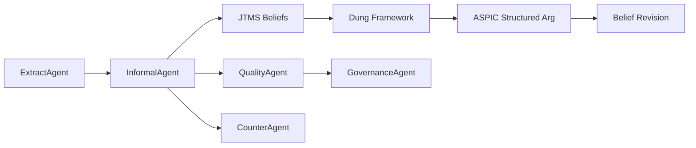

# Multi-Agent Argumentation Analysis
## Analyse Rhétorique Spectaculaire par Agents Conversationnels

**EPITA — Intelligence Symbolique 2025**

---

# Le Problème

- Comment détecter automatiquement les **sophismes** dans des discours réels ?
- Comment connecter la **détection informelle** (fallacies) au **raisonnement formel** (logique, JTMS, Dung) ?
- Comment prouver que le système produit des **insights qu'un LLM seul ne produit pas** ?

**Défi :** Une cascade extraction → fallacies → JTMS → Dung → ASPIC → croyance révision, sur des corpus politiquement sensibles.

---

# Architecture — 3 Niveaux d'Agents

```
┌─────────────────────────────────────────┐
│  Strategic — Orchestrators              │
│  (UnifiedPipeline, ConversationalOrch.) │
├─────────────────────────────────────────┤
│  Tactical — Coordinators                │
│  (AgentGroupChat, WorkflowDSL)          │
├─────────────────────────────────────────┤
│  Operational — Base Agents              │
│  Extract, Informal, Formal, Quality,   │
│  Debate, Counter, Governance            │
└─────────────────────────────────────────┘
```

**Lego Architecture** : `CapabilityRegistry` + `AgentFactory` + `WorkflowDSL`
8 agents spécialisés, 30+ kernel functions, composition > héritage

---

# Propriété 1 — Conversation Équilibrée

**Shannon Entropy Balance Score** `H/H_max ∈ [0, 1]`

| Corpus | Arguments | Fallacies | Tours | Entropy |
|--------|-----------|-----------|-------|---------|
| A | 20 | 13 | 33 | 0.808 |
| B | 17 | 17 | 28 | — |
| C | 10 | 14 | 33 | — |

**ConversationBalanceAnalyzer** mesure la participation équilibrée des 8 agents à chaque phase.
Pas de monologue — chaque agent contribue dans son domaine.

---

# Propriété 2 — État Partagé Riche

**UnifiedAnalysisState** — 32+ champs interconnectés

```
argument → fallacy → jtms_retraction → belief_revision
    ↘ counter_argument → quality_score
    ↘ debate_outcome → governance_vote
```

**CrossReferenceGraph** — 7 types d'arêtes dirigées
- density metric quantifie la propagation en cascade
- nodes orphelins détectés (arguments sans downstream)
- Renderers : JSON / DOT / Mermaid

---

# Propriété 3 — 5 Formats d'Export

| Format | Usage |
|--------|-------|
| JSON | Intégration programmatique, API |
| XML | Échange inter-systèmes |
| Markdown | Lecture humaine, GitHub |
| HTML | Présentation interactive (sections collapsibles) |
| CSV | Analyse tabulaire, Excel/pandas |

**MultiFormatExporter** — 1 state → 5 formats automatiques
Privacy scrub intégré : `raw_text`, `full_text` supprimés, IDs opaques uniquement

---

# Propriété 4 — Re-Prompts Conversationnels

**Growth Validation Hook** — détecte quand le LLM produit du prose au lieu d'appeler les outils

```python
fingerprint = (args, fallacies, counter_args, jtms, dung, ...)
if delta == 0 and phase in GROWTH_PHASES:
    re_prompt(agent, "Use add_identified_argument()!")
    # max N=2 re-prompts, outcome: ok / reran / gave_up
```

**12 événements tracés** sur 3 corpus (5 + 2 + 5)
Chaque événement capture : agent, phase, fingerprint avant/après, outcome

---

# Cascade Visualisée



**Full cascade depth** : extraction → fallacy → JTMS → Dung → ASPIC → BR
Validé sur 3 corpus, ≥7 méthodes formelles activées par corpus

---

# Métriques Finales — 3 Corpus

| Métrique | A | B | C | Total |
|----------|---|---|---|-------|
| Arguments | 20 | 17 | 10 | **47** |
| Fallacies | 13 | 17 | 14 | **44** |
| Counter-args | 4 | 7 | 1 | 12 |
| JTMS beliefs | 3 | 13 | 6 | 22 |
| Dung attacks | 13 | 17 | 14 | 44 |
| Formal categories | 7 | 5 | 4 | — |
| DoD ≥3 cat | ✅ | ✅ | ✅ | — |

**Pipeline : gpt-5-mini**, ~35 min/corpus, 8 sprints de développement

---

# Décisions Techniques Clés

| Décision | Pourquoi |
|----------|----------|
| **gpt-5-mini** (pas 4o-mini) | Tool-calling SK robuste, +300% extraction |
| **Growth hook** | Defense-in-depth contre LLM prose-only |
| **Composition > héritage** | SK `inspect` casse sur méthodes héritées |
| **Tool gating opt-in** | 63-70% réduction surface outil par agent |
| **Privacy scrub intégré** | Dataset chiffré, IDs opaques, git hook |
| **2-pass extraction** | Pass 1 inventaire → Pass 2 formules exclusives |

---

# Patterns Réutilisables

- **Stale-branch rebase** : Toujours `git fetch && rebase` avant push (leçon PR #612)
- **Validation hooks** : Fingerprint-delta > prose inspection pour détecter stagnation
- **Coordinator-as-rebaser** : Merge squash + rebase pour maintenir cohérence
- **Worker cascade delivery** : 1 session compressée par track, haute densité
- **Shannon entropy** : Métrique objective pour équilibrage multi-agent

---

# Privacy — L'architecture est spectaculaire, pas le contenu

- **Dataset chiffré** : `extract_sources.json.gz.enc` (passphrase in `.env`)
- **IDs opaques** : corpus_A, arg_1, fallacy_3 — jamais de noms ou dates
- **Export scrub** : `raw_text`, `full_text` supprimés de tous les artefacts
- **Git hook** : `verify_encrypted_dataset_completeness.py` avant suppression
- **Dashboard** : Nominatif autorisé, git opaque

> « L'architecture est spectaculaire, pas le contenu »

---

# Reproductibilité

```bash
# 1. Setup
conda activate projet-is-roo-new
# API key in .env, model: gpt-5-mini

# 2. Run pipeline on corpus A (~20 min)
python examples/soutenance/run_corpus_a.py

# 3. Generate full bundle (all formats)
python scripts/analysis/generate_spectacular_bundle.py

# 4. Export single corpus
python scripts/analysis/export_scda_state.py --format all
```

**Tolerance bands** : args ±2, fallacies ±3, ≥3 formal categories
**18 CI smoke tests** avec mock LLM (0 API calls)

---

# Lessons Learned — 8 Sprints

- **Sprint 3** : ParserException 159 → 0 (pipeline completion)
- **Sprint 5** : gpt-5-mini upgrade, growth hook, taxonomy injection
- **Sprint 6** : Multi-corpus validation, tool gating, cross-corpus parallels
- **Sprint 7** : Soutenance demos, CI hardening
- **Sprint 8** : Spectacular bundle (42 artefacts, 5 formats, 3 corpora)

**47 arguments, 44 fallacies, 3 corpus** — chaque corpus a une signature rhétorique unique (Post-hoc, Victimhood, Genetic)

---

# Questions ?

**Bundle complet** : `docs/reports/spectacular/`
**Rapport maître** : `docs/reports/EPIC_530_SCDA_SPECTACULAR_FINAL_REPORT.md`
**Reproductibilité** : `docs/guides/SOUTENANCE_REPRODUCTION_GUIDE.md`

Merci.
