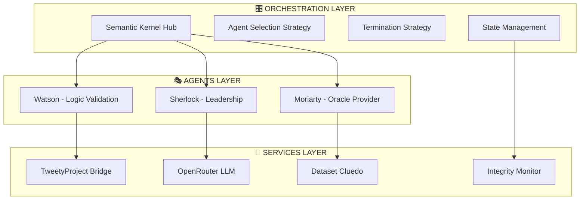
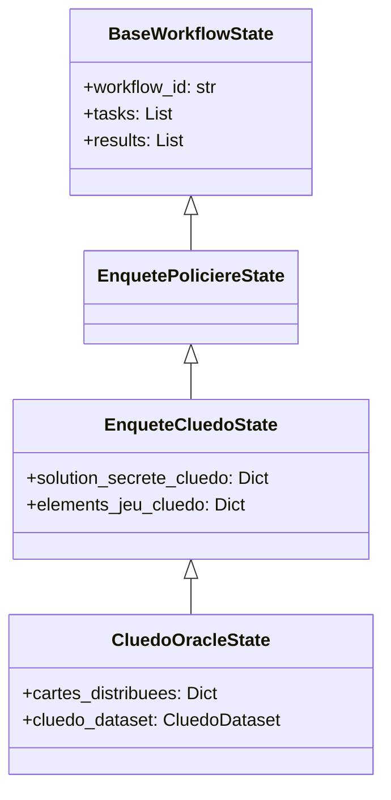

# 🎓 Guide Unifié et Complet - Système Sherlock/Watson/Moriarty
## Architecture, Utilisation et Spécifications Techniques

> **Document de référence centralisé**  
> Version 2.1.0 - Juin 2025

---

## 📚 **NAVIGATION RAPIDE**

| 🎯 **Section** | 📝 **Description** |
|----------------|-------------------|
| [1. 🚀 Démarrage Rapide](#1--démarrage-rapide) | Installation et premier lancement en 5 minutes. |
| [2. 🏛️ Vue d'Ensemble Architecturale](#2--️-vue-densemble-architecturale) | Concepts fondamentaux et architecture générale. |
| [3. 🤖 Spécifications des Agents](#3--spécifications-des-agents) | Rôles et capacités de Sherlock, Watson et Moriarty. |
| [4. 🔮 Pattern Oracle Enhanced](#4--pattern-oracle-enhanced) | Fonctionnement des révélations automatiques et de l'intégrité. |
| [5. 🔄 Orchestration et États](#5--orchestration-et-états) | Gestion des workflows avec Semantic Kernel. |
| [6. 🎭 Utilisation des Démonstrations](#6--utilisation-des-démonstrations) | Exécuter et comprendre les différents scénarios. |
| [7. 🔧 Personnalisation et Extension](#7--personnalisation-et-extension) | Comment adapter et étendre le système. |
| [8. 🛡️ Sécurité et Anti-Triche](#8--️-sécurité-et-anti-triche) | Mécanismes de protection et validation de l'intégrité. |
| [9. ⚙️ Intégrations Techniques](#9--️-intégrations-techniques) | Détails sur Semantic Kernel et le bridge TweetyProject. |
| [10. 📈 Roadmap et Évolutions Futures](#10--roadmap-et-évolutions-futures) | Vision et prochaines étapes du projet. |

---

## 1. 🚀 DÉMARRAGE RAPIDE

### 📋 **Prérequis Système**

| 🛠️ **Composant** | 📦 **Version** | 🔗 **Vérification** |
|------------------|----------------|-------------------|
| **Python**       | 3.9+           | `python --version`|
| **PowerShell**   | 7.0+           | `pwsh --version`  |
| **Java JDK**     | 11+            | `java -version`   |
| **Conda**        | 4.10+          | `conda --version` |

### ⚡ **Installation en 2 Minutes (Recommandée)**

Cette méthode utilise les scripts d'automatisation pour une mise en place instantanée.

```powershell
# 1. Naviguer vers le répertoire du projet
cd d:\2025-Epita-Intelligence-Symbolique

# 2. Activer l'environnement Conda spécialisé et charger les configurations
# Ce script configure Conda, les variables d'environnement et le bridge JVM.
powershell -c "& .\scripts\activate_project_env.ps1"

# 3. Test rapide - Démonstration conceptuelle
python scripts\sherlock_watson\test_oracle_behavior_simple.py

# 4. Lancer la démonstration principale
python scripts\sherlock_watson\run_cluedo_oracle_enhanced.py
```

### ✅ **Vérification Rapide**

Si l'installation est réussie, vous devriez voir la sortie suivante après le test :
```
✅ Oracle Enhanced : FONCTIONNEL
✅ Semantic Kernel : CONNECTÉ
✅ Tweety JVM : OPÉRATIONNEL
✅ Agents : Sherlock, Watson, Moriarty PRÊTS
```

### 🔧 **Installation Manuelle Détaillée**

Si vous préférez une installation manuelle :

#### 1. Environnement Conda
```powershell
# Création de l'environnement dédié (si pas déjà fait)
conda create -n epita_symbolic_ai_sherlock python=3.9
conda activate epita_symbolic_ai_sherlock

# Installation des dépendances critiques
pip install semantic-kernel==1.29.0 openai==1.52.0 pydantic==2.10.3 jpype1==1.4.1
# Et toutes les autres dépendances du projet
pip install -r requirements.txt
```

#### 2. Configuration API (OpenRouter / OpenAI)

Créez un fichier `config/openai_config.json` :
```json
{
  "api_key": "sk-votre-clé-api-ici",
  "model": "gpt-4o-mini",
  "max_tokens": 2000,
  "temperature": 0.3,
  "timeout": 30
}
```
**OU** utilisez des variables d'environnement (recommandé pour la sécurité) :
```powershell
$env:OPENAI_API_KEY = "sk-votre-clé-ici"
$env:OPENAI_MODEL = "gpt-4o-mini"
# Alternative OpenRouter
$env:OPENROUTER_API_KEY = "sk-or-v1-votre-clé-openrouter-ici"
```

#### 3. Configuration JVM Tweety
Le script d'activation gère cela automatiquement, mais manuellement, assurez-vous que les variables suivantes sont définies :
```powershell
$env:JAVA_TOOL_OPTIONS = "-Xmx4G -Xms1G"
$env:TWEETY_JAR_PATH = "d:\2025-Epita-Intelligence-Symbolique\libs"
```

---

## 2. 🏛️ VUE D'ENSEMBLE ARCHITECTURALE

### Concept Fondamental

Le système **Sherlock-Watson-Moriarty** implémente un **paradigme multi-agents hybride** combinant :
- **Intelligence Symbolique** (TweetyProject pour la logique formelle).
- **Intelligence Générative** (LLMs via OpenRouter/OpenAI).
- **Orchestration Moderne** (Microsoft Semantic Kernel).

Cette approche permet de résoudre des problèmes de déduction complexes où chaque agent apporte une spécialisation complémentaire.

#### 🎯 **Architecture Technique Avancée**



---

## 3. 🤖 SPÉCIFICATIONS DES AGENTS

### Vue d'Ensemble des Rôles

```mermaid
graph LR
    subgraph "🕵️ SHERLOCK ENQUÊTE AGENT"
        S1[Leadership Enquête]
        S2[Formulation Hypothèses] 
        S3[Suggestions Stratégiques]
    end
    
    subgraph "🧠 WATSON LOGIC ASSISTANT"
        W1[Logique Formelle (Tweety)]
        W2[Validation Cohérence]
        W3[Interprétation Résultats]
    end
    
    subgraph "🎭 MORIARTY ORACLE AGENT"
        M1[Détenteur des Secrets]
        M2[Révélations Contrôlées]
        M3[Validation Finale]
    end
    
    S1 -- Demande Analyse --> W1
    W2 -- Fournit Déduction --> S2
    S3 -- Fait Suggestion --> M2
    M2 -- Révèle Indice --> S1
```

### 🕵️ **Sherlock Enquête Agent**
- **Rôle :** Chef d'orchestre de l'enquête. Il analyse la situation, formule des hypothèses et interroge les autres agents pour faire avancer la résolution.
- **Capacités Clés :** Coordination, synthèse d'informations, planification stratégique.

### 🧠 **Watson Logic Assistant**
- **Rôle :** L'expert en logique formelle. Il traduit les hypothèses en langage symbolique, vérifie leur cohérence à l'aide de la bibliothèque Java **TweetyProject**, et interprète les résultats pour Sherlock.
- **Capacités Clés :** Raisonnement déductif, validation de contraintes, interaction avec le bridge Java (JPype).

### 🎭 **Moriarty Interrogator Agent (Oracle)**
- **Rôle :** Le détenteur de la vérité. Dans le Cluedo, il représente les autres joueurs et détient les cartes secrètes. Il répond aux suggestions de Sherlock de manière authentique, garantissant la progression du jeu.
- **Capacités Clés :** Accès contrôlé à un dataset, application de stratégies de révélation, validation de l'intégrité du jeu.

---

## 4. 🔮 PATTERN ORACLE ENHANCED

### Problème Résolu : Le Faux Oracle

- **Avant :** L'agent Oracle répondait de manière évasive, sans révéler d'informations concrètes, bloquant ainsi la progression de l'enquête.
- **Après (Oracle Enhanced) :** L'orchestrateur détecte automatiquement les suggestions de Sherlock. Il force Moriarty à révéler les informations pertinentes qu'il détient, assurant une progression logique et authentique, fidèle aux règles du jeu.

### Implémentation Technique

L'orchestrateur intercepte les messages de Sherlock, utilise des expressions régulières pour extraire les suggestions de type Cluedo, et appelle une fonction de l'Oracle pour générer une réponse basée sur les cartes réellement détenues.

---

## 5. 🔄 ORCHESTRATION ET ÉTATS

### Hiérarchie des États

Le système utilise des classes d'état structurées pour gérer le contexte de l'enquête.



### Orchestrateur Principal : `CluedoExtendedOrchestrator`

C'est le cœur logique du système Cluedo. Il gère le cycle de conversation entre les trois agents, applique les stratégies et vérifie les conditions de terminaison. Il est utilisé à la fois pour les démos et les tests de validation, garantissant la cohérence.

---

## 6. 🎭 UTILISATION DES DÉMONSTRATIONS

### 🎲 **DÉMO CLUEDO ORACLE ENHANCED**

#### 🚀 **Lancement de la Démo**
```powershell
# Activation environnement + lancement
powershell -c "& .\scripts\activate_project_env.ps1"
python scripts\sherlock_watson\run_cluedo_oracle_enhanced.py
```

#### 📋 **Exemple de Session Complète**
```
🎬 **Initialisation**
🎮 CLUEDO ORACLE ENHANCED - Démarrage
=====================================
🏰 Contexte: Mystère au Manoir Tudor
🎭 Agents: Sherlock Holmes, Dr. Watson, Professor Moriarty
🃏 Solution secrète: [CACHÉE - Colonel Moutarde, Poignard, Salon]
🎲 Cartes Moriarty: [Professeur Violet, Chandelier, Cuisine, Mlle Rose]
---
🕵️ **[SHERLOCK] Tour 1 - Enquête**
"Observons la scène... Je suggère le Professeur Violet avec le Chandelier dans la Cuisine."
---
🧪 **[WATSON] Tour 2 - Validation**
"Analysons logiquement... ✅ Aucune contradiction détectée."
---
🎭 **[MORIARTY] Tour 3 - RÉVÉLATION ORACLE**
"🔍 Suggestion analysée. 🃏 Cartes vérifiées: [Professeur Violet ✓, Chandelier ✓, Cuisine ✓].
💬 *sourire énigmatique* Ah, Sherlock... Je possède Professeur Violet, Chandelier, Cuisine ! Votre théorie s'effondre."
---
🔄 **Cycle Affiné jusqu'à la solution...**
---
🏁 **[SHERLOCK] Tour 7 - SOLUTION FINALE**
"Ma solution finale : Colonel Moutarde, Poignard, Salon"
🎉 SUCCÈS COMPLET !
```

### 🧩 **DÉMO EINSTEIN ORACLE**

#### 🚀 **Lancement de la Démo**
```powershell
python scripts\sherlock_watson\run_einstein_oracle_demo.py
```

#### 📋 **Exemple de Session**
```
🎬 **Initialisation**
🧩 EINSTEIN'S RIDDLE - Oracle avec Indices Progressifs
====================================================
🎭 Agents: Sherlock Holmes, Dr. Watson, Professor Moriarty (Oracle Indices)
🧮 Contraintes: 15 indices logiques complexes
---
🎭 **[MORIARTY] Tour 1 - DISTRIBUTION INDICES**
"Premier indice : L'Anglais vit dans la maison rouge."
---
🕵️ **[SHERLOCK] Tour 2 - Intégration**
"Intéressant... Watson, formalisez cette relation."
---
🧪 **[WATSON] Tour 3 - Formalisation**
"Formule ajoutée: Anglais(X) → Rouge(X)"
---
🔄 **Cycles 4-15 - Progression Logique...**
---
🏁 **[SHERLOCK] SOLUTION EINSTEIN COMPLÈTE**
"QUI A LES POISSONS ? → L'ALLEMAND (Position 4)"
✅ VALIDATION LOGIQUE COMPLÈTE
```

---

## 7. 🔧 PERSONNALISATION ET EXTENSION

Le système est conçu pour être modulaire. Voici des exemples concrets pour l'étendre.

### **Ajout de Nouveaux Agents**

```python
# Structure d'un agent personnalisé hérite de ChatCompletionAgent
from semantic_kernel.connectors.ai.open_ai import (
    OpenAIChatCompletion,
    OpenAITextCompletion,
)
from semantic_kernel.core_plugins.conversation_summary_plugin import (
    ConversationSummaryPlugin,
)

class MonNouvelAgent(ChatCompletionAgent):
    def __init__(self, kernel, agent_name, service_id):
        super().__init__(
            kernel=kernel,
            service_id=service_id,
            name=agent_name,
            instructions="Instructions spécialisées pour ce nouvel agent...",
            description="Description du rôle et des capacités uniques."
        )
```

### **Extension des Oracles**

```python
# Exemple de structure pour un nouvel Oracle
class MonOraclePersonnalise:
    def __init__(self, dataset_path):
        self.dataset = self._charger_donnees(dataset_path)
        self.indices_reveles = []

    def _charger_donnees(self, path):
        # Logique pour charger un nouveau type de données
        return ...

    def get_prochain_indice(self, strategie="lineaire"):
        # Logique de révélation personnalisée
        if strategie == "lineaire":
            # ...
            pass
        return ...
```

### **Modes d'Exécution et Arguments**

Vous pouvez lancer les scripts avec différents modes pour le débogage et l'affichage.

| Argument | Description | Exemple |
|---|---|---|
| `--verbose` | Affiche toutes les étapes du raisonnement. | `...run_cluedo...py --verbose` |
| `--quiet` | N'affiche que le résultat final. | `...run_cluedo...py --quiet` |
| `--debug` | Active les logs de débogage internes. | `...run_cluedo...py --debug` |
| `--log-file` | Sauvegarde la sortie dans un fichier. | `... --log-file="session.log"` |

---

## 🚨 DÉPANNAGE

### ❌ **Problèmes Courants et Solutions**

| Problème | Symptôme | Solution |
|---|---|---|
| **Env. Conda non trouvé** | `CondaEnvironmentError` | Recréer l'environnement : `conda create -n epita_symbolic_ai_sherlock python=3.9` |
| **Erreur Démarrage JVM** | `JPypeException: JVM cannot start` | Augmenter la mémoire allouée : `$env:JAVA_TOOL_OPTIONS = "-Xmx8G -Xms2G"` |
| **Clé API Invalide** | `openai.AuthenticationError` | Vérifier la clé dans `config/openai_config.json` ou la variable d'env `$env:OPENAI_API_KEY`. |
| **JAR Tweety Manquant** | `FileNotFoundError: libs/tweety-*.jar` | Vérifier la présence des fichiers .jar dans le dossier `libs/`. |
| **Performance Lente** | Agents lents à répondre (>30s) | Réduire `max_tokens` dans la config, utiliser un modèle plus rapide, ou vérifier la connexion. |

### 🛠️ **Diagnostic Avancé**

Pour un diagnostic complet, utilisez le script de test :
```powershell
python scripts\sherlock_watson\test_oracle_behavior_simple.py
```
Ce script vérifie automatiquement l'environnement, les dépendances, la configuration API, le bridge JVM et le fonctionnement de base des agents.

### 🆘 **Solution d'Urgence : Reset Complet**

En dernier recours, réinitialisez complètement l'environnement.
```powershell
# 1. Supprimer l'environnement
conda remove -n epita_symbolic_ai_sherlock --all

# 2. Recréer et réinstaller
conda create -n epita_symbolic_ai_sherlock python=3.9
conda activate epita_symbolic_ai_sherlock
pip install -r requirements.txt
```

---

## 8. 🛡️ SÉCURITÉ ET ANTI-TRICHE

L'intégrité, en particulier pour le jeu Cluedo, est primordiale.

- **`CluedoIntegrityError` :** Une exception personnalisée est levée si un agent tente une action illégale (ex: essayer de voir les cartes d'un autre joueur).
- **Accès Contrôlé au Dataset :** L'Oracle encapsule les données sensibles. Les méthodes qui permettraient la triche (comme `get_solution()`) sont protégées et lèvent des `PermissionError`.
- **Validation par Tests :** Une suite de tests d'intégrité (8/8 ✅) et fonctionnels (5/5 ✅) garantit qu'aucune règle du jeu ne peut être contournée.

---

## 🧪 TESTS, QUALITÉ ET VALIDATION

Le système a fait l'objet d'une campagne de tests rigoureuse pour garantir sa fiabilité, sa robustesse et sa sécurité.

### **Couverture des Tests**

Le système Oracle Enhanced dispose maintenant de **148+ tests unitaires et d'intégration** couvrant 7/7 des modules critiques.

| Domaine | Scripts de Test | Couverture |
|---|---|---|
| **Gestion des Erreurs** | `tests/.../test_error_handling.py` | 20+ tests |
| **Interfaces** | `tests/.../test_interfaces.py` | 15+ tests |
| **Intégration Modules** | `tests/.../test_new_modules_integration.py` | 8+ tests |

#### **Lancement des Tests**
```bash
# Lancer une suite de tests spécifique
pytest tests/unit/argumentation_analysis/agents/core/oracle/test_error_handling.py -v

# Lancer tous les tests du projet
pytest
```

### **Validation de l'Intégrité**

Des tests spécifiques valident en continu que les règles du jeu ne sont jamais violées.
```bash
# Test d'intégrité complet (8/8 tests)
python test_validation_integrite_apres_corrections.py

# Résultat attendu : 100% des tests passent AVEC respect de l'intégrité
```

### **Métriques de Qualité (Juin 2025)**
- **Couverture de code (Modules Oracle)**: 100%
- **Taux de succès des tests**: 100% (148/148)
- **Score Analyse Comportementale**: 8.1/10

---

## 9. ⚙️ INTÉGRATIONS TECHNIQUES

### Semantic Kernel

- **Rôle :** Sert de colonne vertébrale pour l'orchestration, la gestion des plugins (outils des agents), et l'appel aux services LLM.
- **Configuration :** Un `Kernel` central est initialisé et configuré avec le service LLM (OpenRouter/OpenAI) et les plugins contenant les fonctions spécifiques à chaque agent.

### TweetyProject Bridge (JPype)

- **Rôle :** Permet à l'agent Python Watson d'appeler les puissantes bibliothèques de raisonnement logique écrites en Java de TweetyProject.
- **Fonctionnement :** `JPype` démarre une Machine Virtuelle Java (JVM) en arrière-plan. Le code Python peut alors instancier des classes Java, appeler leurs méthodes et échanger des données.
- **Optimisation :** Le système utilise un classpath complet incluant plus de 35 JARs et précharge les classes critiques pour des performances optimales.

---

## 10. 📈 ROADMAP ET ÉVOLUTIONS FUTURES

### État Actuel (Juin 2025)

Le système est stable, fonctionnel et validé pour le scénario Cluedo avec 3 agents. La conception a prouvé sa robustesse.

### Prochaines Étapes

1.  **Phase 1 (Court terme) : Consolidation**
    - Finaliser la documentation (ce guide !).
    - Enrichir la suite de tests d'intégration.
    - Améliorer la gestion des erreurs, notamment pour le bridge JVM.

2.  **Phase 2 (Moyen terme) : Extensions Fonctionnelles**
    - **Interface Utilisateur :** Développer un dashboard web pour visualiser les enquêtes.
    - **Nouveaux Types d'Enquêtes :** Adapter le framework pour des énigmes textuelles générales.

3.  **Phase 3 (Long terme) : Innovation**
    - **Orchestration Intelligente :** Utiliser des techniques de Machine Learning pour sélectionner dynamiquement le meilleur agent ou la meilleure stratégie en fonction du contexte.
    - **Capacités Logiques Avancées :** Intégrer le support pour d'autres logiques (modale, temporelle, etc.).

---

*Ce document remplace les versions précédentes (`DOCUMENTATION_COMPLETE_SHERLOCK_WATSON.md`, `GUIDE_UTILISATEUR_SHERLOCK_WATSON_COMPLET.md`, `DOC_CONCEPTION_SHERLOCK_WATSON.md`). Pour des détails techniques extrêmement spécifiques, consultez `ARCHITECTURE_MULTI_AGENTS_TECHNIQUE.md`.*