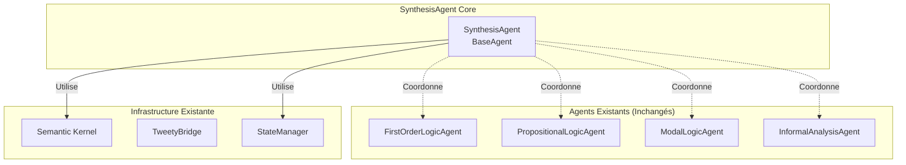
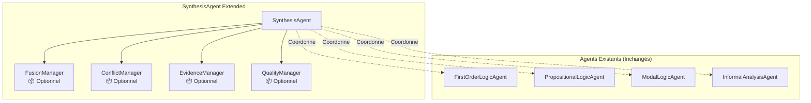
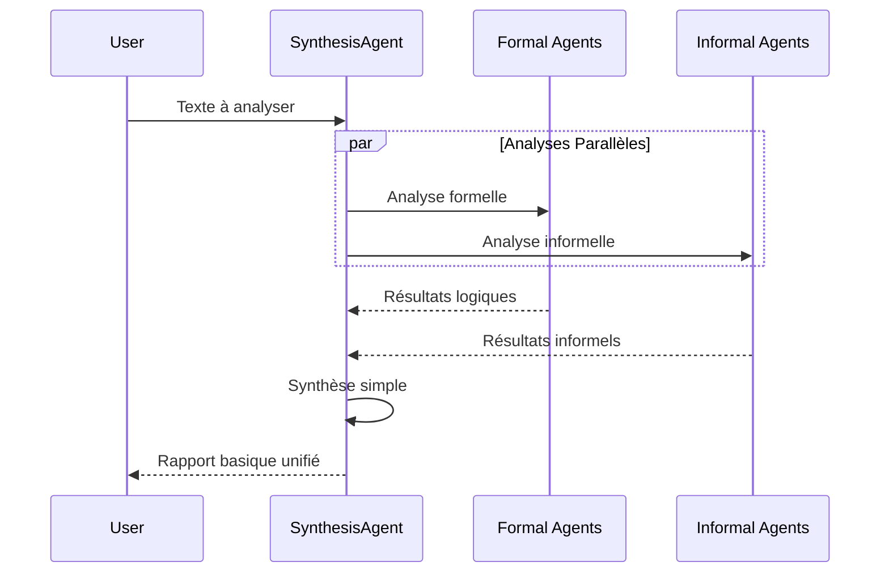
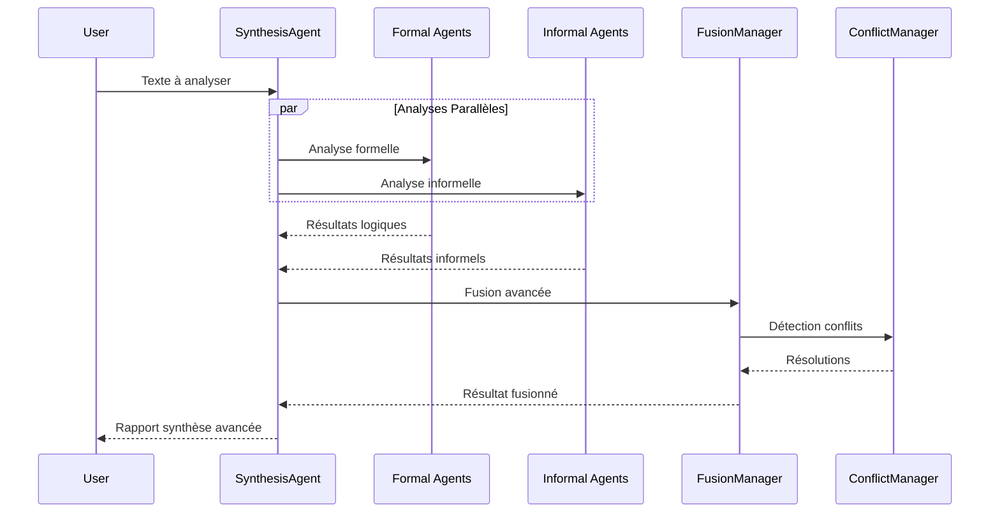

# Architecture de l'Agent de Synthèse Unifié

## 📋 Vue d'Ensemble

L'Agent de Synthèse Unifié est conçu comme une **couche d'orchestration optionnelle** qui préserve l'architecture existante tout en offrant des capacités de synthèse avancées. Tous les composants avancés sont **modulaires et optionnels**.

## 🎯 Principe de Conception : Architecture Progressive

### Niveau 1 : Synthèse Simple (Minimal)


### Niveau 2 : Synthèse Avancée (Optionnelle)


## 🔧 Architecture Technique

### 1. SynthesisAgent Core (Minimal)

```python
class SynthesisAgent(BaseAgent):
    """
    Agent de synthèse avec architecture progressive.
    Peut fonctionner en mode simple ou avec modules avancés.
    """
    
    def __init__(
        self, 
        kernel: sk.Kernel, 
        agent_name: str = "SynthesisAgent",
        enable_advanced_features: bool = False
    ):
        super().__init__(kernel, agent_name, system_prompt=SYNTHESIS_INSTRUCTIONS)
        
        # Modules optionnels - seulement si activés
        self.fusion_manager = FusionManager() if enable_advanced_features else None
        self.conflict_manager = ConflictManager() if enable_advanced_features else None
        self.evidence_manager = EvidenceManager() if enable_advanced_features else None
        self.quality_manager = QualityManager() if enable_advanced_features else None
        
    async def synthesize_analysis(self, text: str) -> UnifiedAnalysisResult:
        """Point d'entrée principal - mode simple ou avancé selon configuration"""
        
        if self.fusion_manager is None:
            return await self._simple_synthesis(text)
        else:
            return await self._advanced_synthesis(text)
```

### 2. Mode Simple : Coordination Basique

```python
async def _simple_synthesis(self, text: str) -> BasicSynthesisResult:
    """Synthèse simple sans modules avancés"""
    
    # 1. Lancer analyses en parallèle (agents existants inchangés)
    formal_task = self._run_formal_analysis(text)
    informal_task = self._run_informal_analysis(text)
    
    formal_results = await formal_task
    informal_results = await informal_task
    
    # 2. Synthèse basique par concaténation structurée
    return BasicSynthesisResult(
        text=text,
        formal_analysis=formal_results,
        informal_analysis=informal_results,
        simple_summary=self._generate_simple_summary(formal_results, informal_results),
        timestamp=self._get_timestamp()
    )

async def _run_formal_analysis(self, text: str) -> FormalResults:
    """Utilise les agents logiques existants sans modification"""
    
    # Réutilise exactement l'infrastructure existante
    fol_agent = FirstOrderLogicAgent(self.kernel, "FOL_Synthesis")
    pl_agent = PropositionalLogicAgent(self.kernel, "PL_Synthesis") 
    modal_agent = ModalLogicAgent(self.kernel, "Modal_Synthesis")
    
    # Même pattern que l'orchestration existante
    fol_result = await fol_agent.analyze_text(text)
    pl_result = await pl_agent.analyze_text(text)  
    modal_result = await modal_agent.analyze_text(text)
    
    return FormalResults(fol=fol_result, pl=pl_result, modal=modal_result)
```

### 3. Modules Avancés Optionnels

#### 📦 FusionManager (Optionnel)
```python
class FusionManager:
    """Module optionnel pour fusion avancée des résultats"""
    
    def __init__(self, enable_semantic_alignment: bool = True):
        self.semantic_alignment = enable_semantic_alignment
        
    async def fuse_results(
        self, 
        formal_results: FormalResults, 
        informal_results: InformalResults
    ) -> FusedResults:
        """Fusion intelligente avec alignement sémantique"""
        
        if self.semantic_alignment:
            return await self._semantic_fusion(formal_results, informal_results)
        else:
            return await self._basic_fusion(formal_results, informal_results)
```

#### 📦 ConflictManager (Optionnel)
```python
class ConflictManager:
    """Module optionnel pour résolution de conflits"""
    
    def __init__(self, resolution_strategy: str = "evidence_based"):
        self.strategy = resolution_strategy
        
    async def detect_and_resolve(
        self, 
        formal_results: FormalResults, 
        informal_results: InformalResults
    ) -> List[Resolution]:
        """Détection et résolution automatique des conflits"""
        
        conflicts = await self._detect_conflicts(formal_results, informal_results)
        resolutions = await self._resolve_conflicts(conflicts)
        return resolutions
```

## 🔄 Flux de Traitement Progressif

### Mode Simple


### Mode Avancé (Avec Modules Optionnels)


## 📊 Modèles de Données Progressifs

### BasicSynthesisResult (Mode Simple)
```python
@dataclass
class BasicSynthesisResult:
    """Résultat de synthèse simple - pas de dépendances complexes"""
    
    text: str
    formal_analysis: FormalResults
    informal_analysis: InformalResults
    simple_summary: str
    timestamp: str
    
    # Métriques basiques
    argument_count: int
    fallacy_count: int
    logical_validity: bool
```

### AdvancedSynthesisResult (Mode Avancé)
```python
@dataclass  
class AdvancedSynthesisResult(BasicSynthesisResult):
    """Extension avec fonctionnalités avancées"""
    
    # Modules optionnels
    fusion_report: Optional[FusionReport] = None
    conflict_resolutions: Optional[List[Resolution]] = None
    evidence_assessment: Optional[EvidenceReport] = None
    quality_metrics: Optional[QualityReport] = None
```

## 🔧 Configuration Progressive

### Configuration Simple
```python
# Utilisation minimale - aucune complexité ajoutée
synthesis_agent = SynthesisAgent(kernel, enable_advanced_features=False)
result = await synthesis_agent.synthesize_analysis("Mon texte à analyser")
```

### Configuration Avancée
```python
# Utilisation avec modules optionnels
synthesis_agent = SynthesisAgent(
    kernel, 
    enable_advanced_features=True
)

# Configuration fine des modules
synthesis_agent.fusion_manager.enable_semantic_alignment = True
synthesis_agent.conflict_manager.resolution_strategy = "evidence_weighted"

result = await synthesis_agent.synthesize_analysis("Mon texte complexe")
```

## 🎯 Avantages de l'Architecture Progressive

### ✅ Préservation de l'Existant
- **Aucune modification** des agents existants
- **Réutilisation intégrale** de l'infrastructure
- **Compatibilité totale** avec l'orchestration actuelle

### ✅ Adoption Graduelle
- **Démarrage simple** : utilisation immédiate sans complexité
- **Évolution progressive** : activation des modules selon les besoins
- **Pas de dépendances forcées** : chaque module est optionnel

### ✅ Flexibilité Maximale
- **Mode découplé** : peut fonctionner comme simple coordinateur
- **Mode intégré** : synthèse avancée avec résolution de conflits
- **Configuration runtime** : activation/désactivation à la volée

## 📈 Plan d'Implémentation par Phases

### Phase 1 : SynthesisAgent Core (Simple)
- [ ] Créer la classe de base `SynthesisAgent`
- [ ] Implémenter la coordination basique des agents existants
- [ ] Tester avec `BasicSynthesisResult`

### Phase 2 : Modules Optionnels de Base
- [ ] Implémenter `FusionManager` optionnel
- [ ] Créer système de configuration progressive
- [ ] Tests d'intégration mode simple/avancé

### Phase 3 : Modules Avancés
- [ ] Développer `ConflictManager` optionnel
- [ ] Ajouter `EvidenceManager` et `QualityManager`
- [ ] Optimisations et métriques avancées

### Phase 4 : Interface Utilisateur
- [ ] Intégration dans `AnalysisRunner`
- [ ] Documentation utilisateur
- [ ] Exemples d'utilisation progressive

## 📋 Points d'Intégration

### Avec AnalysisRunner Existant
```python
# Dans analysis_runner.py - ajout optionnel
async def run_synthesis_analysis(
    texte_a_analyser: str,
    llm_service: Union[OpenAIChatCompletion, AzureChatCompletion],
    use_advanced_synthesis: bool = False  # ← Paramètre optionnel
):
    """Extension optionnelle pour synthèse unifiée"""
    
    if use_advanced_synthesis:
        synthesis_agent = SynthesisAgent(kernel, enable_advanced_features=True)
        return await synthesis_agent.synthesize_analysis(texte_a_analyser)
    else:
        # Utilise l'orchestration existante inchangée
        return await run_analysis_conversation(texte_a_analyser, llm_service)
```

### Avec StateManager Existant
```python
# Extension optionnelle du StateManager
class SynthesisState:
    """Extension optionnelle pour état de synthèse"""
    
    def __init__(self, base_state: RhetoricalAnalysisState):
        self.base_state = base_state  # Réutilise l'existant
        self.synthesis_results: Optional[BasicSynthesisResult] = None
        self.advanced_results: Optional[AdvancedSynthesisResult] = None
```

---

**Cette architecture respecte votre contrainte : elle ajoute des capacités sans complexifier l'existant, avec des modules entièrement optionnels qui peuvent être adoptés progressivement.**