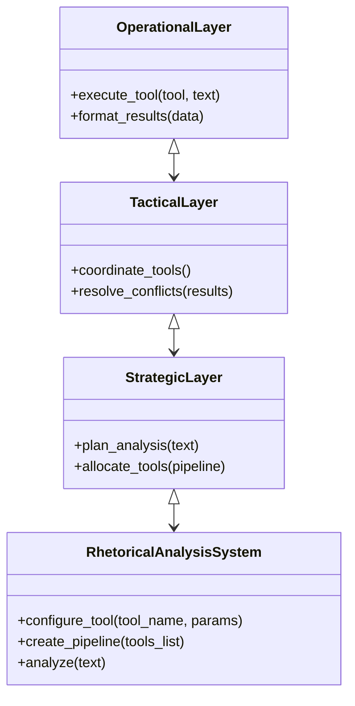

# Référence API - Outils d'Analyse Rhétorique

## Architecture Modulaire


## Modules Principaux

### Module Core
```python
class BaseRhetoricalTool:
    def analyze(self, text: str) -> RhetoricalResults:
        pass

class RhetoricalResults:
    def __init__(self, score: float, explanations: List[str], visualization: str):
        self.score = score
        self.explanations = explanations
        self.visualization = visualization
```

### Module Strategic
```python
class StrategicPlanner:
    def create_analysis_plan(self, text: str) -> AnalysisPlan:
        """Génère un plan d'analyse basé sur la structure du texte"""
        
class AnalysisPlan:
    def __init__(self, steps: List[AnalysisStep]):
        self.steps = steps
```

### Module Tactical
```python
class TacticalResolver:
    def resolve_tool_chain(self, plan: AnalysisPlan) -> List[ToolExecution]:
        """Crée une chaîne d'exécution des outils"""
        
class ToolExecution:
    def __init__(self, tool_name: str, parameters: Dict[str, Any]):
        self.tool_name = tool_name
        self.parameters = parameters
```

### Module Operational
```python
class MermaidVisualizer:
    def generate(self, results: RhetoricalResults) -> str:
        """Convertit les résultats en diagramme Mermaid"""
        
class LLMValidator:
    def validate_extracts(self, text: str) -> ValidationReport:
        """Valide les extraits avec un modèle LLM"""
```

## Améliorations Techniques
| Limitation Initiale | Solution Implémentée |
|---------------------|---------------------|
| Gestion des contextes | Fenêtrage contextuel dynamique |
| Performance | Exécution asynchrone des outils |
| Extensibilité | Système de plug-ins modulaire |
| Robustesse | Validation des extraits avec LLM |

## Exemple d'API Utilisation
```python
from argumentiation_analysis import RhetoricalAnalysisSystem

system = RhetoricalAnalysisSystem()
system.configure_tool("coherence_evaluator", {"threshold": 0.7})

plan = StrategicPlanner().create_analysis_plan("Texte à analyser")
executions = TacticalResolver().resolve_tool_chain(plan)

results = OperationalLayer().execute_tool_chain(executions)
visualization = MermaidVisualizer().generate(results)
```

## Structure des Répertoires
```
argumentiation_analysis/
├── orchestration/
│   ├── strategic/
│   │   ├── planner.py
│   │   └── allocator.py
│   ├── tactical/
│   │   ├── coordinator.py
│   │   └── resolver.py
│   └── operational/
│       ├── adapters/
│       └── manager.py
└── tools/
    ├── coherence.py
    ├── fallacy.py
    └── visualizer.py