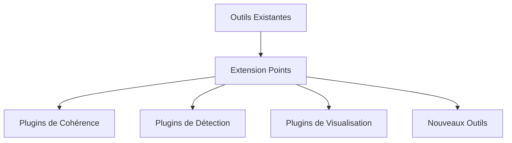
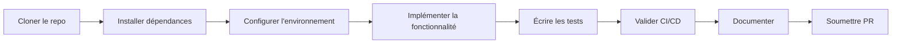

# Guide de Développement des Outils Rhétoriques

## Architecture Extensible


## Étendre les Outils Existants

### Ajouter un Critère de Cohérence
```python
from argumentiation_analysis.tools import CoherenceEvaluator

class CustomCoherenceCriterion:
    def evaluate(self, segment1, segment2):
        # Implémentation personnalisée
        score = self._calculate_score(segment1, segment2)
        explanation = self._generate_explanation(segment1, segment2)
        return score, explanation

# Enregistrement du critère
evaluator = CoherenceEvaluator()
evaluator.add_criterion(CustomCoherenceCriterion())
```

### Créer un Nouveau Type de Sophisme
```python
from argumentiation_analysis.tools import ContextualFallacyDetector

class CustomFallacyPlugin:
    def detect(self, context):
        # Logique de détection personnalisée
        if self._is_fallacious(context):
            return "custom_fallacy", 0.95
        return None, 0.0

# Enregistrement du plugin
detector = ContextualFallacyDetector()
detector.register_detector(CustomFallacyPlugin())
```

## Créer un Nouvel Outil

### Structure de Base
```python
from argumentiation_analysis.core import BaseRhetoricalTool

class MyNewTool(BaseRhetoricalTool):
    def __init__(self, param1, param2):
        super().__init__()
        self.param1 = param1
        self.param2 = param2

    def analyze(self, text):
        # Implémentation de l'analyse
        results = self._process(text)
        return RhetoricalResults(results)

# Enregistrement de l'outil
from argumentiation_analysis.registry import tool_registry
tool_registry.register("my_new_tool", MyNewTool)
```

## Bonnes Pratiques
1. **Tests Unitaires** : Couvrir 100% des cas d'usage
2. **Documentation** : Ajouter des exemples dans `docs/outils/`
3. **Performance** : Optimiser les algorithmes critiques
4. **Sécurité** : Valider toutes les entrées utilisateur

## Workflow de Développement


## Structure de Répertoire
```
argumentiation_analysis/
├── tools/
│   ├── __init__.py
│   ├── coherence.py
│   ├── fallacy.py
│   └── custom_tool.py  ← Nouvel outil
└── tests/
    └── tools/
        └── test_custom_tool.py  ← Tests associés