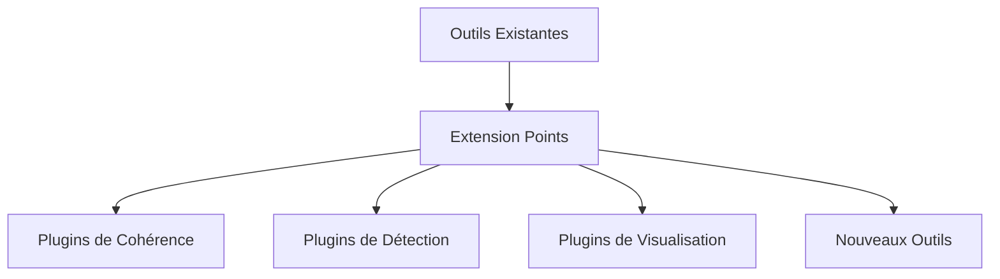
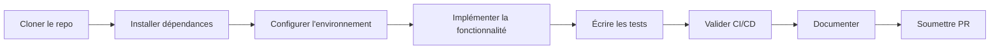

# Guide de Développement des Outils Rhétoriques

## Architecture Extensible

```mermaid
graph TD
    A[Outils Existantes] --> B[Extension Points]
    B --> C[Plugins de Cohérence]
    B --> D[Plugins de Détection]
    B --> E[Plugins de Visualisation]
    B --> F[Nouveaux Outils]
```

## Étendre les Outils Existants

### Étendre l'évaluateur de cohérence
```python
from argumentation_analysis.agents.tools.analysis.new.argument_coherence_evaluator import ArgumentCoherenceEvaluator

# ArgumentCoherenceEvaluator évalue 5 axes internes (logique, thématique,
# structurelle, rhétorique, épistémique). Pour étendre l'évaluation, sous-classer
# et surcharger l'une des méthodes _evaluate_*_coherence, ou ajouter un nouvel axe
# dans coherence_types + la méthode _evaluate_* correspondante.
# Note : il n'existe pas d'API publique add_criterion() ; l'évaluation est
# actuellement simulée (scores pré-définis — voir la docstring du module).
class CustomArgumentCoherenceEvaluator(ArgumentCoherenceEvaluator):
    def _evaluate_logical_coherence(self, arguments, semantic_analysis):
        # Implémentation personnalisée
        return super()._evaluate_logical_coherence(arguments, semantic_analysis)
```

### Créer un Nouveau Type de Sophisme
```python
from argumentation_analysis.tools import ContextualFallacyDetector

class CustomFallacyPlugin:
    def detect(self, context):
        # Logique de détection personnalisée
        if self._is_fallacious(context):
            return "custom_fallacy", 0.95
        return None, 0.0

# Enregistrement du plugin
detector = ContextualFallacyDetector()
detector.register_detector(CustomFallacyPlugin())
```

## Créer un Nouvel Outil

### Structure de Base
```python
from argumentation_analysis.core import BaseRhetoricalTool

class MyNewTool(BaseRhetoricalTool):
    def __init__(self, param1, param2):
        super().__init__()
        self.param1 = param1
        self.param2 = param2

    def analyze(self, text):
        # Implémentation de l'analyse
        results = self._process(text)
        return RhetoricalResults(results)

# Enregistrement de l'outil
from argumentation_analysis.registry import tool_registry
tool_registry.register("my_new_tool", MyNewTool)
```

## Bonnes Pratiques
1. **Tests Unitaires** : Couvrir 100% des cas d'usage
2. **Documentation** : Ajouter des exemples dans `docs/outils/`
3. **Performance** : Optimiser les algorithmes critiques
4. **Sécurité** : Valider toutes les entrées utilisateur

## Workflow de Développement

```mermaid
graph LR
    A[Cloner le repo] --> B[Installer dépendances]
    B --> C[Configurer l'environnement]
    C --> D[Implémenter la fonctionnalité]
    D --> E[Écrire les tests]
    E --> F[Valider CI/CD]
    F --> G[Documenter]
    G --> H[Soumettre PR]
```

## Structure de Répertoire
```
argumentation_analysis/
├── tools/
│   ├── __init__.py
│   ├── coherence.py
│   ├── fallacy.py
│   └── custom_tool.py  ← Nouvel outil
└── tests/
    └── tools/
        └── test_custom_tool.py  ← Tests associés