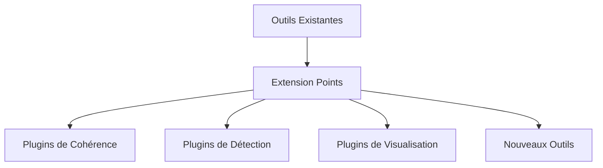
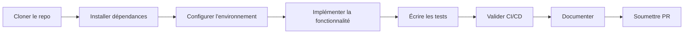

# Guide de Développement des Outils Rhétoriques

## Architecture Extensible

```mermaid
graph TD
    A[Outils Existantes] --> B[Extension Points]
    B --> C[Plugins de Cohérence]
    B --> D[Plugins de Détection]
    B --> E[Plugins de Visualisation]
    B --> F[Nouveaux Outils]
```

## Étendre les Outils Existants

### Ajouter un Critère de Cohérence
```python
from argumentation_analysis.tools import CoherenceEvaluator

class CustomCoherenceCriterion:
    def evaluate(self, segment1, segment2):
        # Implémentation personnalisée
        score = self._calculate_score(segment1, segment2)
        explanation = self._generate_explanation(segment1, segment2)
        return score, explanation

# Enregistrement du critère
evaluator = CoherenceEvaluator()
evaluator.add_criterion(CustomCoherenceCriterion())
```

### Créer un Nouveau Type de Sophisme

Il n'existe pas d'API `register_detector()` de type plug-in. Deux voies réelles :

**1. Sous-classer un détecteur existant** et surcharger sa logique de règles :

```python
from argumentation_analysis.agents.tools.analysis.new.contextual_fallacy_detector import ContextualFallacyDetector

class CustomFallacyDetector(ContextualFallacyDetector):
    def detect_contextual_fallacies(self, argument, context_description, contextual_factors=None):
        # Règle personnalisée, puis complétion par la détection de base
        result = super().detect_contextual_fallacies(argument, context_description, contextual_factors)
        # ...ajouter ou modifier les détections dans result...
        return result

detector = CustomFallacyDetector()
result = detector.detect_contextual_fallacies(
    argument="Argument à analyser",
    context_description="Contexte du débat",
)
```

**2. Exposer la détection comme un plugin Semantic Kernel** (méthode recommandée
pour l'intégration au registre) via `@kernel_function`, puis l'enregistrer :

```python
from semantic_kernel.functions import kernel_function
from argumentation_analysis.core.capability_registry import CapabilityRegistry

class CustomFallacyPlugin:
    @kernel_function(description="Détecte un sophisme personnalisé")
    def detect(self, argument: str) -> dict:
        # Logique de détection personnalisée
        return {"fallacy": "custom_fallacy", "confidence": 0.95}

registry = CapabilityRegistry()
registry.register_plugin(name="custom_fallacy", plugin_class=CustomFallacyPlugin)
```

## Créer un Nouvel Outil

### Structure de Base

> Les classes `BaseRhetoricalTool` / `RhetoricalResults` et le `tool_registry`
> décrits dans les versions précédentes n'existent pas dans le code. Le mécanisme
> d'extension réel est l'architecture Lego : un plugin Semantic Kernel
> (`@kernel_function`) enregistré dans `CapabilityRegistry`.

```python
from semantic_kernel.functions import kernel_function
from argumentation_analysis.core.capability_registry import CapabilityRegistry

class MyNewToolPlugin:
    def __init__(self, param1, param2):
        self.param1 = param1
        self.param2 = param2

    @kernel_function(description="Analyse personnalisée")
    def analyze(self, text: str) -> dict:
        # Implémentation de l'analyse
        return {"score": 0.8, "details": "..."}

# Enregistrement dans le registre (Lego architecture)
registry = CapabilityRegistry()
registry.register_plugin(name="my_new_tool", plugin_class=MyNewToolPlugin)
```

## Bonnes Pratiques
1. **Tests Unitaires** : Couvrir 100% des cas d'usage
2. **Documentation** : Ajouter des exemples dans `docs/outils/`
3. **Performance** : Optimiser les algorithmes critiques
4. **Sécurité** : Valider toutes les entrées utilisateur

## Workflow de Développement

```mermaid
graph LR
    A[Cloner le repo] --> B[Installer dépendances]
    B --> C[Configurer l'environnement]
    C --> D[Implémenter la fonctionnalité]
    D --> E[Écrire les tests]
    E --> F[Valider CI/CD]
    F --> G[Documenter]
    G --> H[Soumettre PR]
```

## Structure de Répertoire

```text
argumentation_analysis/
├── agents/                     # BaseAgent + agents (logic, extract, informal, synthesis…)
│   └── tools/analysis/new/     # Évaluateurs/détecteurs (coherence, fallacy…)
├── core/                       # CapabilityRegistry, communication, llm_service, jvm_setup
├── orchestration/              # unified_pipeline, workflow_dsl, hierarchical/
└── plugins/                    # plugins SK (quality, fallacy, governance)
```