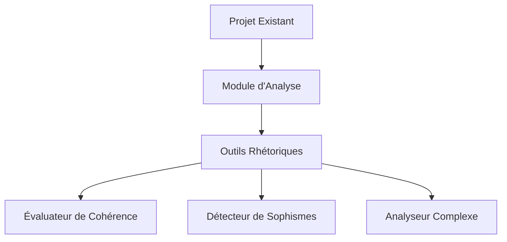

# Guide d'Intégration des Outils Rhétorique

## Intégration dans des Projets Existants

### Architecture de Base


### Étapes d'Intégration
1. **Installation** : `pip install argumentiation-analysis`
2. **Importation** : 
   ```python
   from argumentiation_analysis import RhetoricalAnalysisSystem
   ```
3. **Configuration** :
   ```python
   system = RhetoricalAnalysisSystem()
   system.configure_tool("coherence_evaluator", {"threshold": 0.7})
   ```
4. **Utilisation dans un Pipeline** :
   ```python
   pipeline = system.create_pipeline([
       "coherence_evaluator",
       "contextual_fallacy_detector"
   ])
   results = pipeline.analyze(user_input)
   ```

## Intégration avec des Frameworks
### Flask
```python
@app.route('/analyze', methods=['POST'])
def analyze():
    text = request.json['text']
    results = pipeline.analyze(text)
    return jsonify(results.visualization)
```

### FastAPI
```python
@app.post("/analyze")
async def analyze_text(text: str):
    results = pipeline.analyze(text)
    return {"visualization": results.visualization}
```

## Gestion des Dépendances
```bash
# Requirements.txt
argumentiation-analysis>=1.2.0
mermaid>=10.3.0
```

## Déploiement
```dockerfile
FROM python:3.9
COPY . /app
RUN pip install -r requirements.txt
CMD ["uvicorn", "main:app", "--host", "0.0.0.0", "--port", "8000"]