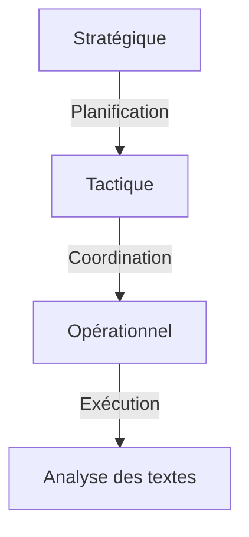

# Documentation des Outils d'Analyse Rhétorique Améliorés

## Vue d'Ensemble
Les outils d'analyse rhétorique améliorés offrent une infrastructure modulaire pour l'analyse argumentative, intégrant trois couches d'abstraction :



## Objectifs des Outils
1. **Analyse de cohérence argumentative** : Évaluation des liens logiques entre arguments
2. **Détection de sophismes contextuels** : Identification des erreurs rhétoriques dans leur contexte
3. **Analyse de complexité logique** : Étude des structures argumentatives complexes
4. **Visualisation des résultats** : Représentation graphique des analyses

## Exemple d'Utilisation
```python
from argumentiation_analysis import RhetoricalAnalysisSystem

# Initialisation du système
system = RhetoricalAnalysisSystem()

# Configuration des outils
system.configure_tool("coherence_evaluator", {
    "threshold": 0.7,
    "explanations": True
})

# Création d'un pipeline
pipeline = system.create_pipeline([
    "coherence_evaluator",
    "contextual_fallacy_detector",
    "enhanced_complex_fallacy_analyzer"
])

# Exécution de l'analyse
results = pipeline.analyze(text="Argumentation complexe à analyser")
print(results.visualization)
```

## Paramètres Clés
| Outil | Paramètres | Valeurs par défaut |
|-------|------------|-------------------|
| `coherence_evaluator` | `threshold`, `explanations` | 0.65, False |
| `contextual_fallacy_detector` | `sensitivity`, `context_window` | 0.8, 100 |
| `enhanced_complex_fallacy_analyzer` | `depth`, `strict_mode` | 3, False |

## Résultats Attendus
- Score de cohérence entre 0 et 1
- Liste des sophismes détectés avec leur type et position
- Représentation graphique au format Mermaid
- Suggestions de réécriture pour les textes problématiques

## Améliorations par Rapport aux Limitations Initiales
1. **Gestion des contextes complexes** : Nouveau système de fenêtrage contextuel
2. **Performance optimisée** : Architecture asynchrone pour les analyses parallèles
3. **Extensibilité** : API standardisée pour l'ajout de nouveaux critères
4. **Robustesse** : Mécanismes de validation des extraits d'arguments

## Structure des Fichiers
```
docs/outils/
├── coherence_evaluator.md
├── contextual_fallacy_detector.md
├── complex_fallacy_analyzer.md
└── visualizer.md
```

## Prochaines Étapes
1. Créer les documents spécifiques pour chaque outil dans `docs/outils/`
2. Ajouter des diagrammes détaillés pour chaque composant
3. Documenter les cas d'utilisation avancés