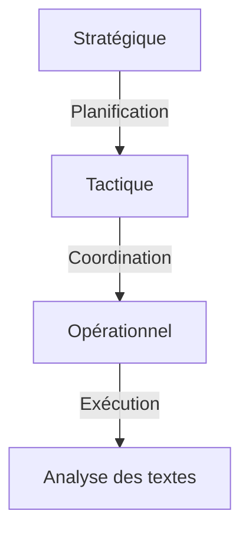

# Documentation des Outils d'Analyse Rhétorique

> ⚠️ **Note de véracité (2026-06-30).** L'exemple précédent utilisait une façade
> `RhetoricalAnalysisSystem` (`system.configure_tool(...)`, `system.create_pipeline([...])`,
> `pipeline.analyze(...)`). **Cette classe n'existe pas dans le code** (vérifié). Le vrai point
> d'entrée programmatique est `run_unified_analysis` (async,
> `argumentation_analysis.orchestration.unified_pipeline`). Les paramètres par outil documentés
> ci-après renvoient aux docs par classe, corrigés contre le code (#1307/#1308/#1309).

## Vue d'Ensemble
Les outils d'analyse rhétorique offrent une infrastructure modulaire pour l'analyse argumentative, organisée selon l'architecture Lego (`CapabilityRegistry` + `UnifiedPipeline` + `WorkflowDSL` + `AgentFactory`).


```mermaid
graph TD
    S[Stratégique] -->|Planification| T[Tactique]
    T -->|Coordination| O[Opérationnel]
    O -->|Exécution| A[Analyse des textes]
```

## Objectifs des Outils
1. **Analyse de cohérence argumentative** : Évaluation des liens logiques entre arguments
2. **Détection de sophismes contextuels** : Identification des erreurs rhétoriques dans leur contexte
3. **Analyse de complexité logique** : Étude des structures argumentatives complexes
4. **Visualisation des résultats** : Représentation graphique des analyses

## Exemple d'Utilisation (`run_unified_analysis`)

```python
import asyncio
from argumentation_analysis.orchestration.unified_pipeline import run_unified_analysis

async def main():
    result = await run_unified_analysis(
        text="Argumentation complexe à analyser.",
        workflow_name="standard",   # "light" | "standard" | "full"
    )
    print(result)   # Dict[str, Any] : résultats d'analyse agrégés

asyncio.run(main())
```

## Outils par classe (API vérifiée contre le code)

Voir les documents dédiés dans `docs/technical/` :

| Outil | Classe réelle | Doc |
|---|---|---|
| Évaluateur de cohérence | `ArgumentCoherenceEvaluator` | `argument_coherence_evaluator.md` |
| Détecteur de sophismes contextuels | `ContextualFallacyDetector` | `contextual_fallacy_detector.md` |
| Analyseur de sophismes complexes | `EnhancedComplexFallacyAnalyzer` | `complex_fallacy_analyzer.md` |
| Visualiseur de résultats | `RhetoricalResultVisualizer` | `visualizer.md` |

> Note : `coherence_evaluator.md` est un redirect (l'ancien nom `CoherenceEvaluator` n'existe pas).

## Résultats
`run_unified_analysis` retourne un `Dict[str, Any]` agrégeant les sorties des phases du workflow (cohérence, sophismes, structure, etc.). Pour une restitution lisible, voir le paramètre `render_restitution=True` de `run_unified_analysis` (rapport 3-actes).

## Structure des Fichiers (docs par outil)

```
docs/technical/
├── argument_coherence_evaluator.md
├── contextual_fallacy_detector.md
├── complex_fallacy_analyzer.md
├── enhanced_complex_fallacy_analyzer.md
└── visualizer.md
```
