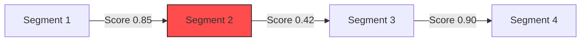

# Évaluateur de Cohérence Argumentative

## Objectif
Évalue la cohérence logique entre les arguments dans un texte, identifiant les ruptures de chaînage sémantique.

## Utilisation
```python
from argumentiation_analysis.tools import CoherenceEvaluator

evaluator = CoherenceEvaluator(threshold=0.7, explanations=True)
result = evaluator.analyze(text="Texte à analyser")
print(result.score)  # Score entre 0 et 1
print(result.explanations)  # Liste des ruptures détectées
```

## Paramètres
| Paramètre | Type | Description | Valeur par défaut |
|-----------|------|-------------|-------------------|
| `threshold` | float | Seuil de cohérence minimal | 0.65 |
| `explanations` | bool | Activer les explications détaillées | False |
| `language_model` | str | Modèle LLM à utiliser | "default" |

## Résultats
- Score de cohérence global
- Liste des segments incohérents avec positions
- Suggestions de réécriture
- Diagramme de flux sémantique

## Exemple de Diagramme


## Extension
Pour ajouter un critère de cohérence personnalisé :
```python
class CustomCoherenceCriterion:
    def evaluate(self, segment1, segment2):
        # Implémentation personnalisée
        return score, explanation

evaluator.add_criterion(CustomCoherenceCriterion())