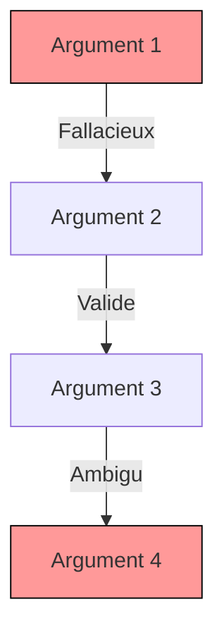

# Détecteur de Sophismes Contextuels

## Objectif
Identifie les erreurs rhétoriques dans leur contexte, en analysant les relations sémantiques entre les arguments.

## Utilisation
```python
from argumentiation_analysis.tools import ContextualFallacyDetector

detector = ContextualFallacyDetector(sensitivity=0.8, context_window=100)
result = detector.analyze(text="Texte à analyser")
print(result.fallacies)  # Liste des sophismes détectés
print(result.context_map)  # Cartographie des relations contextuelles
```

## Paramètres
| Paramètre | Type | Description | Valeur par défaut |
|-----------|------|-------------|-------------------|
| `sensitivity` | float | Niveau de sensibilité à la détection | 0.7 |
| `context_window` | int | Taille de la fenêtre contextuelle | 80 |
| `language_model` | str | Modèle LLM à utiliser | "default" |

## Résultats
- Liste des sophismes avec type, position et gravité
- Cartographie visuelle des relations contextuelles
- Exemples de reformulation suggérés

## Exemple de Diagramme


## Extension
Pour ajouter un nouveau type de sophisme :
```python
class CustomFallacyDetector:
    def detect(self, context):
        # Implémentation personnalisée
        return fallacy_type, confidence

detector.register_detector(CustomFallacyDetector())