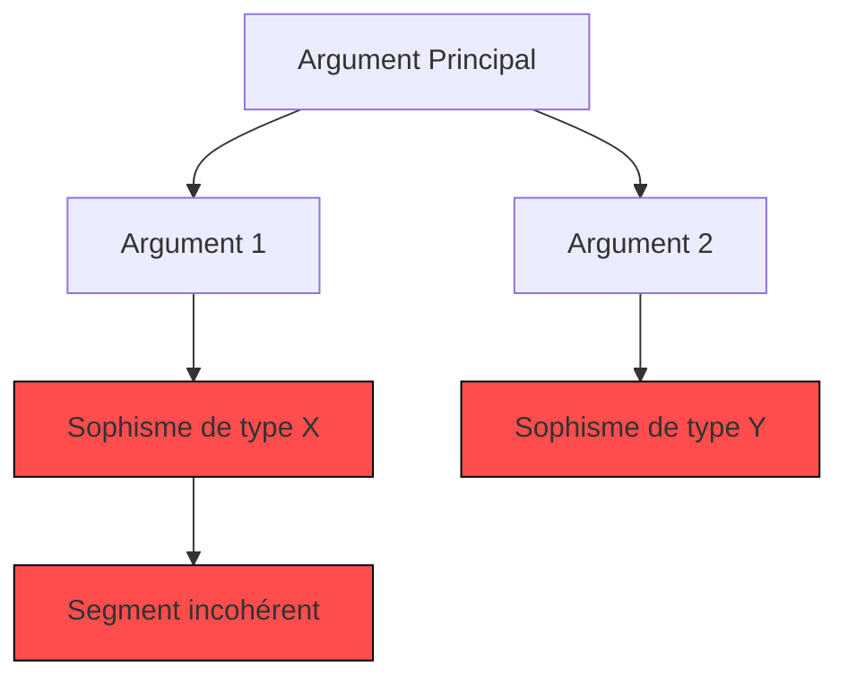

# Visualiseur de Résultats Rhétoriques

## Objectif
Génère des représentations graphiques des analyses argumentatives pour une meilleure compréhension visuelle.

## Utilisation
```python
from argumentiation_analysis.tools import RhetoricalVisualizer

visualizer = RhetoricalVisualizer(style="mermaid", detail_level=2)
result = visualizer.generate(analysis_results)
print(result.mermaid_code)  # Code Mermaid pour intégration
```

## Paramètres
| Paramètre | Type | Description | Valeur par défaut |
|-----------|------|-------------|-------------------|
| `style` | str | Format de visualisation (mermaid, svg, etc.) | "mermaid" |
| `detail_level` | int | Niveau de détail des diagrammes | 1 |
| `theme` | str | Thème visuel | "default" |

## Exemple de Sortie


## Extension
Pour ajouter un nouveau format de visualisation :
```python
class CustomVisualizer:
    def generate(self, results):
        # Implémentation personnalisée
        return visualization_data

visualizer.register_format("custom", CustomVisualizer())