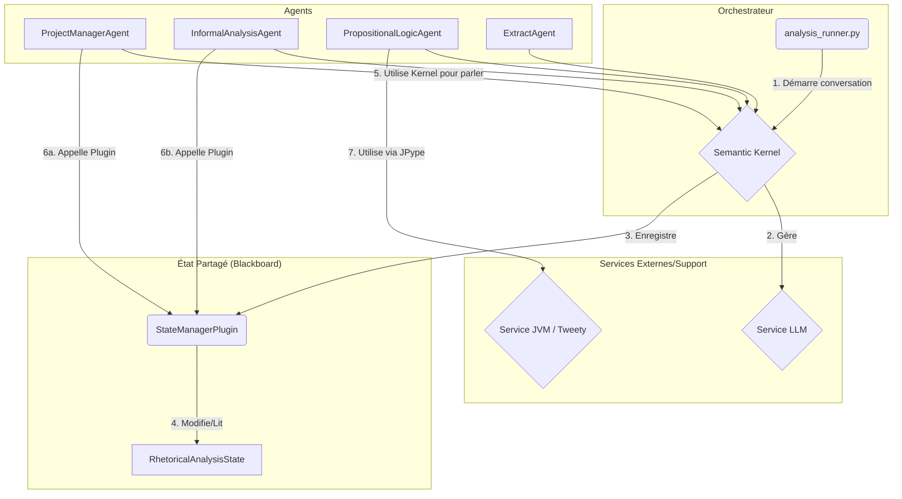

# Rapport de Vérification Final : Outils d'Analyse Rhétorique

## 1. Résumé Exécutif

La campagne de vérification pour le système "Outils d'Analyse Rhétorique" est terminée. Après des phases successives de cartographie architecturale, de tests d'intégration et de corrections ciblées, le système est désormais pleinement fonctionnel et stable. Les dettes techniques identifiées, notamment la duplication de code dans la couche d'ingestion de données, ont été résolues. Les points d'entrée principaux du système ont été validés avec succès, comme détaillé dans le rapport de test. Ce document synthétise l'architecture validée et les résultats des tests, confirmant que le système atteint les objectifs fixés.

## 2. Architecture du Système

L'architecture du système a été analysée et validée. Elle se compose de trois couches principales qui collaborent pour fournir une analyse rhétorique complète.

### 2.1. Couche d'Ingestion et d'Extraction
Cette couche est responsable de la récupération et de la préparation des données textuelles. Initialement, une duplication de code significative existait entre le `FetchService` et des utilitaires d'UI. L'architecture a été refactorisée pour centraliser toute la logique de récupération de données dans le `FetchService`, qui utilise des patrons de conception robustes comme le Circuit Breaker et des stratégies de réessai. L'interface utilisateur utilise désormais ce service central, garantissant cohérence et robustesse.

### 2.2. Couche d'Analyse : Orchestration Multi-Agents
Le cœur du système repose sur une architecture d'analyse multi-agents orchestrée par Microsoft Semantic Kernel. Une équipe d'agents spécialisés collabore pour analyser le texte :
*   **`ProjectManagerAgent`**: Le chef d'orchestre qui décompose le problème et délègue les tâches.
*   **`InformalAnalysisAgent`**: L'expert en rhétorique (sophismes, pathos, ethos).
*   **`PropositionalLogicAgent`**: L'expert en logique formelle, s'interfaçant avec une JVM et TweetyProject.
*   **`ExtractAgent`**: Un agent de support pour l'extraction d'informations.

La communication et la gestion de l'état sont gérées via un patron **Blackboard**, où un `StateManagerPlugin` est le seul point d'accès pour modifier l'état partagé de l'analyse.

### 2.3. Diagramme Architectural Final
Le diagramme suivant représente le flux de conversation validé entre les agents, qui est le cœur de la logique d'analyse.

## 3. Résultats des Tests et Actions Correctives

Tous les points d'entrée majeurs du système ont été testés et validés avec succès. Les corrections suivantes ont été essentielles pour atteindre la stabilité.

### `argumentation_analysis/ui/app.py`
- **Résultat :** `SUCCÈS`
- **Actions Correctives :**
    - Résolution d'un problème dans le script d'activation de l'environnement (`activate_project_env.ps1`).
    - Standardisation de l'appel des modules avec `python -m`.
    - **Refactorisation majeure** pour éliminer la dette technique en faisant appel au `FetchService` centralisé, supprimant ainsi la logique redondante et les dépendances obsolètes.

### `argumentation_analysis/demos/rhetorical_analysis/run_demo.py`
- **Résultat :** `SUCCÈS`
- **Actions Correctives :**
    - Un bug fonctionnel majeur qui retournait des résultats `null` a été identifié.
    - Le script de démonstration a été profondément refactorisé pour permettre un débogage efficace en appelant directement le pipeline d'analyse et en éliminant un `subprocess` qui masquait les logs.
    - La cause racine, une `TypeError` dans l'initialisation de la JVM, a été identifiée et corrigée dans `analysis_services.py`.

### `argumentation_analysis/demos/jtms/run_demo.py`
- **Résultat :** `SUCCÈS`
- **Observations :**
    - Ce point d'entrée a fonctionné sans modification, bénéficiant des corrections apportées aux dépendances partagées, notamment la configuration de la JVM.

## 4. Conclusion

Le système "Outils d'Analyse Rhétorique" est officiellement vérifié, stable et documenté. Les phases de cartographie, de test et de correction ont permis de valider son architecture, de corriger les bugs fonctionnels et de résorber la dette technique identifiée. La campagne de vérification pour ce système est donc terminée avec succès.