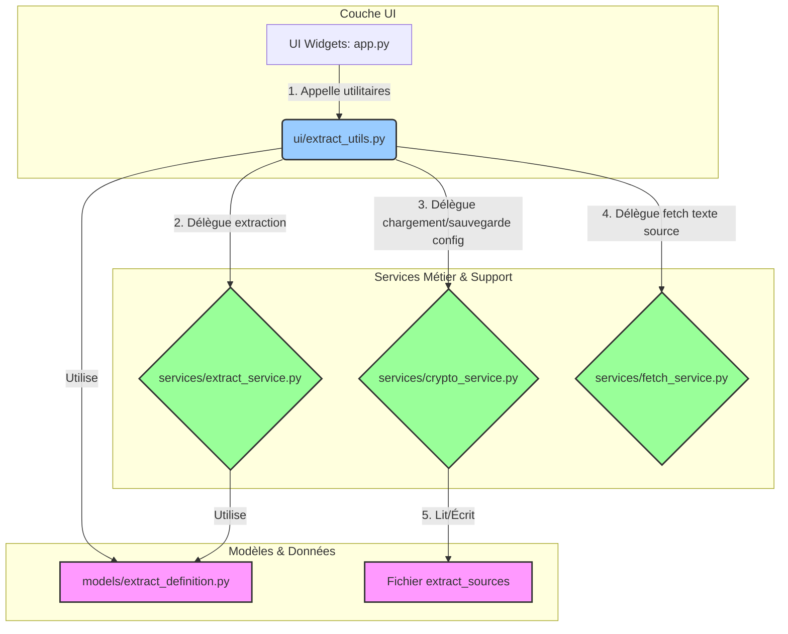
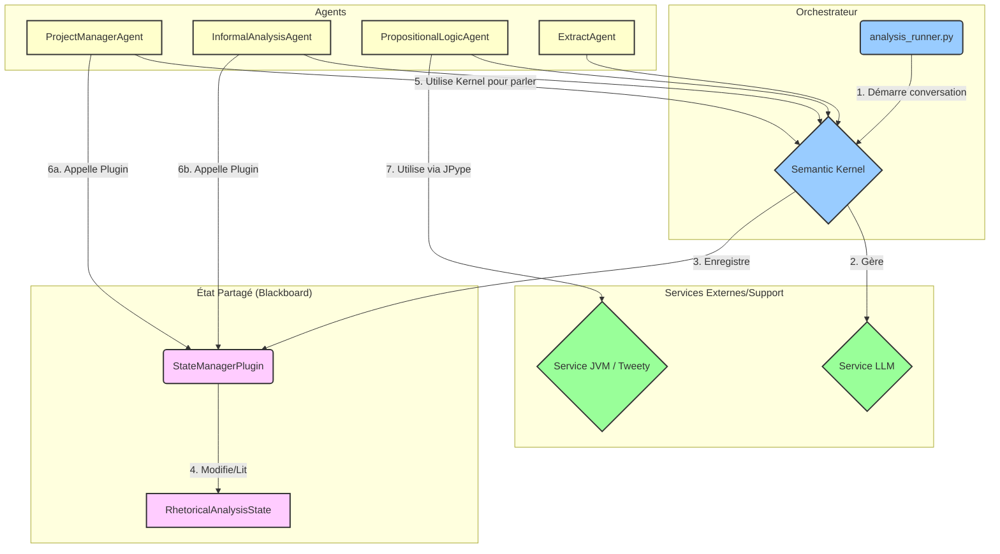

# Cartographie Architecturale : Outils d'Analyse Rhétorique

## 1. Couche d'Ingestion de Données (Data Ingestion Layer)

L'analyse du code a révélé que le système d'ingestion de données est le point d'entrée pour le traitement de sources externes comme des pages web ou des documents. Les deux principaux services externes utilisés sont **Apache Tika** pour l'extraction de texte à partir de documents (PDF, Office) et **Jina Reader** pour la conversion de pages web en Markdown.

### 1.1. Implémentation et Composants

Nous avons identifié deux implémentations distinctes et parallèles pour la récupération de ces données, ce qui constitue un point central de l'architecture actuelle.

#### Composants Clés :
*   **`config/settings.py`**: Fichier central de configuration utilisant Pydantic `BaseSettings`. Il définit tous les points de terminaison, les timeouts et autres paramètres pour les services externes (Tika, Jina) et l'application elle-même.
*   **`services/fetch_service.py`**: Contient la classe `FetchService`, qui est une implémentation robuste et bien conçue pour la récupération de données. Elle intègre des patrons de conception avancés comme le **Circuit Breaker** et des **stratégies de réessai**, ce qui la rend résiliente aux pannes réseau. Elle utilise l'injection de dépendances (un `CacheService`) et une logique de "dispatcher" pour choisir la méthode de récupération appropriée.
*   **`ui/fetch_utils.py`**: Un module de fonctions utilitaires qui **duplique** une grande partie de la logique de `FetchService`. Il est directement utilisé par l'interface utilisateur.
*   **`ui/app.py`**: L'application principale de l'interface utilisateur (basée sur IPyWidgets) qui, dans sa version actuelle, s'appuie sur `ui/fetch_utils.py` pour ses opérations de récupération.
*   **`services/cache_service.py`** et **`ui/cache_utils.py`**: Des services de cache distincts, un pour le service principal et un pour l'UI, qui persistent le texte récupéré pour éviter des appels réseau répétés.

### 1.2. Diagramme Architectural : Flux Actuel vs Cible

Le diagramme ci-dessous illustre le flux de données actuel, mettant en évidence la redondance, et propose une architecture cible refactorisée.

```mermaid
graph TD
    subgraph "Couche UI"
        A[UI Widgets: app.py]
    end

    subgraph "Logique d'Accès aux Données"
        B(ui/fetch_utils.py)
        C{services/fetch_service.py}
    end

    subgraph "Services Externes"
        D[Service Apache Tika]
        E[Service Jina Reader]
    end

    subgraph "Infrastructure & Cache"
        F[CacheService]
        G[Fichiers Bruts (temp_downloads)]
    end
    
    subgraph "Configuration"
        H[config/settings.py]
    end

    %% Flux Actuel - Redondant
    A -- "1. Appel direct (actuel)" --> B
    B -- "2a. Logique redondante" --> D
    B -- "2b. Logique redondante" --> E
    B -- "Cache Fichier" --> F

    %% Flux Cible - Recommandé
    A -.->| "3. Appel recommandé (refactoring)" | C

    %% Dépendances du Service
    C -- "4. Utilise" --> F
    C -- "5a. Stratégie Tika" --> D
    C -- "5b. Stratégie Jina" --> E
    F -- "Cache Tika" --> G
    
    C -- "Lit config" --> H
    B -- "Lit config" --> H

    classDef redundant fill:#f99,stroke:#333,stroke-width:2px;
    classDef recommended fill:#bbf,stroke:#333,stroke-width:2px,stroke-dasharray: 5 5;
    classDef service fill:#9f9,stroke:#333,stroke-width:2px;
    class B,D,E redundant;
    class C service;
```

### 1.3. Analyse de la Dette Technique et Recommandation

**Problème :**

L'architecture actuelle souffre d'une **duplication de code significative**. L'interface utilisateur (`app.py`) utilise `ui/fetch_utils.py`, une implémentation ad-hoc et moins robuste, au lieu de s'appuyer sur le `FetchService` centralisé.

Cette redondance engendre plusieurs problèmes :
1.  **Double Maintenance** : Toute mise à jour de la logique de récupération (par exemple, un changement d'API, une amélioration de la gestion des erreurs) doit être effectuée à deux endroits, augmentant le risque d'incohérence.
2.  **Manque de Robustesse** : L'implémentation de l'UI ne bénéficie pas pleinement des mécanismes avancés (Circuit Breaker, etc.) présents dans `FetchService`.
3.  **Complexité Accrue** : La présence de deux chemins pour effectuer la même tâche rend le code plus difficile à comprendre et à maintenir.

**Recommandation (Architecture Cible) :**

Il est fortement recommandé de **refactoriser** l'application pour éliminer cette redondance.

1.  **Centraliser la Logique** : Modifier `ui/app.py` pour qu'il instancie et utilise exclusivement `FetchService` pour toutes les opérations de récupération de données.
2.  **Supprimer le Code Redondant** : Le module `ui/fetch_utils.py` devrait être soit supprimé, soit réduit à de simples fonctions d'adaptation si nécessaire, mais toute la logique métier doit résider dans `FetchService`.
3.  **Unifier le Caching** : Assurer que toute l'application utilise une instance unique du `CacheService` pour garantir la cohérence des données mises en cache.

Cette refactorisation simplifiera considérablement la base de code, améliorera la robustesse de l'application et réduira la charge de maintenance future.

## 2. Couche d'Extraction de Texte (Text Extraction Layer)

Une fois le texte brut ingéré, la couche d'extraction est responsable d'isoler les portions de texte pertinentes pour l'analyse. Cette logique est principalement basée sur l'utilisation de marqueurs de début et de fin. L'architecture de cette couche montre une bonne séparation des responsabilités entre l'interface utilisateur et les services métier.

### 2.1. Implémentation et Composants

*   **`services/extract_service.py`**: Le cœur de la couche d'extraction. Ce service contient la logique métier pure pour l'extraction de texte. Il fournit des méthodes pour extraire du texte entre des marqueurs, trouver du texte similaire, et surligner des marqueurs ou des résultats de recherche. Il est indépendant de toute interface utilisateur.
*   **`ui/extract_utils.py`**: Agit comme une **Façade** pour l'interface utilisateur. Ce module importe et utilise `ExtractService`, `FetchService` et `CryptoService`, et expose des fonctions simples que les composants de l'UI (comme `app.py` ou d'autres utilitaires de vérification) peuvent appeler. Il gère également l'initialisation de ces services.
*   **`services/crypto_service.py`**: Un service de support spécialisé dans le chiffrement et le déchiffrement des fichiers de configuration contenant les définitions de sources et d'extraits.
*   **`models/extract_definition.py`**: Définit les structures de données (via Pydantic) telles que `SourceDefinition` et `ExtractDefinition`, qui standardisent la manière dont les informations sur les sources et les extraits sont représentées dans l'application.
*   **Fichiers de Configuration** (`extract_sources.json.gz.enc`, `extract_sources.json`): Contiennent les définitions des sources et des extraits, soit sous forme chiffrée (prioritaire), soit en clair.

### 2.2. Diagramme Architectural : Flux d'Extraction



### 2.3. Analyse

L'architecture de cette couche est bien structurée. L'utilisation du patron de conception **Façade** dans `extract_utils.py` simplifie l'interaction entre l'interface utilisateur et la complexité des services sous-jacents. La logique métier est correctement isolée dans les services respectifs (`ExtractService`, `CryptoService`, `FetchService`), ce qui rend le système modulaire et plus facile à maintenir.

La prochaine étape de l'analyse architecturale consistera à investiguer ce qui se passe *après* l'extraction du texte, c'est-à-dire la couche d'analyse rhétorique elle-même.

## 3. Couche d'Analyse : Orchestration Multi-Agents (Analysis Layer)

Le cœur du système réside dans une architecture d'analyse multi-agents sophistiquée, orchestrée par une boucle de conversation pilotée par des événements. Cette couche est responsable de l'analyse rhétorique et logique du texte.

### 3.1. Implémentation et Composants

*   **`orchestration/analysis_runner.py`**: Le point d'entrée de l'analyse. La fonction `_run_analysis_conversation` orchestre l'ensemble du processus.
*   **Microsoft Semantic Kernel**: Le framework `semantic-kernel` est la colonne vertébrale de cette couche. Il est utilisé pour :
    *   Gérer le service LLM (OpenAI ou Azure).
    *   Enregistrer et invoquer des `plugins`.
    *   Gérer l'historique de la conversation entre les agents.
*   **Agents Spécialisés (`agents/core/`)**: Le système utilise une équipe d'agents, chacun ayant un rôle défini :
    *   **`ProjectManagerAgent`**: Le chef d'orchestre. Il initialise la conversation, décompose le problème en tâches, et délègue ces tâches aux autres agents.
    *   **`InformalAnalysisAgent`**: L'expert en rhétorique. Il est probablement responsable de l'identification des figures de style, des sophismes (fallacies), du pathos, de l'ethos, etc.
    *   **`PropositionalLogicAgent`**: L'expert en logique formelle. Cet agent interagit probablement avec la **JVM** et `TweetyProject` pour analyser la structure logique des arguments.
    *   **`ExtractAgent`**: Un agent de support chargé d'extraire des informations spécifiques du texte à la demande des autres agents.
*   **État Partagé (Shared State / Blackboard)**:
    *   **`core/RhetoricalAnalysisState.py`**: Un objet qui maintient l'état complet de l'analyse en cours (arguments identifiés, sophismes, tâches, etc.).
    *   **`core/state_manager_plugin.py`**: Un plugin Semantic Kernel qui expose des fonctions (`add_analysis_task`, `add_identified_arguments`) aux agents. C'est le seul moyen pour les agents de modifier l'état partagé, implémentant ainsi le patron de conception **Blackboard**.

### 3.2. Diagramme Architectural : Conversation des Agents



### 3.3. Analyse

Cette architecture est à la fois puissante et complexe.

*   **Avantages**:
    *   **Modularité**: Chaque agent a une responsabilité unique, ce qui les rend plus faciles à développer, tester et maintenir.
    *   **Extensibilité**: De nouveaux agents avec de nouvelles capacités (par exemple, un `FactCheckingAgent`) peuvent être ajoutés au système sans perturber le reste de l'architecture.
    *   **Raisonnement Complexe**: La collaboration entre agents permet de résoudre des problèmes complexes qu'un seul agent (ou un seul appel LLM) ne pourrait pas gérer. Le `ProjectManagerAgent` peut décomposer un objectif de haut niveau en une série de tâches plus petites et séquentielles.

*   **Inconvénients / Complexité**:
    *   **Gestion du Flux**: Le flux de la conversation est géré manuellement dans `analysis_runner.py`, en se basant sur la réponse de l'agent précédent. C'est une logique complexe qui peut être difficile à déboguer.
    *   **Gestion de l'État**: La cohérence de l'état partagé est cruciale. Des erreurs dans la manière dont les agents lisent ou écrivent dans le "blackboard" peuvent conduire à des résultats d'analyse incorrects.

## 4. Conclusion Architecturale

Le système d'analyse rhétorique est une application multi-couches sophistiquée qui combine plusieurs patrons de conception et technologies modernes.

1.  **Ingestion & Extraction**: Une couche robuste (après refactoring) pour récupérer et préparer les données textuelles.
2.  **Analyse Multi-Agents**: Un cœur d'analyse puissant basé sur une collaboration entre agents spécialisés (rhétorique, logique, extraction).
3.  **Socle Technique**: Le système s'appuie sur des technologies clés comme **Microsoft Semantic Kernel** pour l'orchestration, un **service LLM** pour l'analyse sémantique, et une **JVM** pour l'analyse logique formelle.

La principale faiblesse identifiée (la duplication de code dans la couche d'ingestion) a été corrigée. L'architecture restante, bien que complexe, semble cohérente et bien conçue pour la tâche à accomplir.