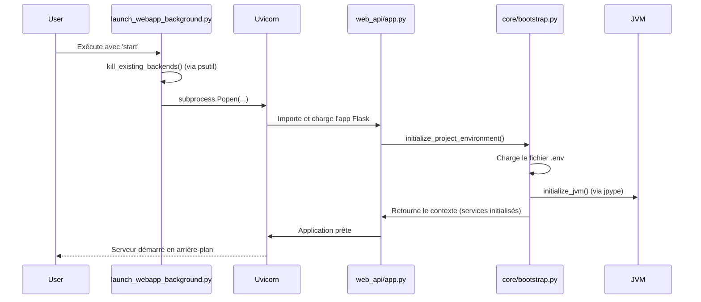

# Plan de Vérification : `scripts/launch_webapp_background.py`

Ce document détaille le plan de vérification pour le point d'entrée `scripts/launch_webapp_background.py`. L'objectif est de cartographier ses dépendances, définir une stratégie de test, identifier des pistes de nettoyage et planifier la documentation nécessaire.

---

## Phase 1 : Cartographie (Map)

Cette phase vise à identifier toutes les dépendances directes et indirectes du script de lancement.

### 1.1. Script de Lancement (`scripts/launch_webapp_background.py`)

*   **Rôle principal** : Wrapper pour lancer, vérifier le statut et arrêter le serveur web Uvicorn de manière détachée.
*   **Dépendances directes (Python Standard)** : `os`, `sys`, `subprocess`, `time`, `pathlib`.
*   **Dépendances optionnelles (Python Tiers)** :
    *   `requests` : Utilisé dans `check_backend_status` pour interroger l'endpoint `/api/health`.
    *   `psutil` : Utilisé dans `kill_existing_backends` pour trouver et terminer les processus Uvicorn existants.
*   **Comportement Clé** :
    *   **Recherche d'interpréteur** : Tente de trouver un exécutable Python dans des chemins Conda hardcodés (`C:/Users/MYIA/miniconda3/envs/projet-is/python.exe`, etc.).
    *   **Lancement de Processus** : Utilise `subprocess.Popen` pour exécuter `uvicorn`.
        *   **Commande** : `python -m uvicorn argumentation_analysis.services.web_api.app:app --host 0.0.0.0 --port 5003 --reload`
    *   **Manipulation d'environnement** : Modifie `PYTHONPATH` pour inclure la racine du projet.
    *   **Spécificités OS** : Utilise `subprocess.DETACHED_PROCESS` sur Windows et `os.setsid` sur Unix pour un détachement complet.

### 1.2. Application Web (`argumentation_analysis/services/web_api/app.py`)

*   **Framework** : Flask (bien que lancé avec Uvicorn, le code est basé sur Flask).
*   **Initialisation Critique** : Appelle `initialize_project_environment` dès son chargement, ce qui constitue le cœur du démarrage.
*   **Dépendances (Services Internes)** :
    *   `AnalysisService`
    *   `ValidationService`
    *   `FallacyService`
    *   `FrameworkService`
    *   `LogicService`
*   **Structure** : Enregistre des `Blueprints` Flask (`main_bp`, `logic_bp`) qui définissent les routes de l'API (ex: `/api/health`).
*   **Frontend** : Sert une application React depuis un répertoire `build`.

### 1.3. Processus de Bootstrap (`argumentation_analysis/core/bootstrap.py`)

C'est le composant le plus complexe et le plus critique au démarrage.

*   **Dépendance Majeure** : **JVM (Java Virtual Machine)** via la librairie `jpype`. C'est une dépendance externe non-Python.
*   **Fichiers de Configuration** :
    *   `.env` à la racine du projet : Chargé pour obtenir les variables d'environnement.
*   **Variables d'Environnement Lues** :
    *   `OPENAI_API_KEY` : Pour les services LLM.
    *   `TEXT_CONFIG_PASSPHRASE` : Utilisé comme fallback pour le déchiffrement.
    *   `ENCRYPTION_KEY` : Clé de chiffrement pour `CryptoService`.
*   **Fichiers de Données** :
    *   `argumentation_analysis/data/extract_sources.json.gz.enc` : Fichier de configuration chiffré pour `DefinitionService`.
*   **Services Initialisés** :
    *   `CryptoService` : Nécessite une clé de chiffrement.
    *   `DefinitionService` : Dépend de `CryptoService` et du fichier de configuration chiffré.
    *   `ContextualFallacyDetector` : Initialisé de manière paresseuse (lazy loading).

### 1.4. Diagramme de Séquence de Lancement

---

## Phase 2 : Stratégie de Test (Test)

*   **Tests de Démarrage (End-to-End)**
    1.  **Test de Lancement Nominal** :
        *   **Action** : Exécuter `python scripts/launch_webapp_background.py start`.
        *   **Attendu** : Le script se termine avec un code de sortie `0`. Un processus `uvicorn` est visible dans la liste des processus.
    2.  **Test de Statut** :
        *   **Action** : Exécuter `python scripts/launch_webapp_background.py status` quelques secondes après le lancement.
        *   **Attendu** : Le script se termine avec le code de sortie `0` et affiche un message de succès.
    3.  **Test d'Arrêt** :
        *   **Action** : Exécuter `python scripts/launch_webapp_background.py kill`.
        *   **Attendu** : Le script se termine avec le code `0` et le processus `uvicorn` n'est plus actif.

*   **Tests de Configuration**
    1.  **Test sans `.env`** :
        *   **Action** : Renommer temporairement le fichier `.env` et lancer le serveur.
        *   **Attendu** : Le serveur doit démarrer mais logger des avertissements clairs sur l'absence du fichier. Les endpoints dépendant des clés API doivent échouer proprement.
    2.  **Test avec `.env` incomplet** :
        *   **Action** : Retirer `OPENAI_API_KEY` du `.env` et lancer.
        *   **Attendu** : Le serveur démarre, mais un appel à un service utilisant le LLM doit retourner une erreur de configuration explicite.
    3.  **Test sans l'interpréteur Conda** :
        *   **Action** : Exécuter le script dans un environnement où les chemins Conda hardcodés n'existent pas.
        *   **Attendu** : Le script doit se rabattre sur le `python` du PATH et le documenter dans les logs.

*   **Tests de Sanity HTTP**
    1.  **Test de l'Endpoint de Santé** :
        *   **Action** : Après le lancement, exécuter `curl http://localhost:5003/api/health`.
        *   **Attendu** : Réponse `200 OK` avec un corps JSON valide.
    2.  **Test d'Endpoint Inexistant** :
        *   **Action** : Exécuter `curl http://localhost:5003/api/nonexistent`.
        *   **Attendu** : Réponse `404 Not Found` avec un corps JSON d'erreur standardisé.

---

## Phase 3 : Pistes de Nettoyage (Clean)

*   **Configuration** :
    *   **Port Hardcodé** : Le port `5003` est en dur. Le rendre configurable via une variable d'environnement (ex: `WEB_API_PORT`).
    *   **Chemin Python Hardcodé** : La logique `find_conda_python` est fragile. Améliorer la détection ou permettre de spécifier le chemin de l'exécutable via une variable d'environnement.
    *   **Centraliser la Configuration** : Les paramètres comme le port, l'hôte, et l'activation du rechargement (`--reload`) devraient être gérés par un système de configuration unifié plutôt que d'être des arguments en dur dans le script.

*   **Gestion des Dépendances** :
    *   Clarifier dans le `README` que `requests` et `psutil` sont nécessaires pour les commandes `status` et `kill`. Envisager de les ajouter comme dépendances de développement dans `requirements-dev.txt`.

*   **Gestion des Erreurs** :
    *   Le serveur peut démarrer (le processus Uvicorn est lancé) mais être non fonctionnel si le `bootstrap` échoue (ex: JVM non trouvée). L'endpoint `/api/health` devrait être enrichi pour vérifier l'état des services critiques (ex: JVM initialisée, `CryptoService` prêt) et ne pas se contenter de retourner "OK" si l'application est dans un état "zombie".

---

## Phase 4 : Plan de Documentation (Document)

*   **Créer/Mettre à jour `docs/usage/web_api.md`** :
    *   **Section "Démarrage Rapide"** : Expliquer comment utiliser `scripts/launch_webapp_background.py [start|status|kill]`.
    *   **Section "Prérequis"** :
        *   Lister explicitement la nécessité d'un **JDK (Java Development Kit)** pour la JVM.
        *   Mentionner l'environnement Conda `projet-is` comme méthode d'installation recommandée.
        *   Lister les paquets Python optionnels (`requests`, `psutil`).
    *   **Section "Configuration"** :
        *   Décrire la nécessité d'un fichier `.env` à la racine du projet.
        *   Fournir un template (`.env.example`) et documenter chaque variable (`OPENAI_API_KEY`, `TEXT_CONFIG_PASSPHRASE`, `ENCRYPTION_KEY`), en expliquant son rôle.
    *   **Section "Monitoring"** :
        *   Documenter l'endpoint `/api/health` et expliquer comment l'utiliser pour vérifier que le service est non seulement démarré, mais aussi opérationnel.