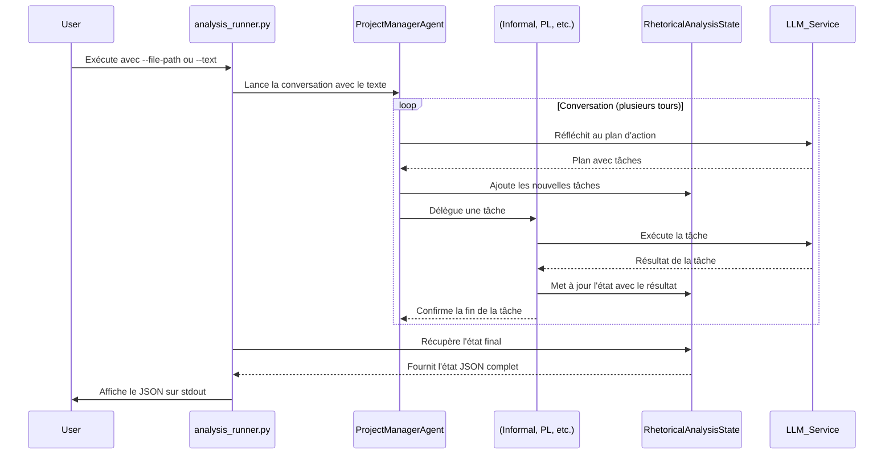

# Plan de Vérification : `argumentation_analysis/orchestration/analysis_runner.py`

Ce document détaille le plan de vérification pour le nouveau point d'entrée `argumentation_analysis/orchestration/analysis_runner.py`. L'objectif est de valider son fonctionnement, de définir une stratégie de test robuste, d'identifier des pistes d'amélioration et de planifier la mise à jour de la documentation.

## Phase 1 : Map (Analyse)

Cette phase vise à comprendre le rôle, le fonctionnement et les dépendances du nouveau script d'orchestration.

### 1.1. Objectif Principal

Le script orchestre une analyse d'argumentation complexe en utilisant une conversation entre plusieurs agents basés sur `semantic-kernel`. Chaque agent a un rôle spécialisé (gestion de projet, analyse informelle, analyse logique, extraction). L'objectif est de produire un état final d'analyse complet au format JSON, ainsi qu'une transcription détaillée de la conversation entre les agents.

### 1.2. Fonctionnement et Composants Clés

*   **Arguments en ligne de commande** : Le script est conçu pour être exécuté en tant que module et accepte deux arguments mutuellement exclusifs :
    *   `--text "..."` : Permet de passer le texte à analyser directement en ligne de commande.
    *   `--file-path "..."` : Permet de spécifier le chemin vers un fichier contenant le texte à analyser.
*   **Orchestration par Conversation** :
    *   Le script n'utilise plus un pipeline linéaire, mais une boucle de conversation manuelle.
    *   Le `ProjectManagerAgent` initie et pilote la conversation. Il désigne les autres agents pour effectuer des tâches spécifiques.
*   **Gestion de l'État** :
    *   La classe `RhetoricalAnalysisState` centralise toutes les informations collectées durant l'analyse (texte initial, tâches, arguments identifiés, sophismes, etc.).
    *   Le `StateManagerPlugin` est un plugin `semantic-kernel` qui permet aux agents de manipuler l'état de manière contrôlée.
*   **Agents Spécialisés** :
    *   `ProjectManagerAgent` : Le chef d'orchestre.
    *   `InformalAnalysisAgent` : Spécialisé dans l'analyse des sophismes.
    *   `PropositionalLogicAgent` : Spécialisé dans l'analyse logique.
    *   `ExtractAgent` : Spécialisé dans l'extraction de contenu.
*   **Génération de la Sortie** :
    *   Le script affiche le résultat principal au format JSON sur la sortie standard.
    *   Il génère également un fichier de rapport JSON (ex: `rapport_analyse_*.json`) si un répertoire de sortie est spécifié.

### 1.3. Dépendances

*   **Fichiers de Configuration** :
    *   `.env` : Essentiel pour charger les variables d'environnement, notamment la clé API pour le LLM.
*   **Variables d'Environnement** :
    *   `OPENAI_API_KEY` ou configuration équivalente pour le service LLM utilisé.
*   **Fichiers de Données** :
    *   Aucune dépendance à un corpus chiffré. Le texte est fourni via les arguments.

### 1.4. Diagramme de Séquence (Mis à jour)

---

## Phase 2 : Test (Plan de Test Mis à Jour)

*   **Prérequis** : Créer un fichier de test simple `tests/data/sample_text.txt`.
*   **Contenu de `sample_text.txt`**: "Les OGM sont mauvais pour la santé. C'est un scientifique qui l'a dit à la télé."

*   **Tests de Cas Nominaux**
    1.  **Test de Lancement Complet avec Fichier** :
        *   **Action** : Exécuter `conda run -n projet-is python -m argumentation_analysis.orchestration.analysis_runner --file-path tests/data/sample_text.txt`.
        *   **Critères de Succès** : Le script se termine avec un code de sortie `0`. La sortie JSON sur stdout contient un statut de "success" et une section "analysis" non vide. La transcription ("history") doit montrer des échanges entre les agents.
    2.  **Test de Lancement Complet avec Texte Direct** :
        *   **Action** : Exécuter `conda run -n projet-is python -m argumentation_analysis.orchestration.analysis_runner --text "Les OGM sont mauvais pour la santé."`.
        *   **Critères de Succès** : Identiques au test précédent.

*   **Tests des Cas d'Erreur**
    1.  **Test sans Fichier `.env`** :
        *   **Action** : Renommer `.env`. Exécuter le test de lancement complet.
        *   **Critères de Succès** : Le script doit échouer avec une erreur claire indiquant que la configuration du service LLM (comme la clé API) est manquante.
    2.  **Test avec Clé API Invalide** :
        *   **Action** : Mettre une fausse valeur pour `OPENAI_API_KEY` dans `.env`. Exécuter le script.
        *   **Critères de Succès** : Le script doit gérer l'échec des appels LLM. La sortie JSON doit indiquer un statut "error" avec un message détaillé sur l'échec de l'authentification ou de l'appel API.
    3.  **Test avec Fichier Inexistant** :
        *   **Action** : Exécuter avec `--file-path chemin/vers/fichier/inexistant.txt`.
        *   **Critères de Succès** : Le script doit se terminer avec un code de sortie non nul et afficher une erreur `FileNotFoundError`.

---

## Phase 3 : Clean (Pistes de Nettoyage)

*   **Gestion des Erreurs** :
    *   **Problème** : La boucle de conversation manuelle a une gestion d'erreur basique. Si un agent échoue de manière inattendue, la boucle peut s'arrêter sans état clair.
    *   **Suggestion** : Implémenter un mécanisme de "retry" ou de "safe failure" où le PM peut être notifié de l'échec d'un agent et décider de continuer avec les tâches restantes ou de s'arrêter proprement.
*   **Complexité de la Boucle** :
    *   **Problème** : La logique de sélection d'agent et de mise à jour de l'état dans `_run_analysis_conversation` est longue et complexe.
    *   **Suggestion** : Extraire la logique de la boucle principale dans une classe `ConversationOrchestrator` dédiée pour mieux séparer les responsabilités.
*   **Configuration du LLM** :
    *   **Problème** : La création du service LLM est faite à plusieurs endroits.
    *   **Suggestion** : Centraliser la création du service LLM dans une factory ou un utilitaire unique pour garantir la cohérence.

---

## Phase 4 : Document (Plan de Documentation Mis à Jour)

*   **Mettre à jour `docs/entry_points/`** :
    *   Créer (ou renommer) un document pour `analysis_runner.py`.
    *   **Section "Objectif"** : Décrire l'orchestration par conversation d'agents.
    *   **Section "Prérequis"** :
        *   Lister les variables d'environnement (`.env`) critiques.
    *   **Section "Utilisation"** :
        *   Fournir les deux commandes exactes pour lancer le script (avec `--text` et `--file-path`).
        *   Expliquer comment exécuter le script en tant que module (`python -m ...`).
    *   **Section "Sorties"** :
        *   Décrire la structure de la sortie JSON principale (status, analysis, history).
        *   Expliquer le contenu de chaque section.
    *   **Section "Limitations"**: Documenter les limitations connues (ex: gestion des erreurs).