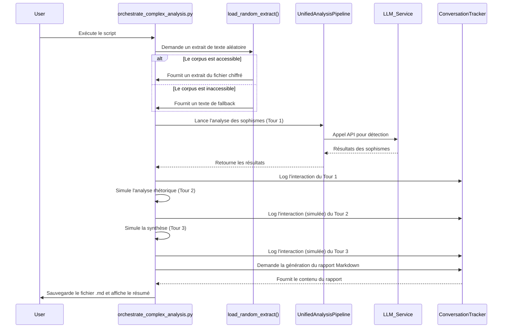

# Plan de Vérification : `scripts/orchestrate_complex_analysis.py`

Ce document détaille le plan de vérification pour le point d'entrée `scripts/orchestrate_complex_analysis.py`. L'objectif est de cartographier son fonctionnement, de définir une stratégie de test, d'identifier des pistes d'amélioration et de planifier la documentation.

## Phase 1 : Map (Analyse)

Cette phase vise à comprendre le rôle, le fonctionnement et les dépendances du script.

### 1.1. Objectif Principal

Le script orchestre une analyse de texte multi-étapes en simulant une collaboration entre plusieurs agents d'analyse (sophismes, rhétorique, synthèse). Son objectif principal est de produire un rapport de synthèse détaillé au format Markdown, qui inclut les résultats de l'analyse, des métriques de performance et une trace complète des interactions.

### 1.2. Fonctionnement et Composants Clés

*   **Arguments en ligne de commande** : Le script n'accepte aucun argument. Il est conçu pour être lancé directement.
*   **Tracker d'Interactions** : La classe `ConversationTracker` est au cœur du script. Elle enregistre chaque étape de l'analyse pour construire le rapport final.
*   **Chargement des Données** :
    *   La fonction `load_random_extract` tente de charger un extrait de texte à partir d'un corpus chiffré (`tests/extract_sources_backup.enc`).
    *   **Comportement de Fallback** : En cas d'échec (fichier manquant, erreur de déchiffrement), il utilise un texte statique prédéfini, garantissant que le script peut toujours s'exécuter.
*   **Pipeline d'Analyse** :
    *   Utilise `UnifiedAnalysisPipeline` pour réaliser l'analyse.
    *   **Tour 1 (Analyse des Sophismes)** : C'est la seule étape d'analyse **réelle**. Elle fait un appel à un LLM (configuré pour `gpt-4o-mini`) pour détecter les sophismes dans le texte.
    *   **Tours 2 & 3 (Rhétorique et Synthèse)** : Ces étapes sont actuellement **simulées**. Le script utilise des données en dur pour représenter les résultats de ces analyses, sans faire d'appels LLM supplémentaires.
*   **Génération de la Sortie** :
    *   Le script génère un fichier de rapport Markdown dont le nom est dynamique (ex: `rapport_analyse_complexe_20240521_143000.md`).
    *   Ce rapport est sauvegardé à la racine du répertoire où le script est exécuté.

### 1.3. Dépendances

*   **Fichiers de Configuration** :
    *   `.env` : Essentiel pour charger les variables d'environnement, notamment la clé API pour le LLM.
*   **Variables d'Environnement** :
    *   `OPENAI_API_KEY` : Requise pour l'appel réel au LLM dans le Tour 1.
    *   Probablement `ENCRYPTION_KEY` ou `TEXT_CONFIG_PASSPHRASE` pour déchiffrer le corpus (hérité des dépendances de `CorpusManager`).
*   **Fichiers de Données** :
    *   `tests/extract_sources_backup.enc` : Source de données principale pour les extraits de texte.

### 1.4. Diagramme de Séquence

---

## Phase 2 : Test (Plan de Test)

*   **Tests de Cas Nominaux**
    1.  **Test de Lancement Complet** :
        *   **Action** : Exécuter `conda run -n projet-is python scripts/orchestrate_complex_analysis.py`.
        *   **Critères de Succès** : Le script se termine avec un code de sortie `0`. Un fichier `rapport_analyse_complexe_*.md` est créé. Le rapport contient des résultats réels pour les sophismes et indique que la source est un "Extrait de corpus réel".
    2.  **Test du Mécanisme de Fallback** :
        *   **Action** : Renommer temporairement `tests/extract_sources_backup.enc`. Exécuter le script.
        *   **Critères de Succès** : Le script se termine avec un code de sortie `0`. Un rapport est créé. Le rapport indique que la source est le "Texte statique de secours" et analyse le discours sur l'éducation.

*   **Tests des Cas d'Erreur**
    1.  **Test sans Fichier `.env`** :
        *   **Action** : Renommer `.env`. Exécuter le script.
        *   **Critères de Succès** : Le script doit échouer ou se terminer en erreur. Les logs doivent indiquer clairement que la clé API (`OPENAI_API_KEY`) est manquante.
    2.  **Test avec Clé API Invalide** :
        *   **Action** : Mettre une fausse valeur pour `OPENAI_API_KEY` dans `.env`. Exécuter le script.
        *   **Critères de Succès** : Le script doit gérer l'échec de l'appel LLM. Le rapport final doit soit indiquer une erreur dans l'analyse des sophismes, soit montrer un résultat vide pour cette section, et le taux de succès (`success_rate`) doit être de `0.5`.

---

## Phase 3 : Clean (Pistes de Nettoyage)

*   **Analyse Simulée** :
    *   **Problème** : Les tours 2 (rhétorique) et 3 (synthèse) sont simulés. Le nom du script (`orchestrate_complex_analysis`) est donc trompeur.
    *   **Suggestion** : Implémenter réellement ces étapes d'analyse en utilisant `UnifiedAnalysisPipeline` ou des agents dédiés. Si ce n'est pas l'objectif, renommer le script pour refléter son fonctionnement actuel (ex: `generate_fallacy_analysis_report.py`).
*   **Configuration** :
    *   **Chemin de Sortie en Dur** : Le rapport est toujours sauvegardé dans le répertoire courant.
    *   **Suggestion** : Permettre de configurer le répertoire de sortie via une variable d'environnement (`ANALYSIS_REPORT_DIR`) ou un argument en ligne de commande.
*   **Modularité** :
    *   **Problème** : La classe `ConversationTracker` mélange la collecte de données et la génération du rendu Markdown.
    *   **Suggestion** : Scinder les responsabilités. `ConversationTracker` ne devrait que collecter les traces. Une autre classe, `MarkdownReportGenerator`, pourrait prendre les données du tracker en entrée pour produire le fichier.

---

## Phase 4 : Document (Plan de Documentation)

*   **Créer `docs/usage/complex_analysis.md`** :
    *   **Section "Objectif"** : Décrire ce que fait le script et son principal produit : le rapport d'analyse.
    *   **Section "Prérequis"** :
        *   Lister les variables d'environnement nécessaires dans le fichier `.env` (`OPENAI_API_KEY`, etc.).
        *   Spécifier la dépendance au fichier de corpus chiffré `tests/extract_sources_backup.enc`.
    *   **Section "Utilisation"** : Fournir la commande exacte pour lancer le script.
    *   **Section "Sorties"** :
        *   Décrire le format du nom du fichier de rapport (`rapport_analyse_complexe_*.md`).
        *   Expliquer la structure du rapport (les différentes sections) pour que les utilisateurs sachent à quoi s'attendre.
    *   **Section "Limitations Actuelles"** : **Documenter explicitement que les analyses rhétorique et de synthèse sont actuellement simulées**. C'est crucial pour éviter toute confusion pour les futurs développeurs.