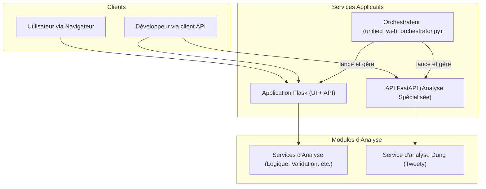

# Rapport Final - Système 3 : Web-Apps et APIs

Ce document synthétise l'architecture, les résultats des tests et l'état final du système "Web-Apps et APIs" après la campagne de vérification.

## Section 1 : Architecture du Système

L'architecture du système repose sur deux composants web principaux, orchestrés par un script central pour assurer un lancement et une gestion unifiés.

- **Application Flask (`argumentation_analysis/services/web_api/app.py`)**: Sert à la fois d'API REST robuste et d'interface utilisateur React. Elle constitue le point d'entrée principal pour les interactions des utilisateurs et expose une large gamme de fonctionnalités d'analyse.

- **API FastAPI (`api/main.py`)**: Une API légère et performante dédiée à des services d'analyse plus spécifiques, notamment l'analyse de frameworks d'argumentation de Dung via la bibliothèque Tweety.

- **Orchestrateur (`scripts/apps/webapp/unified_web_orchestrator.py`)**: Un script central qui gère le démarrage, l'arrêt et la configuration des deux applications, assurant une cohérence dans leur exécution.

Le diagramme suivant illustre les interactions au sein du système :

## Section 2 : Résultats des Tests et Corrections

Les deux applications principales du système ont été testées avec succès.

- **Application Web Flask**:
  - **Résultat :** `SUCCÈS`
  - **Endpoints Testés :** `GET /api/health`, `GET /api/endpoints`

- **API FastAPI**:
  - **Résultat :** `SUCCÈS`
  - **Endpoints Testés :** `GET /health`, `GET /api/status`

Pour atteindre ces résultats, les corrections suivantes ont été appliquées :
- **Configuration Logging :** Création du fichier `argumentation_analysis/config/uvicorn_logging.json` manquant pour permettre à `uvicorn` de démarrer correctement l'application Flask.
- **Orchestration et Lancement :** Modification des scripts `unified_web_orchestrator.py` et `backend_manager.py` pour supporter le lancement de modules applicatifs spécifiques (comme l'API FastAPI) et pour utiliser le bon endpoint de santé (`/health`) lors de la vérification de l'état de l'API.

## Section 3 : Conclusion

Le système "Web-Apps et APIs" a été entièrement vérifié. Son architecture est documentée, ses composants sont fonctionnels et les tests confirment sa stabilité. Le système est désormais considéré comme validé et prêt pour l'intégration.