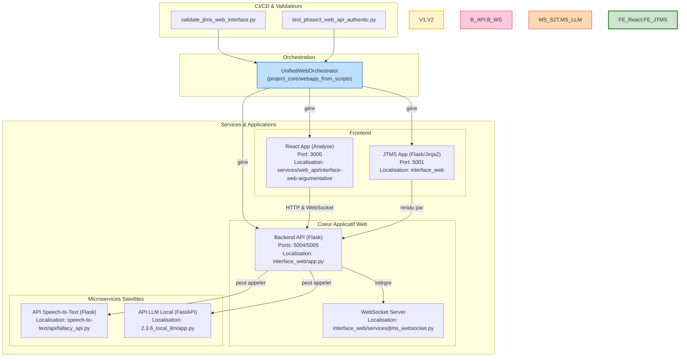

# Cartographie Exhaustive et Détaillée de l'Écosystème Web

*Dernière mise à jour : 15/06/2025*

Ce document est la **référence centrale et la source de vérité** pour l'ensemble des composants, services, et applications web du projet. Il a été compilé via une analyse systématique et approfondie de toutes les couches du projet (code source, tests, documentation, scripts) dans le but de faciliter la maintenance, le développement et une future réorganisation. Il est volontairement détaillé et inclut des extraits de code pour servir de documentation autoportante.

## 1. Architecture Générale : Un Écosystème de Microservices

L'analyse approfondie révèle que le sous-système web n'est pas une application monolithique mais un **écosystème de microservices** interconnectés. Plusieurs applications autonomes (Flask, FastAPI) collaborent pour fournir les fonctionnalités.


*Ce diagramme illustre les relations entre les composants clés. L'orchestrateur gère le cycle de vie des applications principales, qui peuvent ensuite interagir avec les microservices satellites.*

---

## 2. Description Détaillée des Composants

### a. Orchestration
-   **Composant**: [`UnifiedWebOrchestrator`](project_core/webapp_from_scripts/unified_web_orchestrator.py)
-   **Rôle**: **Point d'entrée canonique et unique** pour la gestion de l'écosystème web principal. Il gère le cycle de vie (start, stop, logs, cleanup) des services, la résolution des ports, et le lancement des suites de tests. À utiliser pour toute opération.
    ```python
    # Extrait de 'unified_web_orchestrator.py' montrant le parsing des actions
    class UnifiedWebOrchestrator:
        def __init__(self):
            # ...
            parser = argparse.ArgumentParser(description="Orchestrateur unifié pour l'application web.")
            parser.add_argument('--action', type=str, required=True, choices=['start', 'stop', 'restart', 'status', 'test', 'logs', 'cleanup'],
                                help='Action à exécuter')
            # ...
    ```

### b. Services Backend

#### i. Coeur Applicatif (Flask)
-   **Localisation**: [`interface_web/app.py`](interface_web/app.py)
-   **Rôle**: Sert de backend principal pour les interfaces. Expose les API REST (`/api`, `/jtms`) et rend les templates de l'application JTMS.
-   **Instanciation**:
    ```python
    # Extrait de 'interface_web/app.py'    
    app = Flask(__name__)
    app.secret_key = os.environ.get('SECRET_KEY', 'dev-key-EPITA-2025')
    
    # ... (enregistrement des blueprints pour les routes)
    from .routes.jtms_routes import jtms_bp
    app.register_blueprint(jtms_bp, url_prefix='/jtms')
    ```

#### ii. Service WebSocket pour JTMS
-   **Localisation**: [`interface_web/services/jtms_websocket.py`](interface_web/services/jtms_websocket.py)
-   **Rôle**: Permet une communication bidirectionnelle en temps réel avec l'interface JTMS, essentielle pour la mise à jour dynamique des graphes de croyances et les notifications.
-   **Structure**:
    ```python
    # Extrait de 'jtms_websocket.py'
    class JTMSWebSocketManager:
        def __init__(self):
            self.clients: Dict[str, WebSocketClient] = {}
            self.message_queue = queue.Queue()
            # ...

        def broadcast_to_session(self, session_id: str, message_type: MessageType, data: Dict[str, Any]):
            # ...
            self.message_queue.put(message)
    ```

#### iii. Microservice `speech-to-text` (Flask)
-   **Localisation**: [`speech-to-text/api/fallacy_api.py`](speech-to-text/api/fallacy_api.py)
-   **Rôle**: Fournit une API autonome dédiée à l'analyse de sophismes.
-   **Exemple de route**:
    ```python
    # Extrait de 'fallacy_api.py'
    app = Flask(__name__)
    CORS(app)

    @app.route('/analyze_fallacies', methods=['POST'])
    def analyze_fallacies():
        data = request.get_json()
        if not data or 'text' not in data:
            return jsonify({'error': 'Missing text'}), 400
        # ...
    ```

#### iv. Microservice LLM Local (FastAPI)
-   **Localisation**: [`2.3.6_local_llm/app.py`](2.3.6_local_llm/app.py)
-   **Rôle**: Expose un modèle de langage (LLM) hébergé localement via une API FastAPI.
-   **Exemple de route**:
    ```python
    # Extrait de '2.3.6_local_llm/app.py'
    app = FastAPI()

    class GenerationRequest(BaseModel):
        prompt: str
        # ...

    @app.post("/generate/")
    async def generate(request: GenerationRequest):
        # ...
        return {"response": "..."}
    ```

### c. Interfaces Frontend
#### i. Application d'Analyse (React)
-   **Localisation**: [`services/web_api/interface-web-argumentative/`](services/web_api/interface-web-argumentative/)
-   **Port**: `3000`
-   **Description**: Interface principale et moderne pour l'analyse de texte.

#### ii. Suite d'outils JTMS (Flask/Jinja2)
-   **Localisation**: [`interface_web/`](interface_web/) et servie par [`interface_web/app.py`](interface_web/app.py).
-   **Port**: `5001`
-   **Modules Clés** (vus dans [`tests_playwright/tests/jtms-interface.spec.js`](tests_playwright/tests/jtms-interface.spec.js)): `Dashboard`, `Sessions`, `Sherlock/Watson`, `Tutoriel`, `Playground`.

---

## 3. Tests et Stratégie de Validation

La qualité est assurée par une stratégie de test multi-couches, documentée dans [`docs/RUNNERS_ET_VALIDATION_WEB.md`](docs/RUNNERS_ET_VALIDATION_WEB.md).

*   **Hiérarchie des scripts**: **Validateurs** > **Runners** > **Suites de tests**. Il faut toujours passer par les validateurs de haut niveau.
*   **Exemple de Hiérarchie**:
    ```
    validate_jtms_web_interface.py (Validateur)
        -> utilise UnifiedWebOrchestrator (Runner/Orchestrateur)
            -> lance les tests de tests_playwright/tests/jtms-interface.spec.js (Suite de Tests)
    ```

*   **Tests d'Interface (`tests_playwright/`)**:
    - **Rôle**: Valider le comportement de l'UI en JavaScript.
    - **Exemple de test (`jtms-interface.spec.js`)**:
    ```javascript
    test('Ajout d\'une croyance via l\'interface', async ({ page }) => {
        await page.goto(`${BASE_URL}${JTMS_PREFIX}/dashboard`);
        const beliefName = `test_belief_${Date.now()}`;
        await page.fill('#new-belief', beliefName);
        await page.click('button:has-text("Créer")');
        await expect(page.locator('#activity-log')).toContainText(beliefName);
*   **Outils d'Exécution (Runners)**:
    - **[`UnifiedWebOrchestrator`](project_core/webapp_from_scripts/unified_web_orchestrator.py)**: Comme mentionné, c'est l'orchestrateur principal qui gère l'ensemble de l'écosystème. Pour les tests, il invoque d'autres runners spécialisés.
    - **[`PlaywrightRunner`](project_core/webapp_from_scripts/playwright_runner.py)**: C'est le composant Python qui fait le pont avec l'écosystème Node.js. Son unique rôle est de construire et d'exécuter la commande `npx playwright test` avec la bonne configuration (fichiers de test cibles, mode headless/headed, etc.). Il est typiquement appelé par l'Orchestrator.
    });
    ```

*   **Tests Fonctionnels (`tests/functional/`)**:
    - **Rôle**: Valider les flux de bout en bout en Python, sans mocks, pour garantir une intégration "authentique".
    - **Script Clé**: [`test_phase3_web_api_authentic.py`](tests/functional/test_phase3_web_api_authentic.py)
    - **Extrait de `test_phase3_web_api_authentic.py`**:
    ```python
    class Phase3WebAPITester:
        def __init__(self):
            self.web_url = "http://localhost:3000"
            self.api_url = "http://localhost:5005"
        
        async def run_phase3_tests(self):
            async with async_playwright() as p:
                context.on("request", self._capture_request) # Capture les requêtes
                context.on("response", self._capture_response) # Capture les réponses
                page = await context.new_page()
                await self._test_sophism_detection_analysis(page)
    ```

---
## 4. Cartographie Détaillée des APIs
Basée sur les fichiers de test comme [`tests_playwright/tests/api-backend.spec.js`](tests_playwright/tests/api-backend.spec.js).

*   **`POST /api/analyze`**: Analyse un texte.
    ```json
    {
      "text": "Si il pleut, alors la route est mouillée. Il pleut. Donc la route est mouillée.",
      "analysis_type": "propositional",
      "options": {}
    }
    ```
*   **`POST /api/fallacies`**: Détecte les sophismes.
    ```json
    {
      "text": "Tous les corbeaux que j'ai vus sont noirs, donc tous les corbeaux sont noirs.",
      "options": { "include_context": true }
    }
    ```
*   **`POST /api/framework`**: Construit un graphe argumentatif.
    ```json
    {
      "arguments": [
        { "id": "a", "content": "Les IA peuvent être créatives." },
        { "id": "b", "content": "La créativité requiert une conscience." }
      ],
      "attack_relations": [
        { "from": "b", "to": "a" }
      ]
    }
    ```
*   **`POST /api/validate`**: Valide un argument logique.
    ```json
    {
      "premises": ["Si A alors B", "A"],
      "conclusion": "B",
      "logic_type": "propositional"
    }
    ```

---

## 5. Annexe

### Inventaire des Scénarios de Test Principaux

#### Suite `tests_playwright/tests/`
-   **`api-backend.spec.js`**: Teste directement les endpoints de l'API (`/health`, `/analyze`, `/fallacies`, `/framework`, `/validate`). Crucial pour valider les contrats de l'API.
-   **`flask-interface.spec.js`**: Le nom est trompeur, il teste en réalité l'**interface React**. Il couvre le chargement de la page, l'interaction avec le formulaire, le compteur de caractères, et la validation des limites.
-   **`jtms-interface.spec.js`**: Le test le plus complet. Il valide de manière exhaustive **tous les modules de l'application JTMS**, du dashboard à la gestion de session, en passant par le playground et le tutoriel.
-   **`investigation-textes-varies.spec.js`**: Teste des cas d'usage spécifiques d'analyse sur des textes variés, probablement pour vérifier la robustesse des différents types d'analyse.
-   **`phase5-non-regression.spec.js`**: Valide la coexistence des différentes interfaces (React, Simple, JTMS) et s'assure qu'aucune fonctionnalité clé n'a régressé après des modifications.

#### Suite `tests/functional/`
-   **`test_phase3_web_api_authentic.py`**: Test d'intégration de référence qui simule un utilisateur réel sur l'interface React et capture le trafic réseau pour s'assurer que les interactions avec le backend sont authentiques (sans mocks).
-   **`test_interface_web_complete.py`**: Un orchestrateur de test qui démarre le serveur Flask puis lance d'autres tests fonctionnels (comme `test_webapp_homepage.py`).
-   **`test_webapp_api_investigation.py`**: Scénarios de tests avancés pour l'API web, investiguant des cas limites ou des comportements complexes.
-   **`test_webapp_homepage.py`**: Test simple pour s'assurer que la page d'accueil de l'application se charge correctement.
### a. Configuration Type
Extrait de la configuration canonique ([`config/webapp_config.yml`](config/webapp_config.yml)).
```yaml
playwright:
  enabled: true
  browser: chromium
  headless: false
  test_paths:
    - "tests_playwright/tests/jtms-interface.spec.js"

backend:
  ports: [5003, 5004, 5005, 5006]
  # ...

frontend:
  enabled: true
  port: 3000
```
### b. Fichiers de Documentation Clés
Le dossier `docs/` est une source d'information cruciale.
-   [`docs/RUNNERS_ET_VALIDATION_WEB.md`](docs/RUNNERS_ET_VALIDATION_WEB.md)
-   [`docs/WEB_APPLICATION_GUIDE.md`](docs/WEB_APPLICATION_GUIDE.md)
-   [`docs/unified_web_orchestrator.md`](docs/unified_web_orchestrator.md)
-   [`docs/composants/api_web.md`](docs/composants/api_web.md)
-   [`docs/migration/MIGRATION_WEBAPP.md`](docs/migration/MIGRATION_WEBAPP.md)
### Exemples de Réponses API

*   **`POST /api/analyze`**:
    *   **Succès (200 OK)**:
        ```json
        {
          "success": true,
          "text_analyzed": "Si il pleut...",
          "fallacies": [],
          "fallacy_count": 0,
          "logical_structure": { "...": "..." }
        }
        ```
    *   **Erreur - Données Manquantes (400 Bad Request)**:
        ```json
        {
            "error": "Missing 'text' field in request."
        }
        ```
    *   **Erreur - Type d'analyse invalide (500 Internal Server Error)**:
        ```json
        {
            "error": "Invalid analysis type: invalid_type"
        }
        ```

*   **`POST /api/validate`**:
    *   **Succès (200 OK)**:
        ```json
        {
            "success": true,
            "result": {
                "is_valid": true,
                "explanation": "The argument is valid by Modus Ponens."
            }
        }
        ```
    *   **Succès - Argument Invalide (200 OK)**:
        ```json
        {
            "success": true,
            "result": {
                "is_valid": false,
---

## 6. Flux de Données : Exemple d'une Analyse Argumentative

Pour illustrer comment les composants interagissent, voici le flux de données pour une analyse de texte simple initiée depuis l'interface React.

1.  **Interface Utilisateur (React)**:
    *   L'utilisateur saisit le texte "Tous les hommes sont mortels, Socrate est un homme, donc Socrate est mortel" dans le `textarea`.
    *   Il sélectionne le type d'analyse "Comprehensive" dans le menu déroulant.
    *   Au clic sur le bouton "Analyser", l'application React construit un objet JSON.

2.  **Requête HTTP**:
    *   Le client envoie une requête `POST` à l'endpoint `http://localhost:5004/api/analyze`.
    *   Le corps (`body`) de la requête contient le payload :
        ```json
        {
          "text": "Tous les hommes sont mortels, Socrate est un homme, donc Socrate est mortel",
          "analysis_type": "comprehensive",
          "options": { "deep_analysis": true }
        }
        ```

3.  **Traitement Backend (Flask)**:
    *   Le serveur Flask reçoit la requête sur la route `/api/analyze`.
    *   Il valide les données d'entrée (présence du texte, type d'analyse valide).
    *   Il délègue la tâche d'analyse au service approprié (ex: `AnalysisRunner` ou un module de logique).
    *   **Hypothèse**: Pour une analyse "comprehensive", le service peut faire des appels internes à d'autres microservices, par exemple :
        *   Appel à l'API du **LLM Local** pour une reformulation ou une analyse sémantique.
        *   Appel à l'API **Speech-to-Text** (si le texte provenait d'une source audio) pour une détection de sophisme spécifique.
    *   Une fois les résultats de l'analyse obtenus, le backend formate la réponse.

4.  **Réponse HTTP**:
    *   Le serveur renvoie une réponse avec un statut `200 OK`.
    *   Le corps de la réponse contient le résultat de l'analyse :
        ```json
        {
          "success": true,
          "text_analyzed": "Tous les hommes sont mortels...",
          "fallacies": [],
          "logical_structure": {
              "type": "Syllogism",
              "form": "Barbara (AAA-1)",
              "is_valid": true
          },
          "sentiment": "neutral"
        }
        ```

5.  **Affichage (React)**:
---

## 7. Intégration et Communication entre les Services

Cette section détaille les mécanismes techniques utilisés par les composants pour communiquer entre eux.

### a. Orchestration des Services
L'`UnifiedWebOrchestrator` utilise des modules Python standards pour gérer le cycle de vie des services.
-   **Lancement des processus**: Fait usage de `subprocess.Popen` pour lancer les serveurs Flask et Node.js dans des processus séparés et non-bloquants.
-   **Gestion des runners**: Appelle directement les classes Python comme `PlaywrightRunner` via des imports pour déléguer l'exécution des tests.

### b. Communication Frontend-Backend
-   **Appels API REST**: L'application React utilise l'API `fetch()` standard des navigateurs pour communiquer avec le backend Flask.
-   **Communication Temps Réel**: Une connexion `WebSocket` est établie entre React et le backend pour l'interface JTMS, permettant au serveur de pousser des données au client.

### c. Communication Inter-Services (Backend vers Microservices)
L'architecture en microservices est conçue pour que le backend principal puisse interroger les services satellites (LLM, Speech-to-Text).
-   **Mécanisme Attendu**: Typiquement, ces appels se feraient via des requêtes HTTP (par exemple avec les librairies `requests` ou `httpx`).
-   **État Actuel**: L'analyse du code source du service principal (`argumentation_analysis`) **ne montre pas d'implémentation existante de ces appels directs**. Cela implique que l'intégration est soit future, soit réalisée par un autre composant non identifié, ou que ces microservices sont pour l'instant utilisés de manière indépendante. C'est un point d'attention important pour de futurs développements.
    *   L'interface React reçoit la réponse JSON.
    *   Elle met à jour son état avec les données reçues.
    *   Les composants React (ex: `<ResultsSection>`, `<LogicGraph>`) se re-rendent pour afficher la structure logique, la validité, et l'absence de sophismes.
---
## 7. Historique et Fichiers Obsolètes

L'exploration du code source révèle une évolution significative du projet, ce qui a laissé des traces sous forme de scripts et de configurations potentiellement obsolètes. Il est crucial d'en être conscient pour ne pas utiliser de composants dépréciés.

### a. Scripts de Lancement Multiples
Plusieurs scripts semblent avoir servi de point d'entrée par le passé. Ils doivent être considérés comme **obsolètes** au profit de `UnifiedWebOrchestrator`.
-   `start_webapp.py` (présent à plusieurs endroits)
-   `scripts/launch_webapp_background.py`
-   `scripts/orchestrate_webapp_detached.py`
-   `archived_scripts/obsolete_migration_2025/scripts/run_webapp_integration.py`

### b. Configurations Multiples
De même, plusieurs versions du fichier de configuration `webapp_config.yml` existent.
-   **Canonique**: [`config/webapp_config.yml`](config/webapp_config.yml) (utilisé par l'orchestrateur principal).
-   **Autres versions (probablement obsolètes)**:
    -   `archived_scripts/obsolete_migration_2025/directories/webapp/config/webapp_config.yml`
    -   `scripts/apps/config/webapp_config.yml`
    -   `scripts/webapp/config/webapp_config.yml`

### c. Scripts de Test Archivés
Le répertoire `archived_scripts/` contient de nombreux tests et scripts qui, bien qu'utiles pour comprendre l'histoire du projet, ne doivent pas être considérés comme faisant partie de la suite de tests active.
                "explanation": "The argument is invalid, fallacy of affirming the consequent."
            }
        }
        ```

### c. Commandes Essentielles
Utilisez **toujours** l'orchestrateur.
-   `python -m project_core.webapp_from_scripts.unified_web_orchestrator --action start`
-   `python -m project_core.webapp_from_scripts.unified_web_orchestrator --action stop`
-   `python -m project_core.webapp_from_scripts.unified_web_orchestrator --action test`