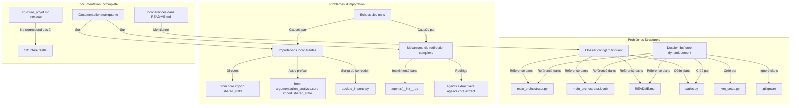

# Rapport d'Analyse de l'Architecture du Projet "argumentiation_analysis"

## Table des matières
1. [Introduction](#introduction)
2. [Méthodologie d'analyse](#méthodologie-danalyse)
3. [Structure actuelle du projet](#structure-actuelle-du-projet)
4. [Problèmes identifiés](#problèmes-identifiés)
   - [Incohérences structurelles](#incohérences-structurelles)
   - [Problèmes d'importation](#problèmes-dimportation)
   - [Documentation incomplète](#documentation-incomplète)
5. [Recommandations](#recommandations)
   - [Correction des incohérences structurelles](#correction-des-incohérences-structurelles)
   - [Résolution des problèmes d'importation](#résolution-des-problèmes-dimportation)
   - [Amélioration de la documentation](#amélioration-de-la-documentation)
6. [Plan d'implémentation](#plan-dimplémentation)
7. [Conclusion](#conclusion)

## Introduction

Ce rapport présente une analyse détaillée de l'architecture du projet "argumentiation_analysis" qui doit être déployé pour des étudiants de l'EPITA. L'objectif est d'identifier et de résoudre les problèmes structurels avant le déploiement, notamment les références à des dossiers manquants, les problèmes d'importation dans les tests et les incohérences dans la documentation.

## Méthodologie d'analyse

L'analyse a été réalisée en examinant :
- La structure des fichiers et dossiers du projet
- Les références aux chemins dans le code source
- Les scripts de test et leur fonctionnement
- Les mécanismes d'importation et de redirection
- La documentation existante et sa cohérence avec la structure réelle

## Structure actuelle du projet

Le projet "argumentiation_analysis" est organisé selon une architecture modulaire avec les composants principaux suivants :

```
argumentiation_analysis/
├── __init__.py
├── main_orchestrator.ipynb      # Notebook interactif pour l'orchestration
├── main_orchestrator.py         # Script principal d'orchestration
├── run_analysis.py              # Script pour lancer l'analyse argumentative
├── run_extract_editor.py        # Script pour lancer l'éditeur de marqueurs d'extraits
├── run_extract_repair.py        # Script pour lancer la réparation des bornes défectueuses
├── run_orchestration.py         # Script pour lancer l'orchestration des agents
├── run_tests.py                 # Script pour exécuter les tests
├── requirements.txt             # Dépendances Python
├── agents/                      # Agents spécialistes
├── core/                        # Composants fondamentaux
├── models/                      # Modèles de données
├── orchestration/               # Mécanismes d'orchestration
├── services/                    # Services partagés
├── tests/                       # Tests unitaires et d'intégration
├── ui/                          # Interface utilisateur
└── utils/                       # Utilitaires généraux
```

## Problèmes identifiés

### Incohérences structurelles

1. **Dossier `config/` manquant**
   - Le dossier `config/` est référencé dans plusieurs fichiers (`main_orchestrator.py`, `main_orchestrator.ipynb`, `README.md`) mais n'existe pas dans la structure actuelle.
   - Dans `paths.py`, il y a une référence à `CONFIG_DIR = ROOT_DIR / "config"` et la fonction `ensure_directories_exist()` est censée créer ce répertoire, mais il semble que cette création ne fonctionne pas correctement.
   - Des fichiers comme `test_data/error_cases/service_error.json` font référence à des chemins comme `./config/extract_sources.json`.

2. **Dossier `libs/` créé dynamiquement**
   - Le dossier `libs/` est mentionné dans plusieurs fichiers (`README.md`, `main_orchestrator.py`, `main_orchestrator.ipynb`) et est censé contenir les JARs TweetyProject.
   - Ce dossier est créé dynamiquement lors de l'exécution par la fonction `ensure_directories_exist()` dans `paths.py` et par le script `jvm_setup.py`.
   - Le dossier est ignoré dans `.gitignore`, ce qui est cohérent avec sa création dynamique, mais cela peut poser des problèmes lors du premier déploiement.

### Problèmes d'importation

1. **Incohérences dans les importations**
   - Les importations sont faites de deux manières différentes dans le projet :
     - Importations directes : `from core import shared_state`
     - Importations avec préfixe : `from argumentiation_analysis.core import shared_state`
   - Le script `update_imports.py` contient des motifs de recherche et de remplacement pour corriger les importations, ce qui suggère que les importations sont incohérentes dans le projet.
   - Le script `check_imports.py` vérifie les importations et s'attend à ce que les modules soient importés avec le préfixe `argumentiation_analysis`.

2. **Mécanisme de redirection complexe**
   - Le fichier `agents/__init__.py` implémente un mécanisme de redirection pour maintenir la compatibilité avec le code qui importe depuis `agents.extract` alors que les fichiers sont en réalité dans `agents.core.extract`.
   - Ce mécanisme peut être source de confusion et de bugs difficiles à détecter.

3. **Échecs des tests**
   - 20% des tests échouent principalement à cause de problèmes d'importation, ce qui indique que les mécanismes de redirection et les chemins d'importation ne sont pas cohérents dans tout le projet.

### Documentation incomplète

1. **Incohérences dans la documentation**
   - Le fichier `README.md` mentionne des fichiers et des dossiers qui ne semblent pas exister dans la structure actuelle, comme `config/`.
   - La documentation dans `docs/structure_projet.md` décrit une structure qui ne correspond pas exactement à la structure réelle du projet.

2. **Documentation manquante sur les mécanismes d'importation**
   - Il n'y a pas de documentation claire sur la façon dont les importations doivent être gérées dans le projet (directes ou avec préfixe).
   - Le mécanisme de redirection dans `agents/__init__.py` n'est pas documenté de manière exhaustive.

## Recommandations

### Correction des incohérences structurelles

1. **Création du dossier `config/`**
   - Créer physiquement le dossier `config/` à la racine du projet.
   - Ajouter un fichier `.gitkeep` dans ce dossier pour qu'il soit inclus dans le contrôle de version.
   - Vérifier que la fonction `ensure_directories_exist()` dans `paths.py` fonctionne correctement.
   - Créer un fichier `.env.template` dans ce dossier comme mentionné dans le `README.md`.

2. **Gestion du dossier `libs/`**
   - Documenter clairement que ce dossier est créé dynamiquement lors de l'exécution.
   - Ajouter un script d'initialisation qui crée ce dossier et télécharge les JARs nécessaires avant le premier déploiement.
   - Mettre à jour la documentation pour expliquer comment les JARs sont gérés et téléchargés.

### Résolution des problèmes d'importation

1. **Standardisation des importations**
   - Choisir une approche cohérente pour les importations (directes ou avec préfixe) et l'appliquer dans tout le projet.
   - Mettre à jour tous les fichiers pour utiliser cette approche cohérente.
   - Exécuter le script `update_imports.py` pour corriger automatiquement les importations.

2. **Simplification du mécanisme de redirection**
   - Documenter clairement le mécanisme de redirection dans `agents/__init__.py`.
   - Envisager de simplifier ce mécanisme à long terme en réorganisant les fichiers pour éviter les redirections.

3. **Correction des tests**
   - Mettre à jour les tests pour utiliser l'approche d'importation standardisée.
   - Vérifier que tous les tests passent après les modifications.

### Amélioration de la documentation

1. **Mise à jour du `README.md`**
   - Mettre à jour le `README.md` pour refléter la structure réelle du projet.
   - Clarifier les étapes d'installation et de configuration, notamment la création des dossiers `config/` et `libs/`.

2. **Mise à jour de la documentation de structure**
   - Mettre à jour `docs/structure_projet.md` pour refléter la structure réelle du projet.
   - Ajouter des informations sur les mécanismes d'importation et de redirection.

3. **Documentation des conventions d'importation**
   - Créer un document expliquant les conventions d'importation à suivre dans le projet.
   - Inclure des exemples de bonnes et mauvaises pratiques.

## Plan d'implémentation

1. **Phase 1 : Correction des incohérences structurelles**
   - Créer le dossier `config/` et ajouter un fichier `.gitkeep`
   - Créer un fichier `.env.template` dans le dossier `config/`
   - Vérifier et corriger la fonction `ensure_directories_exist()` dans `paths.py`
   - Créer un script d'initialisation pour le dossier `libs/`

2. **Phase 2 : Résolution des problèmes d'importation**
   - Exécuter le script `update_imports.py` pour standardiser les importations
   - Mettre à jour les tests pour utiliser l'approche d'importation standardisée
   - Documenter le mécanisme de redirection dans `agents/__init__.py`

3. **Phase 3 : Amélioration de la documentation**
   - Mettre à jour le `README.md`
   - Mettre à jour `docs/structure_projet.md`
   - Créer un document sur les conventions d'importation

4. **Phase 4 : Tests et validation**
   - Exécuter tous les tests pour vérifier qu'ils passent
   - Vérifier que l'application fonctionne correctement après les modifications

## Conclusion

L'analyse de l'architecture du projet "argumentiation_analysis" a révélé plusieurs problèmes structurels qui doivent être résolus avant le déploiement pour les étudiants de l'EPITA. Les principales recommandations sont de corriger les incohérences structurelles, de standardiser les importations et d'améliorer la documentation. En suivant le plan d'implémentation proposé, ces problèmes peuvent être résolus de manière systématique, ce qui permettra aux étudiants de travailler sur un projet bien structuré et cohérent.
## Visualisation des problèmes et solutions

### Problèmes structurels identifiés



### Solutions proposées

```mermaid
graph TD
    subgraph "Correction Incohérences Structurelles"
        A1[Créer dossier config/] -->|Ajouter| B1[.gitkeep]
        A1 -->|Ajouter| C1[.env.template]
        A1 -->|Vérifier| D1[ensure_directories_exist()]
        
        E1[Gérer dossier libs/] -->|Documenter création dynamique| F1[README.md]
        E1 -->|Créer| G1[Script d'initialisation]
    end
    
    subgraph "Résolution Problèmes d'Importation"
        H1[Standardiser importations] -->|Exécuter| I1[update_imports.py]
        H1 -->|Mettre à jour| J1[Tests]
        
        K1[Simplifier redirections] -->|Documenter| L1[agents/__init__.py]
        K1 -->|Réorganiser| M1[Structure des fichiers]
    end
    
    subgraph "Amélioration Documentation"
        N1[Mettre à jour README.md] -->|Refléter| O1[Structure réelle]
        N1 -->|Clarifier| P1[Installation et configuration]
        
        Q1[Mettre à jour structure_projet.md] -->|Refléter| O1
        Q1 -->|Ajouter info sur| R1[Mécanismes d'importation]
        
        S1[Créer documentation] -->|Sur| T1[Conventions d'importation]
    end
    
    subgraph "Plan d'Implémentation"
        U1[Phase 1: Correction structurelle] --> V1[Phase 2: Résolution importations]
        V1 --> W1[Phase 3: Amélioration documentation]
        W1 --> X1[Phase 4: Tests et validation]
    end
```