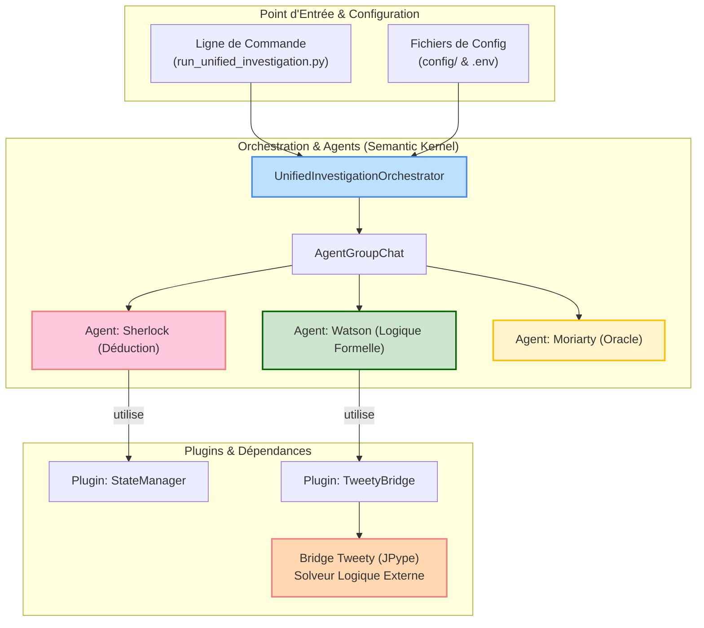

# Système Sherlock & Watson : Plateforme d'Enquêtes Collaboratives par IA

*Dernière mise à jour : 15/06/2025*

Ce document est le guide de référence complet pour le système d'enquêtes collaboratives "Sherlock & Watson". Il détaille l'architecture, la configuration et l'utilisation de cette plateforme d'IA conçue pour le raisonnement multi-agents.

## 1. Architecture du Système

Le système est architecturé autour d'un orchestrateur central qui gère le cycle de vie de l'enquête et la communication entre les agents spécialisés, avec une intégration profonde de `Semantic Kernel` et du solveur logique `Tweety`.



## 2. Configuration de l'Environnement

### a. Prérequis
- **Python** : 3.9+ (recommandé via Conda)
- **Java** : JDK 8 ou supérieur ( requis pour le solveur logique Tweety).
- **Clés API** : Une clé pour un service LLM (OpenRouter ou OpenAI).

### b. Installation
1.  **Créez et activez un environnement Conda :**
    ```bash
    conda create --name projet-is python=3.9
    conda activate projet-is
    ```
2.  **Installez les dépendances Python :**
    ```bash
    pip install -r requirements.txt
    ```
3.  **Configurez vos clés API :**
    Créez un fichier `.env` à la racine du projet avec votre clé :
    ```ini
    # Pour OpenRouter (recommandé)
    OPENROUTER_API_KEY="sk-or-v1-votrecLé"
    OPENROUTER_MODEL="gpt-4o-mini"

    # OU pour OpenAI
    # OPENAI_API_KEY="sk-votrecLé"
    ```

## 3. Commandes d'Utilisation

Le point d'entrée unique pour toutes les enquêtes est `run_unified_investigation.py`.

**Important :** Exécutez toujours les scripts en tant que modules depuis la racine du projet avec l'option `-m` pour assurer la résolution correcte des imports.

### a. Workflow `cluedo`
Lance une enquête collaborative pour résoudre un mystère.
```bash
python -m scripts.sherlock_watson.run_unified_investigation --workflow cluedo
```

### b. Workflow `einstein`
Résolution de la célèbre énigme d'Einstein pour tester le raisonnement logique pur.
```bash
python -m scripts.sherlock_watson.run_unified_investigation --workflow einstein
```

### c. Workflow `jtms`
Enquête où le raisonnement des agents est validé en temps réel par un JTMS (Justification-Truth Maintenance System) via le bridge Tweety.
```bash
python -m scripts.sherlock_watson.run_unified_investigation --workflow jtms
```

## 4. Interprétation des Résultats

Les enquêtes génèrent une trace JSON détaillée dans le dossier `results/sherlock_watson/`.

**Exemple de sortie (`trace_..._cluedo.json`):**
```json
{
  "session_id": "sherlock_watson_20250610_040000",
  "total_messages": 7,
  "participants": ["Sherlock", "Watson", "Moriarty"],
  "metrics": {
    "naturalness_score": 8.5,
    "personality_distinctiveness": 7.8,
    "conversation_flow": 8.2
  },
  "conversation": [
    {
      "agent": "Sherlock",
      "content": "Watson, observez ces indices curieux...",
      "timestamp": "2025-06-10T04:00:15.123Z",
      "analysis": {
        "personality_markers": ["observez", "curieux"],
        "deductive_reasoning": true
      }
    }
  ]
}
```

## 5. Dépannage

### Erreur : `JPypeException: Unable to start JVM`
-   **Cause :** Java n'est pas installé ou la variable d'environnement `JAVA_HOME` n'est pas correctement configurée.
-   **Solution :**
    1.  Installez un JDK 8 ou supérieur.
    2.  Assurez-vous que `JAVA_HOME` pointe vers le bon dossier d'installation.
    ```bash
    # Exemple pour Linux
    export JAVA_HOME=/usr/lib/jvm/java-8-openjdk-amd64
    export PATH=$JAVA_HOME/bin:$PATH
    ```

### Erreur : `openai.AuthenticationError: Invalid API key`
-   **Cause :** Votre clé API est manquante, incorrecte ou n'a plus de crédits.
-   **Solution :**
    1.  Vérifiez que le fichier `.env` existe à la racine du projet.
    2.  Confirmez que la clé API est correcte et valide.
    3.  Vérifiez votre solde sur la plateforme (OpenRouter ou OpenAI).