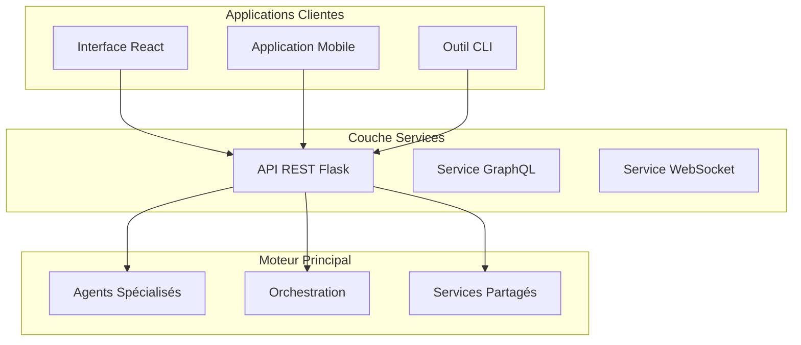

# Services Web et API

Ce dossier contient les services web et API qui permettent l'intégration externe du moteur d'analyse argumentative. Ces services exposent les fonctionnalités du système via des interfaces standardisées (REST, GraphQL) pour faciliter le développement d'applications clientes.

## Table des Matières

- [Vue d'ensemble](#vue-densemble)
- [API Web Flask](#api-web-flask)
- [Architecture des Services](#architecture-des-services)
- [Démarrage Rapide](#démarrage-rapide)
- [Intégration avec le Moteur Principal](#intégration-avec-le-moteur-principal)
- [Développement et Extension](#développement-et-extension)

## Vue d'ensemble

Les services dans ce dossier servent de **pont** entre le moteur d'analyse argumentative complexe et les applications clientes modernes. Ils permettent aux étudiants de :

- **Créer des interfaces web** sans gérer la complexité du moteur multi-agents
- **Intégrer l'analyse argumentative** dans des applications existantes
- **Développer des prototypes rapidement** avec des API REST standardisées
- **Tester et valider** les fonctionnalités d'analyse de manière interactive

## API Web Flask

### [`web_api/`](./web_api/)

L'API REST Flask est le service principal qui expose toutes les fonctionnalités d'analyse argumentative via des endpoints HTTP.

#### Fonctionnalités Principales

| Endpoint | Méthode | Description |
|----------|---------|-------------|
| `/api/health` | GET | Vérification de l'état de l'API et des services |
| `/api/analyze` | POST | Analyse argumentative complète d'un texte |
| `/api/validate` | POST | Validation logique d'un argument structuré |
| `/api/fallacies` | POST | Détection de sophismes et erreurs de raisonnement |
| `/api/framework` | POST | Construction et analyse de frameworks de Dung |
| `/api/endpoints` | GET | Documentation interactive des endpoints |

#### Architecture de l'API

```
web_api/
├── app.py                 # Application Flask principale
├── start_api.py          # Script de démarrage avec vérifications
├── requirements.txt      # Dépendances Python
├── models/              # Modèles de données Pydantic
│   ├── request_models.py   # Modèles pour les requêtes
│   └── response_models.py  # Modèles pour les réponses
└── services/            # Services métier
    ├── analysis_service.py    # Service d'analyse principale
    ├── validation_service.py  # Service de validation logique
    ├── fallacy_service.py     # Service de détection de sophismes
    └── framework_service.py   # Service de frameworks de Dung
```

#### Rôle dans l'Écosystème

L'API web agit comme une **couche d'abstraction** qui :

1. **Simplifie l'accès** aux agents spécialisés (Extract, Informal, PL, PM)
2. **Standardise les formats** d'entrée et de sortie via des modèles Pydantic
3. **Gère les erreurs** et fournit des réponses cohérentes
4. **Active CORS** pour permettre les appels depuis des applications web
5. **Fournit une documentation** interactive des services disponibles

#### Intégration avec le Moteur Principal

L'API utilise les composants suivants du moteur principal :

- **Agents spécialisés** : Via `argumentation_analysis.agents.core.*`
- **Services partagés** : Cache, crypto, extraction via `argumentation_analysis.services.*`
- **Modèles de données** : Structures communes via `argumentation_analysis.models.*`
- **Orchestration** : Coordination des analyses via `argumentation_analysis.orchestration.*`

## Démarrage Rapide

### Prérequis

- Python 3.8+
- Pip (gestionnaire de paquets Python)
- Accès au moteur principal d'analyse argumentative

### Installation et Démarrage

```bash
# 1. Naviguer vers l'API
cd services/web_api

# 2. Installer les dépendances
pip install -r requirements.txt

# 3. Démarrer l'API (méthode recommandée)
python start_api.py

# OU méthode alternative
python app.py
```

### Vérification du Fonctionnement

```bash
# Test de santé de l'API
curl http://localhost:5000/api/health

# Test d'analyse simple
curl -X POST http://localhost:5000/api/analyze \
  -H "Content-Type: application/json" \
  -d '{"text": "Tous les chats sont des animaux. Félix est un chat. Donc Félix est un animal."}'
```

### Exemple d'Utilisation avec JavaScript

```javascript
// Service API simple
const API_BASE = 'http://localhost:5000';

async function analyzeArgument(text) {
  const response = await fetch(`${API_BASE}/api/analyze`, {
    method: 'POST',
    headers: { 'Content-Type': 'application/json' },
    body: JSON.stringify({
      text,
      options: {
        detect_fallacies: true,
        analyze_structure: true,
        evaluate_coherence: true
      }
    })
  });
  
  return response.json();
}

// Utilisation
analyzeArgument("Votre argument ici")
  .then(result => console.log('Analyse:', result))
  .catch(error => console.error('Erreur:', error));
```

## Architecture des Services

### Séparation des Responsabilités



### Flux de Traitement d'une Requête

1. **Réception** : L'API reçoit une requête HTTP avec un texte à analyser
2. **Validation** : Les modèles Pydantic valident la structure des données
3. **Orchestration** : Le service approprié coordonne l'analyse avec les agents
4. **Traitement** : Les agents spécialisés analysent le texte
5. **Agrégation** : Les résultats sont combinés et formatés
6. **Réponse** : L'API retourne une réponse JSON structurée

### Gestion des Erreurs

L'API implémente une gestion d'erreurs robuste :

- **Validation des entrées** : Erreurs 400 pour les données malformées
- **Erreurs métier** : Erreurs 422 pour les problèmes d'analyse
- **Erreurs système** : Erreurs 500 pour les problèmes internes
- **Logging détaillé** : Traçabilité complète des erreurs

## Développement et Extension

### Ajouter un Nouveau Service

1. **Créer le service** dans `services/web_api/services/`
2. **Définir les modèles** dans `models/`
3. **Ajouter les routes** dans `app.py`
4. **Documenter l'endpoint** dans `/api/endpoints`

### Exemple d'Extension

```python
# services/web_api/services/custom_service.py
class CustomAnalysisService:
    def __init__(self):
        # Initialisation du service
        pass
    
    def analyze_custom(self, request):
        # Logique d'analyse personnalisée
        return CustomResponse(...)

# app.py
@app.route('/api/custom', methods=['POST'])
def custom_analysis():
    service = CustomAnalysisService()
    result = service.analyze_custom(request.json)
    return jsonify(result.dict())
```

### Tests et Validation

L'API web dispose d'une suite complète de tests unitaires pour valider le bon fonctionnement des endpoints et services.

#### Structure des Tests

```
web_api/tests/
├── conftest.py              # Configuration pytest et fixtures
├── test_basic.py           # Tests de validation de base
├── test_endpoints.py       # Tests des endpoints HTTP
├── test_services.py        # Tests des services métier
├── requirements-test.txt   # Dépendances de test
└── conftest_complex.py     # Configuration avancée (avec mocks)
```

#### Exécution des Tests

```bash
# Naviguer vers l'API
cd services/web_api

# Installer les dépendances de test
pip install -r tests/requirements-test.txt

# Exécuter tous les tests
python -m pytest tests/ -v

# Tests avec couverture de code
python -m pytest tests/ --cov=. --cov-report=html --cov-report=term

# Tests spécifiques
python -m pytest tests/test_basic.py -v          # Tests basiques
python -m pytest tests/test_endpoints.py -v     # Tests des endpoints
python -m pytest tests/test_services.py -v      # Tests des services
```

#### Types de Tests

1. **Tests Basiques** (`test_basic.py`)
   - Validation des opérations de base
   - Tests de validation des données
   - Gestion d'erreurs fondamentale

2. **Tests des Endpoints** (`test_endpoints.py`)
   - Tests HTTP complets pour chaque endpoint
   - Validation des codes de statut
   - Tests des cas d'erreur et de validation
   - Tests CORS et gestion des headers

3. **Tests des Services** (`test_services.py`)
   - Tests unitaires des services métier
   - Mocking des dépendances externes
   - Tests d'intégration entre services

#### Couverture de Code

Les tests visent une couverture élevée du code :
- **Endpoints** : Tous les endpoints et leurs cas d'erreur
- **Services** : Logique métier et gestion d'erreurs
- **Modèles** : Validation Pydantic et contraintes
- **Intégration** : Communication entre composants

#### Badge de Couverture


#### Intégration Continue

Les tests sont conçus pour s'intégrer facilement dans des pipelines CI/CD :

```yaml
# Exemple GitHub Actions
- name: Run Tests
  run: |
    cd services/web_api
    pip install -r tests/requirements-test.txt
    python -m pytest tests/ --cov=. --cov-report=xml
```

## Ressources Complémentaires

### Documentation Détaillée

- **[Guide d'Utilisation de l'API](../docs/projets/sujets/aide/interface-web/GUIDE_UTILISATION_API.md)** : Documentation complète des endpoints
- **[Démarrage Rapide Interface Web](../docs/projets/sujets/aide/interface-web/DEMARRAGE_RAPIDE.md)** : Checklist pour être opérationnel rapidement
- **[Exemples React](../docs/projets/sujets/aide/interface-web/exemples-react/)** : Composants prêts à l'emploi

### Guides de Développement

- **[Interface Web d'Analyse Argumentative](../docs/projets/sujets/3.1.1_Interface_Web_Analyse_Argumentative.md)** : Guide complet pour créer des interfaces modernes
- **[Troubleshooting](../docs/projets/sujets/aide/interface-web/TROUBLESHOOTING.md)** : Solutions aux problèmes courants

### Support et Contribution

Pour toute question ou contribution :

1. Consultez la documentation existante
2. Vérifiez les issues GitHub du projet principal
3. Créez une issue détaillée si nécessaire
4. Proposez une Pull Request avec vos améliorations

---

**Note** : Ces services sont conçus pour faciliter le développement d'applications clientes. Ils ne remplacent pas le moteur principal mais le rendent accessible via des interfaces standardisées.