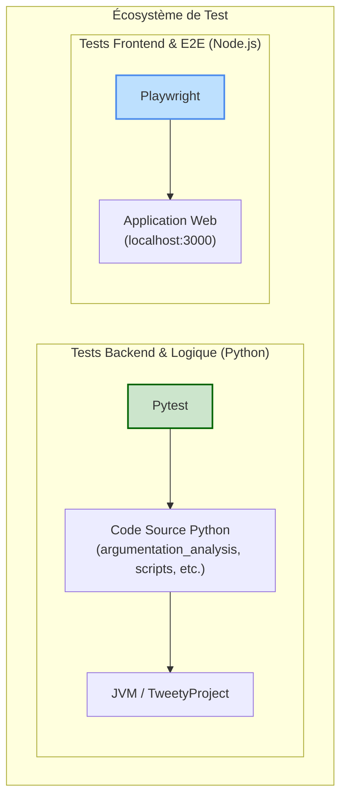

# Guide Complet des Tests du Projet

Ce document est le guide de référence pour l'ensemble des tests du projet. Il couvre à la fois les tests backend/logique avec **Pytest** et les tests frontend/E2E avec **Playwright**.

## 1. Philosophie et Architecture des Tests

### a. Philosophie
Nous suivons l'approche de la pyramide des tests : une large base de **tests unitaires** rapides, complétée par des **tests d'intégration** ciblés, et des **tests fonctionnels de bout en bout** pour valider les scénarios utilisateurs clés sur l'interface web.

### b. Architecture Générale

Le système de test est divisé en deux piliers principaux :



## 2. Configuration Initiale Requise

Avant de lancer les tests, vous devez configurer les deux environnements.

### a. Environnement Python (pour Pytest)
Assurez-vous que votre environnement Conda est activé :
```powershell
# Activer l'environnement (à exécuter depuis la racine du projet)
. .\activate_project_env.ps1
```

### b. Environnement Node.js (pour Playwright)
1.  **Installez les dépendances Node.js :**
    Naviguez dans le répertoire `tests_playwright` et exécutez :
    ```bash
    # Depuis la racine:
    cd tests_playwright
    npm install
    cd ..
    ```

2.  **Installez les navigateurs Playwright :**
    Cette commande télécharge les navigateurs (Chromium, Firefox, WebKit) nécessaires.
    ```bash
    npx playwright install
    ```

## 3. Exécution des Tests

### a. Tests Python (Pytest)

-   **Lancer tous les tests Pytest :**
    ```bash
    pytest
    ```

-   **Lancer un répertoire spécifique (ex: tests unitaires) :**
    ```bash
    pytest tests/unit/
    ```

-   **Utiliser des marqueurs (ex: exécuter les tests `slow`) :**
    ```bash
    pytest -m slow
    ```
    (Voir `tests/conftest.py` pour la liste des marqueurs).

-   **Générer un rapport de couverture de code :**
    ```bash
    pytest --cov=argumentation_analysis --cov-report=html
    ```
    (Le rapport sera dans `htmlcov/`).

### b. Tests Web (Playwright)

-   **Lancer tous les tests Playwright (headless) :**
    ```bash
    npx playwright test
    ```

-   **Lancer les tests en mode interactif (avec interface graphique) :**
    ```bash
    npx playwright test --ui
    ```

-   **Lancer les tests sur un navigateur spécifique :**
    ```bash
    npx playwright test --project=chromium
    ```

-   **Voir le rapport de test HTML :**
    Après une exécution, ouvrez le dernier rapport généré.
    ```bash
    npx playwright show-report
    ```

## 4. Ajouter de Nouveaux Tests

### a. Ajouter un test Pytest
1.  Créez un nouveau fichier nommé `test_*.py`.
2.  Placez-le dans le sous-répertoire de `tests/` qui correspond à la structure du code que vous testez (ex: un test pour `argumentation_analysis/core/utils.py` irait dans `tests/unit/core/test_utils.py`).
3.  Écrivez vos fonctions de test en les préfixant par `test_`.

### b. Ajouter un test Playwright
1.  Créez un nouveau fichier nommé `*.spec.js` ou `*.spec.ts`.
2.  Placez-le dans le répertoire `tests_playwright/tests/`.
3.  Utilisez l'API de Playwright pour écrire vos scénarios de test.

## 5. Structure des Répertoires de Tests (Pytest)

-   **`agents/`**: Tests pour les agents intelligents.
-   **`functional/`**: Tests fonctionnels validant des workflows complets.
-   **`integration/`**: Tests d'intégration entre les modules.
-   **`unit/`**: Tests unitaires qui vérifient de petites unités de code isolées. La structure de ce répertoire miroir celle du code source.